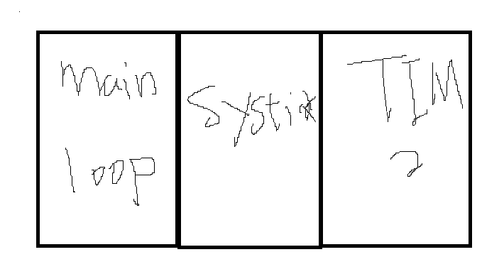
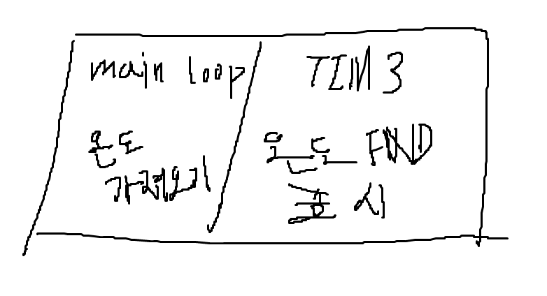

#### 참고

- 이번강의 part 초반부에 stm32CubeIDE의 프로젝트 복사방법이 있다.

### 쓰레드란?

## 학습목표

- 온도정보를 FND LED에 표현해보기

### 현재 FND module의 문제점

- fnd 모듈에는 4개의 Segment가 있다.
- 모듈 구조상 동시에 segment들의 불을 킬수는 없는 상태고
- 사람이 인지할 수 없는 속도로 빠르게 하나씩 키고 끄고를 반복하는 상태이다.
  - 이렇게 번갈아가면 segment를 껏다 켰다하면서 온도정보를 가져오고 fnd에 온도정보를 표현할 수는 없다.
- **segment를 동시에 켜서 온도를 표현하는 방법은 없을까?**
- **온도정보를 가져오면서 동시에 fnd로 온도를 표현하는 방법은 무엇일까?**
  - **유사 쓰레드 방식을 사용하자!**

### 타이머를 이용하자!

- 타이머를 이용해서 유사 쓰레드 구현하기

#### Cooperative Multitasking(협력형 멀티테스킹)

- 실제로 여러 작업이 동시에 실행되는 것이 아니다.
- Interrupts와 `main loop`가 서로 순서대로 실행되면서 협력하는 방식으로 멀티테스킹이 이뤄진다.
  - (엄밀히 말하면 빠르게 왔다갔다 수행되면서 멀티테스킹이 되는것처럼 보여지는것임)
- STM32와 같은 MCU에서는 이러한 방식으로 마치 여러 흐름이 동시 실행되는 것처럼 보이도록 구현하는 경우가 많다.



#### TIM3 추가하기

TIM3를 추가하여 유사 쓰레드방식을 구현해보자

- IOC모드에서 TIM3를 추가한다.
- 100us마다 interrupt 발생시키기
  - clock 주파수가 72MHz이므로 Prescaler를 72-1로 설정
  * 100us마다 interrupt를 발생시키기위해 Counter Period를 100-1로 설정
- System Core => NVIC => 우선순위 10으로 설정 => code generate
- main.c에 TIM3에 대한 Interrupt 시작코드 추가하기

```c
/* USER CODE BEGIN 2 */
HAL_TIM_Base_Start_IT(&htim3);
/* USER CODE END 2 */
```

##### 결론

- **TIM3**는 100us마다 Interrupt 발생
- **Systick은 1ms 마다 Interrupt 발생**

### Main loop대신 TIM3 Interrupt 주기로 fnd 숫자 표현해보기

```c
// stm32fxx_it.c

void TIM3_IRQHandler(void) {
	/* USER CODE BEGIN TIM3_IRQn 0 */
	digit_Temper(500, 50);
	/* USER CODE END TIM3_IRQn 0 */
	HAL_TIM_IRQHandler(&htim3);
	/* USER CODE BEGIN TIM3_IRQn 1 */

	/* USER CODE END TIM3_IRQn 1 */
}
```

```c
// fnd_controller.c
void digit_Temper(temper, replay) {
	int n1, n2, n3, n4;
	n1 = (int) temper % 10;
	n2 = (int) ((temper % 100)) / 10;
	n3 = (int) ((temper % 1000)) / 100;
	n4 = (int) ((temper % 10000)) / 1000;

	for (int i = 0; i < replay; i++) {
		send_port(_LED_0F[n1], 0b0001);
		send_port(_LED_0F[n2] & 0x7F, 0b0010);
		if (temper > 99)
			send_port(_LED_0F[n3], 0b0100);
		if (temper > 999)
			send_port(_LED_0F[n4], 0b1000);
	}

// 위 코드에서는 약간의 흠이 있다. 정상적으로 숫자가 표현되지만 led 밝기가 균일하게 표현되지 않는다는것이다. ==> 마지막 segment가 머무르는 시간이 더 길기 때문에 더 밝게 표시된다.

// 아래와 같은 코드로 고쳐보자
static uint8_t m_temperCount = 0;

void digit4_Temper(int temper) {
	int n1, n2, n3, n4;
	n1 = (int) temper % 10;
	n2 = (int) ((temper % 100)) / 10;
	n3 = (int) ((temper % 1000)) / 100;
	n4 = (int) ((temper % 10000)) / 1000;

	switch (m_temperCount) {
	case 0:
		send_port(_LED_0F[n1], 0b0001);
		break;
	case 1:
		send_port(_LED_0F[n2] & 0x7F, 0b0010);
		break;
	case 2:
		if (temper > 99)
			send_port(_LED_0F[n3], 0b0100);
		break;
	case 3:
		if (temper > 999)
			send_port(_LED_0F[n4], 0b1000);
		break;
	default:
		break;
	}
	m_temperCount++;
	if (temper > 999 && m_temperCount >= 4)
		m_temperCount = 0;
	else if (temper > 99 && m_temperCount >= 3)
		m_temperCount = 0;
	else if (temper <= 99 && m_temperCount >= 2)
		m_temperCount = 0;
}

// 4자리 segment가 균일하게 켜지는것을 볼 수 있다.
}
```

## FND에 온도 표현하기



### 유사 쓰레드방식 구현 실패

- 결론부터 말해서 main loop에서 온도를 가져오는 동시에 fnd에 온도정보를 표시하는것은 실패했다.

- main loop에서

- main loop에서 온도정보를 가져오는 도중에 tim3_it가 발생하여 온도정보도 가져오지 못한 상태에서 fnd에 온도정보를 표시할려하다보니 결국에는 gpio신호가 꼬여서 온도정보도 가져오지 못하고 fnd segment에 온도를 표현하지 못하기 때문이다.

### 해결방법

- 온도정보를 가져오고 나서야
- fnd에 온도정보를 표현해야한다.
- 온도정보를 가져올 때는 **Mutex 처리**를하여 TIM3가 간섭하지 못하도록 처리해야한다.
