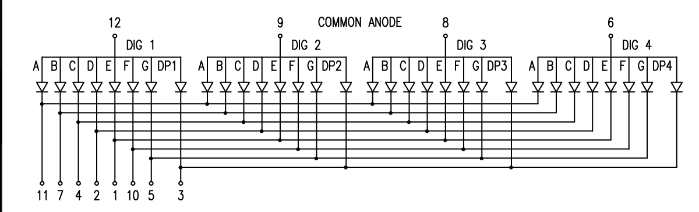
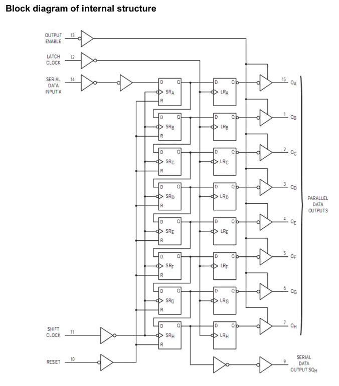

### 실습

- main loop에서 uart 통신으로 printf 출력함과 동시에
- TIM3에서 fnd로 숫자 표현하기

#### hardware FND 모듈문제 해결?

종류가 다른 여러 숫자를 4개의 7segment에 동시에 표현할 수 있을까?

- **불가능하다.**

- 7segment구조상 같은 part는 동시에 `on`이 가능하지만 `off`는 불가능하다.
  

#### `TM74HC595` shift register의 구조

32분 남았을때부터 구조를 설명하니 복습을 많이해서 명확히 이해하도록하자

- shift register는 MUC처럼 Programming이 가능한 chip이 아니다.
- 순수한 회로만으로 동작하는 칩
- 직렬신호를 병렬신호로 바꾸는 기능이있다.
  

### 해결해야할 문제

- FND 7segment와 DS18B20 온도센서 둘다 GPIO신호를 송수신한다.
- main loop에서 온도정보를 가져오는 GPIO 통신을하다가
- TIM3 Interrupt가 발생해서 온도정보를 FND에 표현하는 신호를 만든다.
- 즉, GPIO신호가 꼬여버리는것!
- 따라서 온도정보를 가져오는 동안에는 Mutex처리를 통해 TIM3 인터럽트가 발생하지 않도록 조정하고 다 가져왔을 때 Interrupt를 발생시켜서 fnd에 온도정보를 표현하도록 하자

### 문제 해결 방법

1. 온도정보를 가져오는 구간 (우선순위 1)
2. 온도정보를 가져올때는, 7segment를 제어하지 않는다.
3. 또한 온도정보를 가져오는 시간이 너무 길면 7세그먼트가 안켜지는 시간도 너무 길다. 따라서...

- 온도정보를 가져오는 코드를 분해햐여 mutex처리한다.
- 쓸데없는 코드를 다 없애서 간추린다.
- 즉, 온도정보를 가져오는 코드를 분해를 해서, 7segment를 키는 부분이 동작하도록한다.

## 온도정보 가져오는 코드 분해

- Mutex 부분 15분 50초 남은 시점부터 시작

### DS18B20_Init() 함수의 sample코드를 만들어 Mutex처리하기

- 필요없는 부분은 삭제하고
- 필요한 부분만 쪼개고 요약해서 sample코드에 삽입하자

```c
// Ds18b20Sensor_t	ds18b20[_DS18B20_MAX_SENSORS];
Ds18b20Sensor_t	temperSensor; // 위 코드의 대체 변수

static uint8_t m_init = 0; // Mutex처리에 필요한 변수
// Mutex 처리에 필요한 함수
uint16_t isTemperSensorInit() {
	return m_init;
}

// Ds18b20_Init 함수를 대체하는 함수
bool Ds18b20_Init_Sample()
{
	m_init = 0; // Init이 안됐을 때 어떤것도 간섭을 금지할 때
	OneWire_Init(&OneWire,_DS18B20_GPIO ,_DS18B20_PIN);
	// OneWire_First 대신에 주소를 찾아서 주소값을 따로 저장해준다.
	// OneWire_First(&OneWire);

	OneWire.ROM_NO[0] = 0x28;
	OneWire.ROM_NO[1] = 0xb6;
	OneWire.ROM_NO[2] = 0x5e;
	OneWire.ROM_NO[3] = 0x43;
	OneWire.ROM_NO[4] = 0xd4;
	OneWire.ROM_NO[5] = 0xe1;
	OneWire.ROM_NO[6] = 0x3c;
	OneWire.ROM_NO[7] = 0xdf;
	OneWire_GetFullROM(&OneWire, temperSensor.Address);
	// OneWire_Next(&OneWire); 다음 장치주소 찾는 동작이기 때문에 적용하지 않아도 됨

	Ds18b20Delay(50);
	DS18B20_SetResolution(&OneWire, temperSensor.Address,
			DS18B20_Resolution_12bits);
	Ds18b20Delay(50);
	DS18B20_DisableAlarmTemperature(&OneWire, temperSensor.Address);

	m_init = 1; // Mutex 설정
	return true;
}
```

### Ds18b20_ManualConvert(void) 분석하고 Mutex처리하기

```c
bool Ds18b20_ManualConvert(void)
{

// <!-- #if (\_DS18B20_USE_FREERTOS==1)
// Ds18b20StartConvert=1;
// while(Ds18b20StartConvert==1)
// Ds18b20Delay(10);
// if(Ds18b20Timeout==0)
// return false;
// else
// return true; -->

#else
Ds18b20Timeout=\_DS18B20_CONVERT_TIMEOUT_MS/10;
DS18B20_StartAll(&OneWire); // 온도 변환 시작
Ds18b20Delay(100);
while (!DS18B20_AllDone(&OneWire))
{
Ds18b20Delay(10);
 Ds18b20Timeout-=1;
if(Ds18b20Timeout==0)
break;
}
if(Ds18b20Timeout>0)
{
for (uint8_t i = 0; i < TempSensorCount; i++)
{
Ds18b20Delay(100);
ds18b20[i].DataIsValid = DS18B20_Read(&OneWire, ds18b20[i].Address, &ds18b20[i].Temperature);
}
}
else
{
for (uint8_t i = 0; i < TempSensorCount; i++)
ds18b20[i].DataIsValid = false;
}
if(Ds18b20Timeout==0)
return false;
else
return true;
#endif
}
```

#### DS18B20_StartAll(&OneWire); 분석

```c
void DS18B20_StartAll(OneWire_t* OneWire)
{
	/* Reset pulse */
	OneWire_Reset(OneWire);
	/* Skip rom */
	OneWire_WriteByte(OneWire, ONEWIRE_CMD_SKIPROM);
	/* Start conversion on all connected devices */
	OneWire_WriteByte(OneWire, DS18B20_CMD_CONVERTTEMP);
}
```

- 모든 sensor들의 rom_code를 입수하고
- 변환된 온도를 read하는 명령어
- 위 명령어를 수행하는 동안에는 Interrupt가 발생하면 안된다 따라서 Mutex처리해야 한다.

```c
void StartConverting() {
	m_busy = 1;
	DS18B20_StartAll(&OneWire);
	m_busy = 0;

}
```

```c
uint8_t isBusy() {
	return m_busy;
}
```

### 일단 ds18b20_Init() 그리고 Ds18b20_ManualConvert() 내부 함수역할 다시 복습하고 Mutex과정 다시 복습하고 (2번이상) 혼자서 쪼개는작업 해보기

- 스스로 쪼개는 작업도 5번정도 해보기
- 이중 한번은 안보고 해보기
