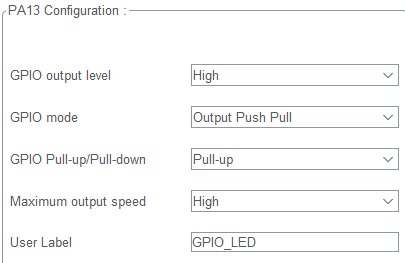
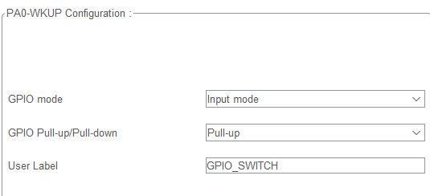

강의 참조

참고 자료

- 데이터 시트
- 레퍼런스
- 회로도 등

## 프로젝트 생성

- CubeIDE에 들어가서 STM32 Project 실행
- 내가 사용할 칩을 선택하고 프로젝트 생성
  - **stm32F103C8** 선택

## Main chip과 ST-link를 연결하고 st usb와 컴퓨터 연결하기

## GPIO 간단히 제어해보기

### IOC모드에서 설정

- System core 옵션의 sys에서 **Debug mode**를 **Serial Wire로 설정**

#### Serial Wire mode: pin을 2개사용

- 적은 개수의 pin을 사용하니 resource를 아낄수 있어 개발자들이 선호

### 코드의 핵심

- 임베디드의 기본 프로그램은 아래 코드 무한루프에서 작동한다.
  - 인터럽트 및 시스템폴트는 제외
  - DMA도 예외

```c
while(1)
{
  HAL_DELAY(100);
}
```

### GPIO를 통한 Pin13과 Pin0를 제어하여 switch로 LED on/off

- ioc모드에서 아래와 같은 옵션으로 설정하고 저장(code generation)한다.
  
  

#### 코드 작성

```c
while (1)
  {
	if(HAL_GPIO_ReadPin(GPIO_SWITCH_GPIO_Port, GPIO_SWITCH_Pin))
	{
		HAL_GPIO_WritePin(GPIO_LED_GPIO_Port, GPIO_LED_Pin, 1);
	}else
	{
		HAL_GPIO_WritePin(GPIO_LED_GPIO_Port, GPIO_LED_Pin, 0);
	}
	HAL_Delay(100);
    /* USER CODE END WHILE */

    /* USER CODE BEGIN 3 */
  }
```
