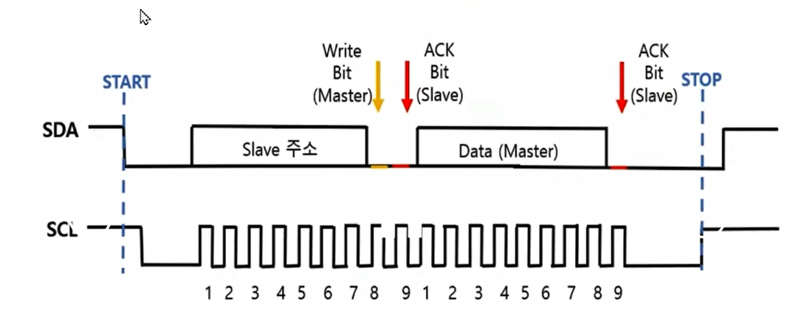

# I2C통신

## 통신의 종류

### 시간 base방식(비동기 방식)

### Clock base방식(동기 방식)

#### SPI

- SCLK, SDA 선 이외에도 **Chip Select(CS선)**이 존재 각 slave장치에 연결되어 통신대상을 지정할 수 있다.

#### I2C

- SPI와는 달리 별도의 CS선이 존재하지 않는 통신방식
- 대신 각 slave들에게 부여된 주소값을 호명하여 cs선 역할을 대신하는 방식
- One-Wire방식에서의 rom-code가 address역할을 하였다.
- 주소호출방식은 바드시 **Master-Slave 관계**로 구성된다.
  - Slave는 오직 Master의 respond 통신만 가능하다.
  - slave는 먼저 Master에게 데이터를 송신할 수 없다.

##### I2C선의 특징

- 8bit씩 data를 송수신(7bit는 주소공간)
  - 7bit의 주소 공간 사용(128종류의 장치 연결가능)
- 400kHz의 전송속도(Fast Mode)
- sleep mode에서 주소 인식
- 동기 방식(CLK으로 동작)
- SCLK, SDA(2가닥선 필요)
- 기본은 High상태

#### I2C 동작 과정

SPI 8bit를 보내는 하나의 Sequence

- clk을 발생하는 주체는 Master이다.
- **Start**: SDA의 값이 `HIGH => LOW`일 때 SCLK을 HIGH상태로 계속 유지
- **신호 읽기**SDA 신호 읽는 구간은 Slave가 데이터를 읽는 구간
  - 파란색 선 구간 8번 반복.
- **통신종료**: 갈색선을 참고하면 SDA의 값이 `LOW => HIGH`일 때 SCLK을 HIGH상태로 계속 유지한다.

#### Write 통신

- Start후 Master가 Slave의 주소(7bit) 전송
- 주소 전송후 Write 통신이면 LOW bit전송 or Read 통신이면 HIGH bit 전송
- Slave가 ACK Bit(LOW State)를 전송하여 Master에게 수신양호 응답

  - if ACK bit가 HIGH이면 수신이 양호하지 않다는것을 의미

- Master가 Slvae에게 8bit의 데이터를 Write 전송한다.
- 그 후 Slave또한 수신양호 Ack bit(LOW)를 전송
- SCLK이 마무리로 HIGH를 유지하면 데이터전송이 끝난다.

#### Read 통신

- SDA선에서 Read 통신 START시 LOW State를 유지한다.
- 7Bit Slave주소를 보낸 후 Read bit(HIGH)를 전송한다.
- Slave가 Ack bit를 전송해 Master에게 수신양호를 알림
- Slave가 Master에게 8bit data전송하여 Read Protocal 수행
- Master가 Slave부터 수신양호의 의미로 NACK bit(High)를 전송
- SCLK을 HIGH로 유지하여 통신 Sequence를 종료

## I2C 설정하기

### GPIO로 I2C 프로토콜 구현하는 방법

### Stm칩 자체에서 제공하는 기능을 사용하여 I2C 프로토콜 구현

## I2C 옵션

### Master Features

#### I2C Speed Mode

- Standard mode
- Fast mode

#### I2C Clock Speed

- Standard mode) 100kHz
- Fast mode) 400kHz

### Slave Features

#### clock no stretch mode

#### Primary address Length selection

- 7 bit or 10bit

#### Dual address acknowledged

- slave address를 2개 사용할 것인가?

#### Primary slave address

- 내 칩을 slave device로 사용시 주소 설정
- Primary slave address must be between 0 and 127.

#### General Call address detection

- all slave device 호출에 응할것인지 설정

## Duty cycle이란?

