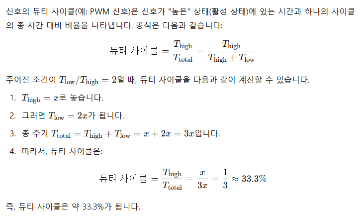
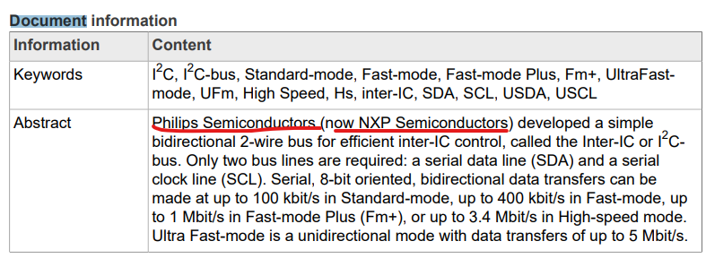

# I2C통신


## 통신의 종류

### 시간 base방식(비동기 방식)

### Clock base방식(동기 방식)

#### SPI

- SCLK, SDA 선 이외에도 **Chip Select(CS선)** 이 존재 각 slave장치에 연결되어 통신대상을 지정할 수 있다.

#### I2C

- SPI와는 달리 별도의 CS선이 존재하지 않는 통신방식
- 대신 각 slave들에게 부여된 주소값을 호명하여 cs선 역할을 대신하는 방식
- One-Wire방식에서의 rom-code가 address역할을 하였다.
- 주소호출방식은 반드시 **Master-Slave 관계**로 구성
  - Slave는 오직 Master의 respond 통신만 가능하다.
  - slave는 먼저 Master에게 데이터를 송신할 수 없다.

##### I2C선의 특징

- 8bit씩 data를 송수신
  - 7bit의 주소 공간 사용(128종류의 장치 연결가능)
  - 나머지 1bit는 Write/read 통신 여부를 결정
- 400kHz의 전송속도(Fast Mode)
- sleep mode에서 주소 인식
- 동기 방식(CLK으로 동작)
- SCLK, SDA(2가닥선 필요)
- 기본은 High상태

#### I2C 동작 과정

SPI 8bit를 보내는 하나의 Sequence


- CLK이 발생하는 주체는 **Master**이다.
- **Start**: SDA의 값이 `HIGH => LOW`일 때 SCLK을 HIGH상태로 계속 유지
- **신호 읽기**: SDA 신호 읽는 구간은 Slave가 데이터를 읽는 구간
  - 파란색 선 구간 8번 반복.
- **통신종료**: 갈색선을 참고하면 SDA의 값이 `LOW => HIGH`일 때 SCLK을 HIGH상태로 계속 유지한다.
- 위 sequence가 8번 반복

#### Write 통신


- Start후 Master가 Slave의 주소(7bit) 전송
- 주소 전송후 Write 통신이면 LOW bit전송 or Read 통신이면 HIGH bit 전송
- Slave가 ACK Bit(LOW State)를 전송하여 Master에게 수신양호 응답

  - if ACK bit가 HIGH이면 수신이 양호하지 않다는것을 의미

- Master가 Slvae에게 8bit의 데이터를 Write 전송한다.
- 그 후 Slave또한 수신양호 Ack bit(LOW)를 전송 ==> **slave의 수신양호 bit는 LOW임**
- 마무리로 SCLK이 HIGH로 올린뒤 SDA가 HIGH를 유지하면 데이터전송이 끝난다.

#### Read 통신


- **Read 통신 START**: LOW State를 유지한다.
- 7Bit Slave주소를 보낸 후 Read bit(HIGH)를 전송
- Slave가 Ack bit를 전송해 Master에게 수신양호를 알림
- Slave가 Master에게 8bit data전송하여 Read Protocal 수행
- Master가 Slave부터 수신양호의 의미로 NACK bit(High)를 전송
- SCLK을 HIGH로 유지하여 통신 Sequence를 종료

## I2C 설정하기

### GPIO로 I2C 프로토콜 구현하는 방법

### Stm칩 자체에서 제공하는 기능을 사용하여 I2C 프로토콜 구현


## I2C 옵션

### Master Features

#### I2C Speed Mode

- Standard mode
- Fast mode

#### I2C Clock Speed

- Standard mode) 100kHz
- Fast mode) 400kHz

### Slave Features

#### clock no stretch mode

- **Stretch mode**

  - 클럭을 LOW로 유지해서 시간을 멈춤

  * Master가 Slave에게 데이터를 읽으려할 때 슬레이브는 데이터 준비하는데 시간이 필요한 경우 사용하는 mode
  * 마스터의 버퍼에 next데이터가 오고있는데 아직 현재 버퍼에 있는 데이터를 읽지 못했을때, 사용하는 mode

- No Stretch Mode: disabled ==> No가 붙었으니 stretch mode를 사용하겠다.

#### Primary address Length selection

- 7 bit or 10bit

#### Dual address acknowledged

- slave address를 2개 사용할 것인가?

#### Primary slave address

- 내 칩을 slave device로 사용시 주소 설정
- Primary slave address must be between 0 and 127.

#### General Call address detection

- all slave device 호출에 응할것인지 설정

# Duty cycle이란?



## Standard Mode와 Fast Mode의 Duty Cycle


## Standard Mode

1:1 비율의 Duty cycle

## Fast Mode

### 1. Duty cycle Tlow/Thigh = 2

- TLow = 2x
- THigh = x
- total = 3x에서
- **Duty cycle**= Thigh / total = x / 3x = 33.3%

### 2. Duty cycle Tlow/Thigh = 16/9

- TLow = 16x
- THigh = 9x
- total = 25x
- **Duty cycle** = THigh / total = 9x/25x = 9/25 ==> 36%

## I2C bus specification & user manual(NXP)


- I2C Fast Mode에서 Low period는 최소한 1.3us를 유지해야한다.
- 400kHz는 1Hz당 2.5us 시간이 필요하다.
- 이상적인 Duty cycle은 1:1 즉, 1.25:1.25로 설정하면 좋으나...
- 사양서를 보면 I2C칩의 Low period는 최소한 1.3us를 유지해야한다.
- 따라서 Fast Mode Duty cycle의 2가지 버전이 나온것이다.
  - **TLOW:THIGH = 2:1 Version** 주기 버전
  - **TLOW:THIGH = 16:9 Version** 주기 버전
  - 2가지 옵션중 어떤것을 고르냐는 slave장치의 스펙에 따라 결정된다.



## I2C통신을 활용한 OLED제어

- 코딩을 통해 OLED로 로고와 Text표현하기
- 관련 Library 가져와서 Porting하기
- 출저: https://controllerstech.com/oled-display-using-i2c-stm32/
- OLED폴더의 INC, SRC 파일들을 포팅하는 과정갖기
  - porting시 hello world까지 출력해보기

```c
  SSD1306_Init();  // initialise
	/// lets print some string
  SSD1306_GotoXY(0, 0);
  SSD1306_Puts("HELLO", &Font_11x18, 1);
  SSD1306_GotoXY(10, 30);
  SSD1306_Puts("  WORLD :)", &Font_11x18, 1);
  SSD1306_UpdateScreen(); //display

  HAL_Delay(2000);
```

### porting시 slave(ssd1306)의 주소값이 맞는지 documnet와 대조해보기

`#define SSD1306_I2C_ADDR         0x78`

- `0x78`의 값은 `0111 1000`

  

- 마지막 bit는 `read/write`를 뜻하므로 일치한다.

## 코드 분석

### uint8_t SSD1306_Init(void)

```c
uint8_t SSD1306_Init(void) {

	/* Init I2C */
	// ssd1306_I2C_Init(); // not anything

	/* Check if LCD connected to I2C */
	if (HAL_I2C_IsDeviceReady(&H_I2C, SSD1306_I2C_ADDR, 1, 20000) != HAL_OK) {
		/* Return false */
		return 0;
	}

	/* A little delay */
	uint32_t p = 2500;
	while(p>0)
		p--;

	/* Init LCD */
	SSD1306_WRITECOMMAND(0xAE); //display off
	SSD1306_WRITECOMMAND(0x20); //Set Memory Addressing Mode
	SSD1306_WRITECOMMAND(0x10); //00,Horizontal Addressing Mode;01,Vertical Addressing Mode;10,Page Addressing Mode (RESET);11,Invalid
	SSD1306_WRITECOMMAND(0xB0); //Set Page Start Address for Page Addressing Mode,0-7
	SSD1306_WRITECOMMAND(0xC8); //Set COM Output Scan Direction
	SSD1306_WRITECOMMAND(0x00); //---set low column address
	SSD1306_WRITECOMMAND(0x10); //---set high column address
	SSD1306_WRITECOMMAND(0x40); //--set start line address
	SSD1306_WRITECOMMAND(0x81); //--set contrast control register
	SSD1306_WRITECOMMAND(0xFF);
	SSD1306_WRITECOMMAND(0xA1); //--set segment re-map 0 to 127
	SSD1306_WRITECOMMAND(0xA6); //--set normal display
	SSD1306_WRITECOMMAND(0xA8); //--set multiplex ratio(1 to 64)
	SSD1306_WRITECOMMAND(0x3F); //
	SSD1306_WRITECOMMAND(0xA4); //0xa4,Output follows RAM content;0xa5,Output ignores RAM content
	SSD1306_WRITECOMMAND(0xD3); //-set display offset
	SSD1306_WRITECOMMAND(0x00); //-not offset
	SSD1306_WRITECOMMAND(0xD5); //--set display clock divide ratio/oscillator frequency
	SSD1306_WRITECOMMAND(0xF0); //--set divide ratio
	SSD1306_WRITECOMMAND(0xD9); //--set pre-charge period
	SSD1306_WRITECOMMAND(0x22); //
	SSD1306_WRITECOMMAND(0xDA); //--set com pins hardware configuration
	SSD1306_WRITECOMMAND(0x12);
	SSD1306_WRITECOMMAND(0xDB); //--set vcomh
	SSD1306_WRITECOMMAND(0x20); //0x20,0.77xVcc
	SSD1306_WRITECOMMAND(0x8D); //--set DC-DC enable
	SSD1306_WRITECOMMAND(0x14); //
	SSD1306_WRITECOMMAND(0xAF); //--turn on SSD1306 panel


	SSD1306_WRITECOMMAND(SSD1306_DEACTIVATE_SCROLL);

	/* Clear screen */
	SSD1306_Fill(SSD1306_COLOR_BLACK);

	/* Update screen */
	SSD1306_UpdateScreen();

	/* Set default values */
	SSD1306.CurrentX = 0;
	SSD1306.CurrentY = 0;

	/* Initialized OK */
	SSD1306.Initialized = 1;

	/* Return OK */
	return 1;
}
```

#### HAL_I2C_IsDeviceReady 장치 준비완료 확인

- 위 함수 내부에 중요한 코드가 있다.

```c
/* Send Slave Address */
 hi2c->Instance->DR = I2C_7BIT_ADD_WRITE(DevAddress);
```


#### Transmitter mode

- DR register에 데이터가 쓰여지면 자동으로(HW가 알아서) 그 데이터는 전송된다.
  - 나의 경우에는 OLED칩에 전송됨

#### Receiver mode

- 수신된 byte는 DR에 복사됨
- 다음 데이터가 오기전에 DR reg를 읽는다면 transmit stream은 유지된다.

#### Slave mode

- DR reg에 address는 저장되지 않는다.

### Command

- 데이터시트 참고

### OLED에 LOGO 삽입
