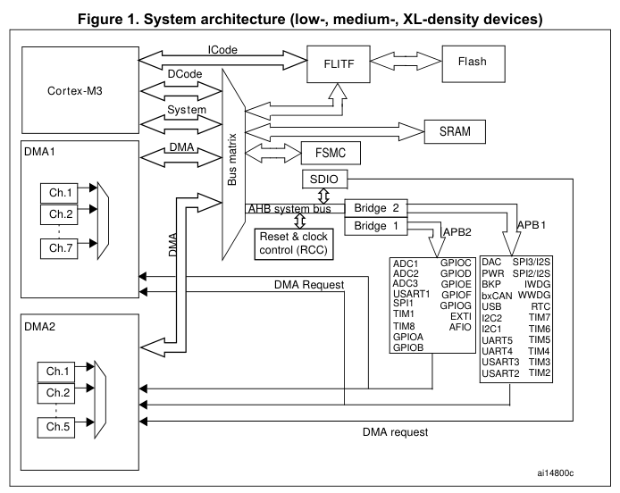
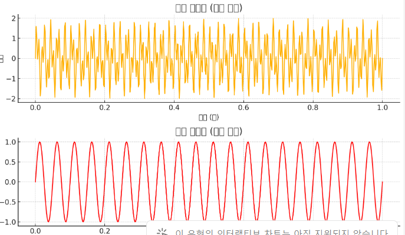

# 사전 지식

## 클럭 속도

장치들마다 클럭속도에 차이가 있다. 따라서 `빠른 클럭 속도` `느린 클럭 속도` 두 그룹으로 분류할 수 있다.

## 전이중 통신

- 두 장치가 동시에 데이터를 주고받을 수 있는 통신 방식
  - 따라서 송수신선 2개 존재
  - `두 개의 독립된 송수신선`을 사용하여 클럭 속도가 다른 장치 간의 신호 `간섭`을 방지

### `다중 통신선`으로 발생하는 문제점

- 여러 장치가 복잡하게 얽히면서 각 장치들간의 `클럭 속도 차이`로 인한 **간섭**때문에 통신 문제가 발생
  - **간섭이란?** 희망 신호 이외의 신호가 외부 방해파로서 신호에 중첩되어 나타난 교란

# System Architecture

# AHB

- **Advanced High-performance Bus**
- **고속 데이터 전송**이 필요한 장치들을 연결하는 `Bus`
- **높은 속도와 대역폭을 제공**(많은 데이터를 빠르게 전송할 수 있다)

- **사용처**: 고속 데이터 전송이 필요한 장치들

  - `메모리(Memory)`, `DMA(Direct Memory Access)`, `고속 주변 장치(Peripherals)`

- **구조**
  - 여러 장치가 동시에 버스를 사용하는 구조(**멀티마스터 구조**)
  - 데이터 전송 효율이 높다.

# APB

- **Advanced Peripheral Bus(주변 장치 버스)**

  - `비교적 저속의 데이터 전송`이 필요한 장치들을 연결하는 버스
  - **AHB 버스**보다 `속도`와 `대역폭`이 낮다.**(상대적인 저속 데이터 전송)**

  - **사용처**: **저속 데이터 전송**이 필요한 장치들
    - **`타이머(Timers)`**, **`UART(Universal Asynchronous Receiver/Transmitter)`**, **`GPIO(General Purpose Input/Output)`** 등이 APB 버스를 통해 연결됨

## Bridge

- `AHB`와 `APB` 같은 서로 다른 속도와 특성을 가진 **버스간의 연결**을 관리하는 장치
- `클럭 속도` 및 `데이터 폭` 등의 두 버스간의 차이를 조정하여 원활한 데이터 전송을 도와줌
  

### Prescaler
입력 클럭 신호를 일정한 비율로 나누어 더 느린 클럭 신호를 생성하는 회로 또는 설정

#### 통신 하고자하는 통신기기들의 속도에 따라 그룹이 나뉘어져 있다는것을 알 수 있다.
