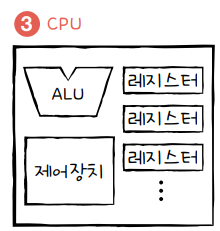

# 임베디드란?
- 특정 기능을 수행하기 위해 하드웨어와 소프트웨어가 결합된 컴퓨팅 시스템 

# CPU (Central Processing Unit)

- 메모리에 저장된 데이터를 읽고 해석 및 실행하는 장치
- `코어 수`, `클럭 속도` 및 `아키텍처`에 따라 성능이 결정됨

#### ALU(산술논리장치): 연산

#### 제어장치: 제어 신호를 통해 컴퓨터 부품을 관리 및 control

#### 레지스터: 빠른 실행을 위한 cpu의 임시 저장장치

#### 아키텍처: CPU의 설계와 명령어 집합(ISA)을 정의하는 방식.

# MCU (Micro Controller Unit)

- cpu, 메모리, I/O port, 타이머 및 인터럽트 컨트롤러 등 같은 주변장치들을 하나의 칩에 통합한 소형 컴퓨터
- 특정 작업을 제어하거나 장치를 구동하는데 최적화

## MPU와 MCU의 차이점
- MCU와 달리 CPU만 포함하고 메모리나 주변장치가 외부에 연결됨