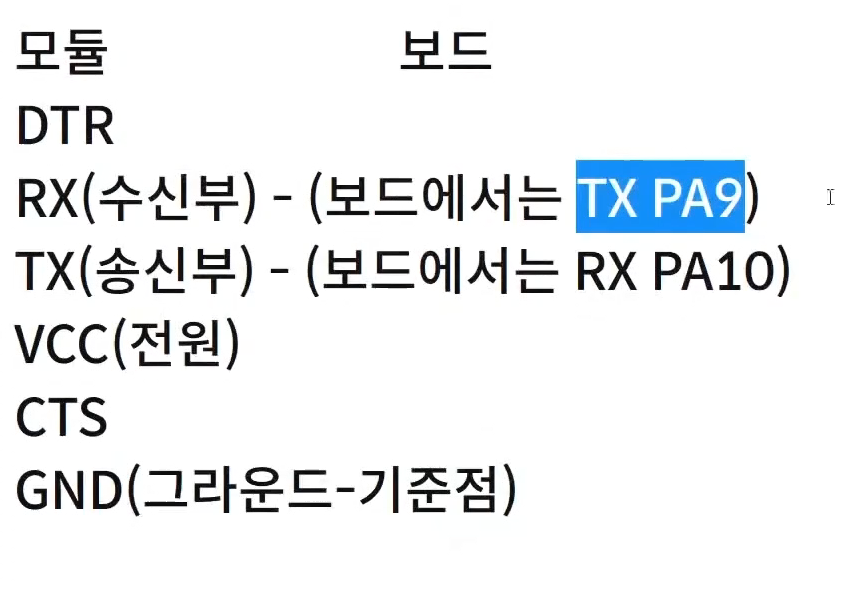
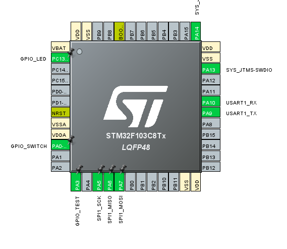
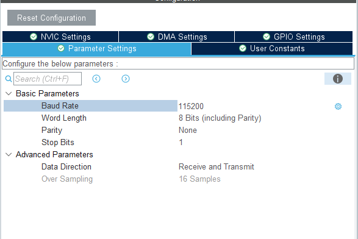
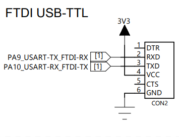
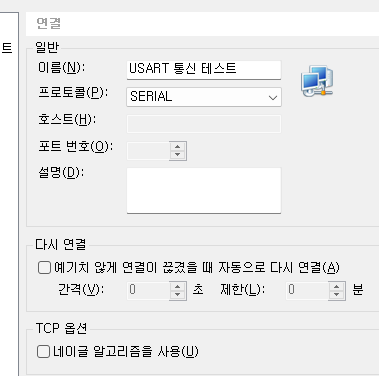
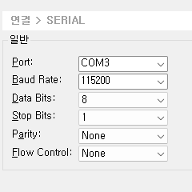
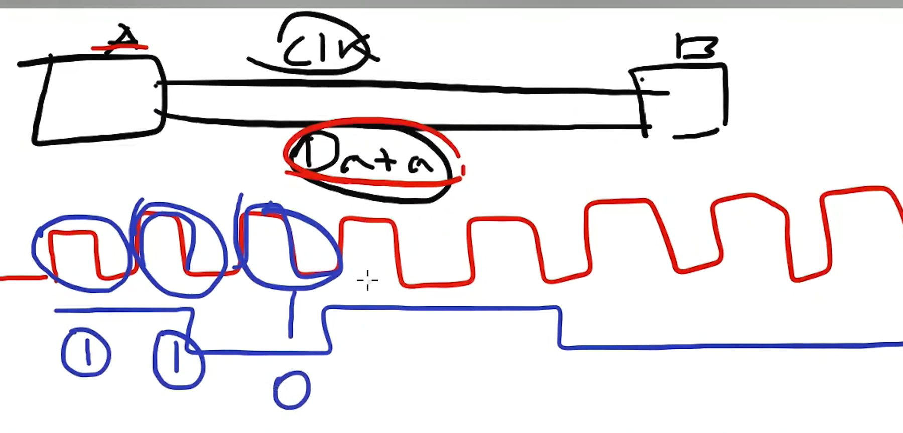
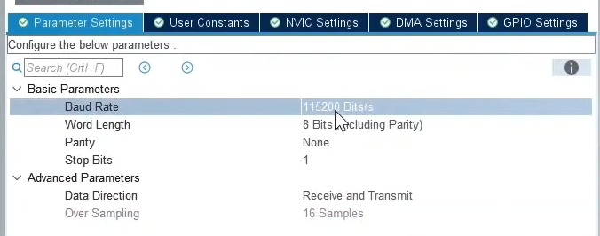
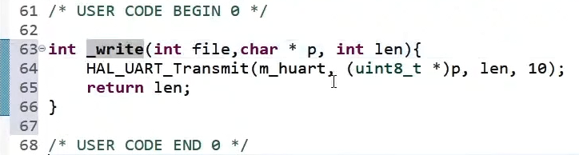
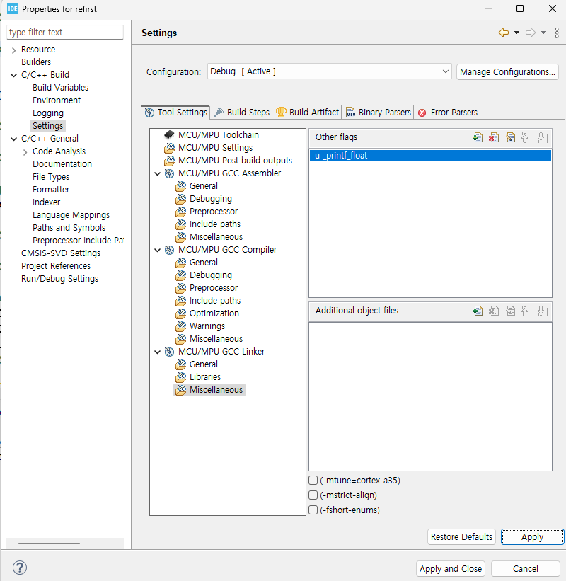

- GND는 송/수신부가 데이터를 전송하는것에 대한 기준점이므로 꼭 필요하다.
- PA9와 PA10을 빵판에 연결

### IOC 모드에서

- USART1 의 Asynchronous 옵션 선택
- Hardware Flow Control은 disable설정
  
- PA10, PA9 pin 2개 활성화
  
- 하위 옵션 설정은 일단 그대로 둔고 저장(Code Generation)

### 빵판과 FTDI 그리고 STM칩을 연결한다.

- GND와 RX,TX 선만 연결한다.
  

### Xshell5를 실행하여

- 세션 생성
  
- Serial 옵션 설정
  
- 위 프로그램은 String만 출력이된다.
- 프로그램 연결 check

#### 역할

- `TX pin`: 모듈이 Data Output
- `RX pin`: 모듈에 Data input
- `GND`: TX/RX 선들에 대한 기준선

### stm32cubeIDE 소스코드 창

```c
char sendData[20] = "Hello World!\r\n";
  while (1)
  {
	// USART print
	HAL_UART_Transmit(&huart1, sendData, strlen(sendData), 1000);
	HAL_Delay(1000);
```

- GPIO에서 하던것처럼 분석해보자

### Description

- stm에서 uart 통신으로 모듈에 데이터를 전송하였다.
- FTDI모듈을 usb로 컴퓨터에 연결하였다.
- 컴퓨터에서는 모듈의 usb로부터 오는 오는 데이터들을 port3(COM3)으로 인식
  - 드라이버로 uart 데이터를 해석한다.ㅁ
  - 모듈을 사용하기 위해서는 드라이버가 있어야하고
  - 드라이버는 pc에 기본적으로 내장되어있다.
- XShell프로그램을 통해 port3을 열고 출력하였다.

#### 옵션 설정에 대한 세부내용은 모드 버스 강의를 통해서 배우기

- 유튜브 참고
- RS485의 이해
- c++을 알아야함

## Serial 통신이란?

- 데이터를 1bit씩 순차적으로 전송하는 방식
- 적은 배선의 개수로 간단히 설치가능
- 병렬통신보다 긴 거리에서 안정적으로 통신이 가능하다.

### 병렬통신

- 시리얼 통신과 대조적으로 여러비트를 동시에 전송함

## Synchronous & Asynchronous

### Synchronous 방식



- 클럭을 기준으로 데이터를 측정
- SPI, I2C 방식

### Asynchronous 방식

- 클럭이 없음
- 시간을 일정하게 쪼개서 쪼갠 시간을 기준으로 데이터를 측정

#### Uart 통신

- asyc(비동기) 통신방식의 일종으로서 시작비트와 정지비트 사이의 시간을 쪼개 데이터를 측정하는 방식

### 옵션 설정에 대한 설명



- 위 그림을 기준으로 옵션에대한 설명을 하겠다.

#### Baud Rate

- Asynchronous 방식에서 사용하는 옵션
- 위 그림은 1초를 115,200개로 쪼갠 상태
- 적게 쪼갤수록 데이터를 보내는 시간이 오래걸린다.
- 너무 많이 쪼개면 데이터 전송시 에러가 발생할 확률이 높다.

#### Word Length

- word: 레지스터에서 처리하는 bit크기 단위
- 한번에 데이터 전송시 8bit단위로 데이터 전송
- 송수신 노드 간의 데이터 비트 설정이 일치하지 않으면 통신이 불가능
- 따라서 8비트로 데이터를 전송할 때 받는 쪽도 동일하게 8비트로 word length를 설정해야함

#### Parity & Stop bits

- 오류를 검출하기 위해서 사용하는 bit
- [모드버스 RS485 부분 참고](../../모드버스프로토콜/시리얼통신과RS485.md)

### pintf 설정하는법

- stm32IDE에서 Printf를 사용할 수 있도록 설정해보자
  

```c
printf(~~~~)
```

- printf시 위 함수가 호출되어 uart출력이된다.
- 분석 ㄱㄱ

### 전역변수로 설정하면 실시간으로 debug mode live expression에서 변수의 값을 실시간으로 확인할 수 있다.

### live expression 실수 값 나타내기



### 정리

- uart통신은 Serial 방식으로 통신한다.
- 한번에 1bit씩 직렬로 데이터를 전송하되 8bit(옵션에서 조정가능)씩 한꺼번에 전송한다.
- 비동기 방식이므로 clk대신 시간을 쪼갠 단위(BPS)를 기준으로 데이터를 프레임을 전송한다.
