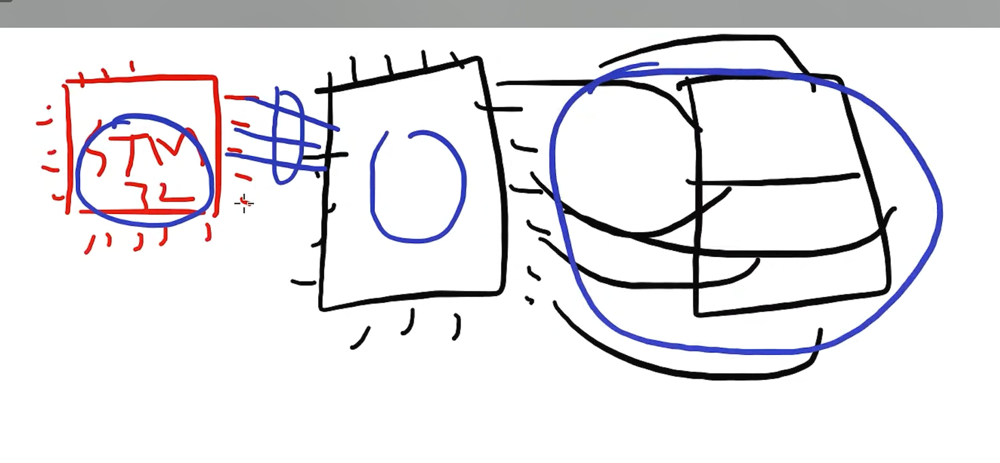
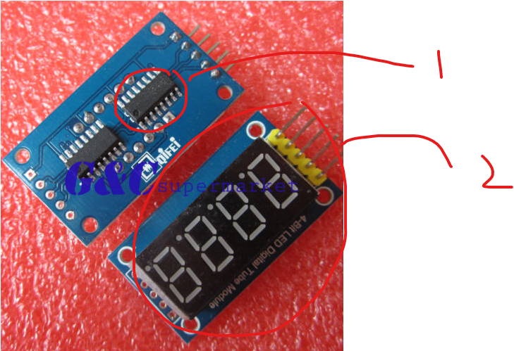
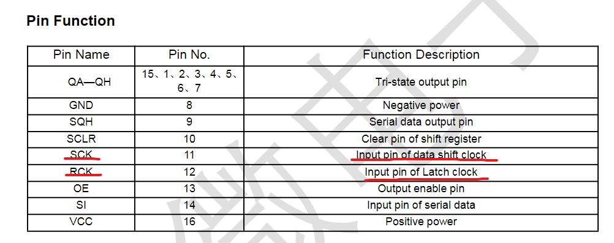
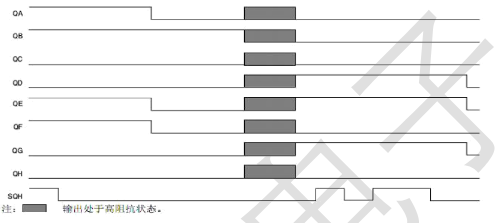
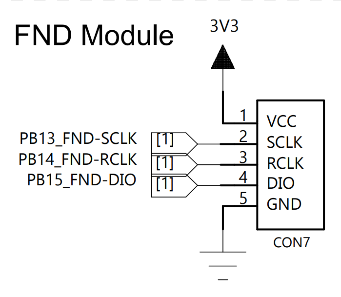

# FND제어

- FND란? 7segment의 다른 이름
- TM74HC595를 제어해보자(fnd모듈 이름)
- 모듈 = 메인칩(TM74HC595) + 필요한 최소한의 회로

## 제어 방법



- stm32칩과 7segment(FND )를 직접적으로 GPIO연결을 하면 너무 많은 pin을 사용하게된다.
- 따라서 중간에 LCD 드라이버칩을 사용해서 stm32의 적은 pin의 개수로 7segment를 제어할 수 있다.
- 즉, 메인칩에서 최소한의 필수적인선만 사용하고 중간 LCD드라이버를 사용해 4개의 7segment로 이뤄진 fnd모듈을 제어할 수 있다.

## 데이터시트

필요한 데이터시트는 2가지이다.


### 1. TM74HC595

- 중요한 키워드 **Standard SPI**
  
- TM75HC595(lcd 드라이버)와 7segment led들에 연결된 선들의 명칭(QA~QH)
  
- 1p 해석 (나중에 능력이된다면)

* QA~QH가 FND어디에 어떻게 연결됐는지 알아내는 방법
  - 1. 멀티테스터기를 사용해서 쇼트테스트를 통해 연결관계 파악
  - 2. 샘플코드를 구해서 일단 동작시키고... 그 다음에 추리를한다.(제일 빠른 방법)
    - tm74hc595 sample code 참조
  - 3. 모듈 데이터시트를 정독해서 해당 정보를 알아내기

### 2. 모듈에 대한 데이터시트

# Sample 코드 분석하기

## 1. sample코드 분석하기전에 FND Module회로도를보고 빵판에 pin부터 연결하기



## 2. IOC모드에서 SCLK, RCLK, DIO pin 옵션 설정

- STM32에서는 SPI통신을 자체적으로 지원해준다.
- 하지만 지금은 GPIO 3개를 통해 CLK, DIO 통신들을 인위적으로 구현할 것이다.
- 강의 기준말고 회로도 기준으로 옵션설정 및 빵판 구성

## 3. SAMPLE코드 Porting 및 분석하기 (cpp, h)

[TM74HC595 사용예제](https://blog.naver.com/boilmint7/221442725896)

- stm32IDE의 fnd_controller.c or .h 참고

### send(uint8\_ x) 함수

- cpp코드 c코드로 변환
- C++코드

```c++
void TM74HC595Display::send(unsigned char X)
{

  for (int i = 8; i >= 1; i--)
  {
    if (X & 0x80)
    {
      digitalWrite(_DIO, HIGH);
    }
    else
    {
      digitalWrite(_DIO, LOW);
    }
    X <<= 1;
    digitalWrite(_SCLK, LOW);
    digitalWrite(_SCLK, HIGH);
  }
}
```

- c코드로 변환 + HAL드라이브 사용

```c
#include "fnd_controller.h"

void send(uint8_t X)
{
	for (int i = 8; i >= 1; i--)
	  {
	    if (X & 0x80)
	    {
	      HAL_GPIO_WritePin(FND_DIO_GPIO_Port, FND_DIO_Pin, HIGH);
	    }
	    else
	    {
	    	HAL_GPIO_WritePin(FND_DIO_GPIO_Port, FND_DIO_Pin, LOW);
	    }
	    X <<= 1;
      // 데이터시트를 참고해서 시작 bit가 HIGH이므로 LOW-HIGH 주기 작성
	    HAL_GPIO_WritePin(FND_SCLK_GPIO_Port, FND_SCLK_Pin, LOW);
	    HAL_GPIO_WritePin(FND_SCLK_GPIO_Port, FND_SCLK_Pin, HIGH);
	  }
}
```

- 헤더파일 `fnd_controller.h`

```c++
#ifndef SRC_FND_CONTROLLER_H_
#define SRC_FND_CONTROLLER_H_

#include "main.h" // GPIO Port, Pin define문을 사용하기 위함

#define HIGH 1
#define LOW 0

#endif /* SRC_FND_CONTROLLER_H_ */
```

- Data를 총 8번 보내는것을 알 수 있다.
- Data한번 보낼때마다 클럭이 한주기 움직이는것을 볼 수 있다.
- 데이터시트를 보고 SCLK 시작 state(Default State)를 확인하여 LOW-HIGH를 할건지 HIGH-LOW로 할건지 판단할 수 있다.

### send(uint8_t X, uint8_t port) 함수

```c++
void TM74HC595Display::send(unsigned char X, unsigned char port)
{
  send(X);
  send(port);
  digitalWrite(_RCLK, LOW);
  digitalWrite(_RCLK, HIGH);
}
```

- c문법으로 변환시 c++과 달리 인자의 개수차이 만으로는 똑같은 함수 이름을 사용할 수 없다.

```c
void send_port(uint8_t X, uint8_t port)
{
  send(X);
  send(port);
  HAL_GPIO_WritePin(FND_RCLK_GPIO_Port, FND_RCLK_Pin, LOW);
  HAL_GPIO_WritePin(FND_RCLK_GPIO_Port, FND_RCLK_Pin, HIGH);
}
```

### 나머지 함수도 변환

- stmIDE에서 알아서 코딩
- c언어에는 `bool` 타입이 없으므로 그냥 `uint8_t`사용
  - 어차피 1 or 0 구분 용도
- 이름 겹치는 함수 적절한 조치

### fnd_controller.c, fnd_controller.h 작성하기

### main.c에 적용해서 fnd사용하기

```c
// main.c
#include "fnd_controller.h"

int main(void)
{
  init_Led_Display();

  while (1)
  {
  	for(int i = 0; i<=99; i++)
  	{
  		digit2(i, 0b0001, 50);
  	}

  }

}

```

#### 디버깅 및 오류 검사 그리고 사이트 참고해서 다양하게 실습해보기

[TM74HC595 사용예제](https://blog.naver.com/boilmint7/221442725896)

#### 발생 Issue

1. 중복 함수 선언
2. 중복 배열 선언 `_LED_0F[]`

- 헤더파일에 선언시 변수의 경우 `extern` 키워드를 사용한다.

#### 복습시 완성코드 폴더 참고
