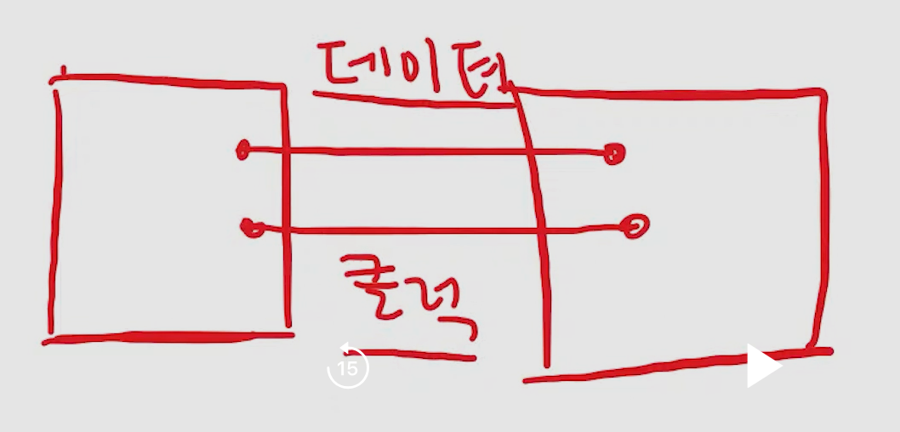
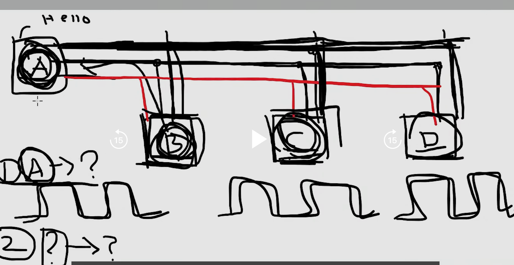
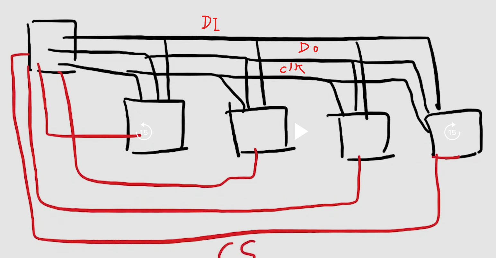

# SPI (Serial Peripheral Interface)

- 근거리에서 많이 사용
- 2개의 부품 사이에서 데이터를 주고받는 통신 방법
- 기본적으로 2가닥으로 데이터 통신을 한다.
- 전압차이 이용
  

## SPI 통신 측정 기준

- CLK을 기준으로 데이터 신호를 측정

## 반이중 방식

- CLK선, DI/O선 2개로 구성
- 두 부품 사이에서 동시에 신호를 보내면 신호 간섭이 일어나기 때문에 문제가 발생한다. 따라서 두 부품이 신호를 송수신하는 규칙(순서)를 정해야한다.

## 전이중 방식

- CLK, DIO, DIO(3가닥으로 구성)
- 두 부품 사이에 Data Input/output 선 2개를 두어 신호의 간섭을 방지
- **SPI통신은 전이중 방식이 기본이다.**

## 1대 다중 통신 방식

### 문제점

#### 송신 노드가 무엇인지 알 수 없을 때

- Master와 Slave 관계를 정의
- **Master**: 신호를 송신하는 주체
- **Slave**
  - 신호를 송신하는 권한이 없음
  - 무조건 신호를 수신하고 응답
- 기본적으로 SPI 1대 다중 통신에 있어서 Master는 1개로 고정된다.
  - Master가 여러개면 신호 간섭이 일어나서 혼란이 일어나기 때문

#### 수신 노드가 무엇인지 알 수 없을 때

- Master가 누구에게 신호를 보내는가?
- 선 한가닥을 더 사용해서 해결
- **CS(Chpi Select)선 사용**
- 보통 GPIO옵션으로 사용하는데 평상시에는 High 상태로 있다가 Master가 보내는 chip에 한하여 Low 상태로 낮춰준다.
  - 이 방식은 Master가 한번만 신호를 보내도 여러 Slave 소자들이 동시에 수신이 가능하다.
  - 즉, Master가 B, D에게만 신호를 보내고싶다면... 해당 노드에 연결된 CS선의 State를 Low로 낮추면된다.

### SPI 통신에서는 기본적으로 선이 4종류이다.(CLK, DI, DO, CS)

#### 참고로 I2C는 DI/O. CLK 선 2가닥만 사용(반이중 방식)하는데도 1대 다중 통신이 가능하다. 그 이유는 CS선을 사용하는 대신 Software적으로 다중통신이 가능하게 설계했기 때문이다.

- ex) 에초에 데이터를 송신할 때 패킷에 수신 노드의 주소를 포함해서 송신한다.
