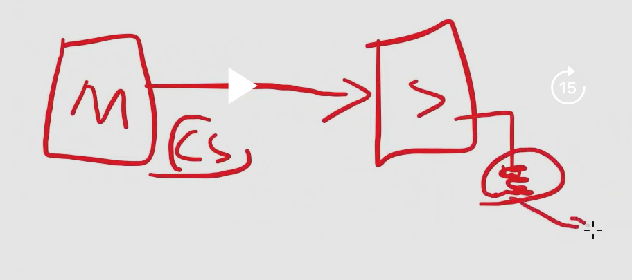

# STM32F103C8Tx 칩에서 지원하는 SPI 통신 알아보기

- 기본적으로 이 칩은 SPI를 2개 지원한다.

## 용어 파악하기

### MISO

- **Master Input Slave Output**

### MOSI

- **Master Output Slave Input**
- Mater가 신호를 보내는 전용선

## IOC의 SPI Mode

### Full-Duplex: 전이중 (CLK, DI, DO)

### Half-Duplex: 반이중 (CLK, DI/DO)

### Receive only: 수신 전용 (CLK, DI)

### Transmit only: 송신 전용 (CLK, DO)

## Hardware NSS Signal

- CS를 어떻게 컨트롤할것인가?
- 송신 대상 노드에 데이터를 전달할 때 연결된 CS선을 LOW로 떨어트린다.
  - 따라서 각 SLAVE역할의 노드에는 Master로부터 CS선 각각 1쌍식
    연결되어야 온전한 CS역할을 할 수 있다.
  - 그리고 CS선은 상시 HIGH State에 있는 상태이다.
  - NSS선 한개를 2개의 SLAVE로 연결하면 **Chip Select**의 역할을 수행할 수 없다.
    
    - 다시헌번 언급하지만 nss선은 M-S 쌍당 1개씩 존재해야 온전한 역할을 수행한다.ㅋ
- **즉, Hardware적으로 CS선을 사용하는 건 선 한개당 Master와 Slave 관계가 1:1이라는 것이다!**
- 실무에서는 잘 사용하지 않는다. 그냥 GPIO를 다루는게 더 편하다.

  ### Software Type: GPIO를 사용

  ### Hardware Type: hw CS선 사용

## Parameter Settings

### Frame Format : Motorola(SPI 통신을 최초로 설계한 회사)

### 데이터시트를 보고 Data Size를 선택할 수 있다.

- 한번에 몇 bit씩 보낼것인가?

### First Bit

- MSB: Max bit부터 시작
- LSB: Last bit부터 시작(0 bit부터)

### Clock Parameters

#### Prescaler: 클럭 속도를 일정 비율로 나눠줌

- 데이터시트를 보면 해당 칩의 속도제한이 있는데 Prescaler로 그 속도가 넘어가지 않게끔 조절할 수 있다.

#### Baud Rate: 클럭 속도

#### Clock Polarity(CPOL)

- 극성
- CLK이 (시작점)default로 Low 상태인가 High 상태인가?
- Master노드와 Slave노드가 서로 CPOL이 다르면 통신이 불가능한것을 알 수 있다.
  - 이는 MSB, LSB여부도 마찬가지이다.

#### Clock Phase: 어느 시점에 데이터를 측정하는지에 대한 설정

#### NSS Signal Type

- Software 옵션은 GPIO를 사용하겠다라는 의미

### Master에 연결된 Slave가 하나밖에 없는 경우

- 굳이 CS선을 사용할 필요가 없는상황
- 위 그림처럼 회로를 구성하여 CS선을 아예 LOW로 만들어 버린다.
  - 항상 Listening상태로 설정

### Quad SPI

- Data Input/ Data Output으로 4가닥 사용

1. Half Duplex: 반이중 방식
2. Full Duplex: 전이중 방식
3. Squad 방식: DI/O선을 4개 사용

---

1. 별도의 CS선을 두는 방식
2. CS선을 chain형태로 묶어서 software를 사용해 처리하는 방식
