> ### 학습목표

- 내가 모르는것을 어떻게 학습할까?
- 1 Wire 방식으로 온도 센서 정보를 가져오는 방법

### 내가 모르는 것을 어떻게 학습하는가?

#### 1. 1-Wire 통신 방식을 몰랐을 때

- 1-wire 통신이 일반적인 통신방법인지 확인한다.
  - 유명한 통신 방법은 100% library가 존재한다.
- 만약 그렇다고 한다면 stm32에서 사용하는 1-wire통신 라이브러리를 찾아서 Porting... 사용한다.
- 그 다음에 그 통신방식에 대해 공부한다.
  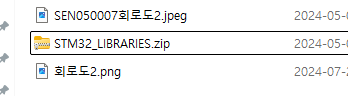

#### 2. 위 라이브러리는 TM라이브러리이기 때문에 충돌이 일어난다.

- HAL과 TM은 동시에 사용할 수 없다.
- TM을 HAL로 전환해야 한다.
- [참고사이트](https://github.com/nimaltd/ds18b20) 해당 사이트를 참고하여 TM라이브러리를 HAL라이브러리로 전환하자

### 1-wire통신이란?

**dallas Semiconductor corp**에서 만든 통신 방식

- maxim 1-wire 버스를 사용하면 선 하나로 통신이 가능
- 신호선으로 전원 공급까지 가능
- 선1개로 데이터 송수신이 가능하다
  => **1-wire 통신 MCU는 GPIO의 `출력모드`와 `입력모드`를 번갈아가며 사용**한다.

### 일단 fnd를 GPIO로 control한 지점에서부터 환경설정

#### 용어 공부

##### 포팅이란

- 이식
- 소프트웨어를 다른 플랫폼(CPU 및 운영 체제)에서도 동작할 수 있도록 변환하는 것

## 라이브러리 Porting

### file porting

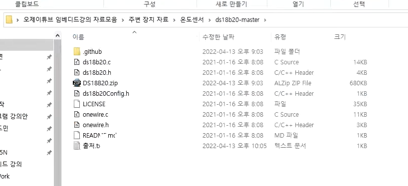

- 위 폴더에서 파일을 복사하여

  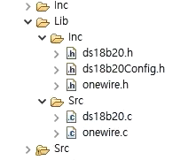

- 위 그림처럼 파일구조 만들기

### Compile하여 error 잡기

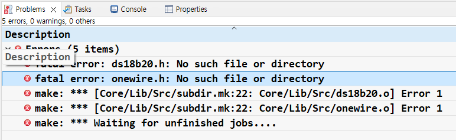

#### Include File 경로 지정

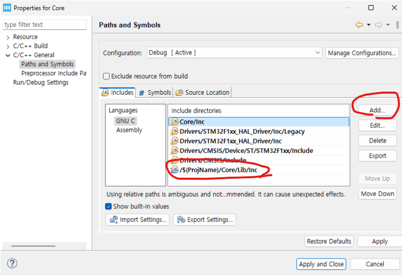

#### 나머지 err 고치기

- 다시 디버깅
  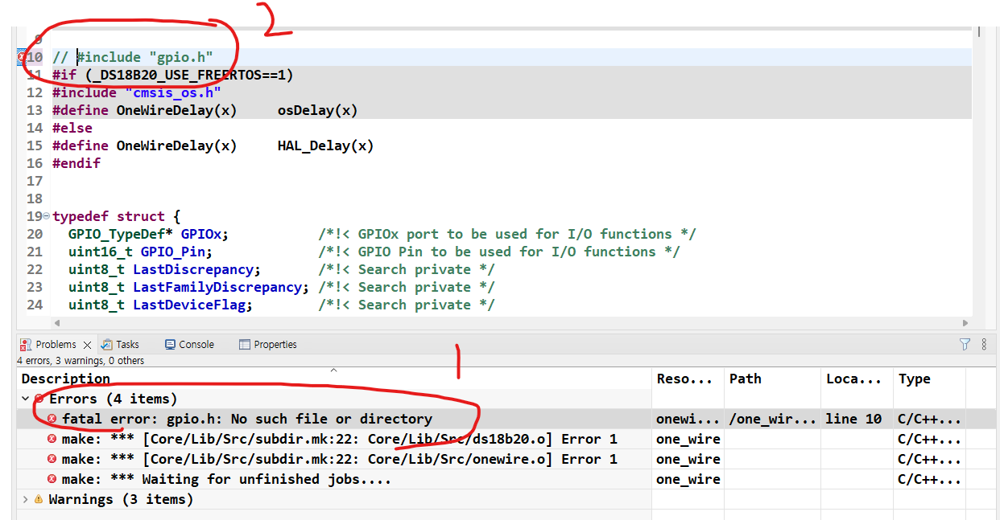

- gpio.h 파일이 없으므로 주석처리하면... 아래와 같이 여러에러가 다시 생긴다.

  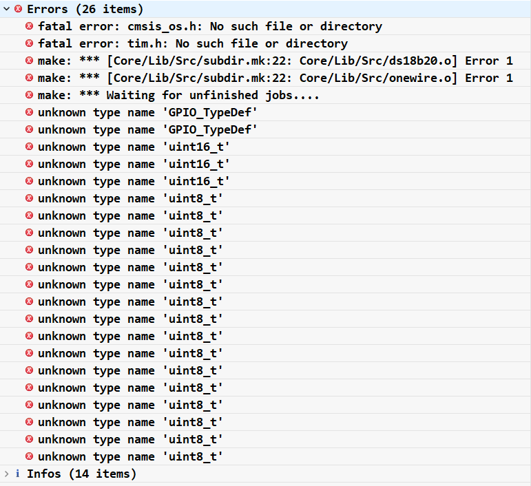

- `uint8_t`, `uint16_t`은 `main.h`를 Include하면 간단히 해결
- 대부분의 error가 사라지고 아래와 같은 err만 남음

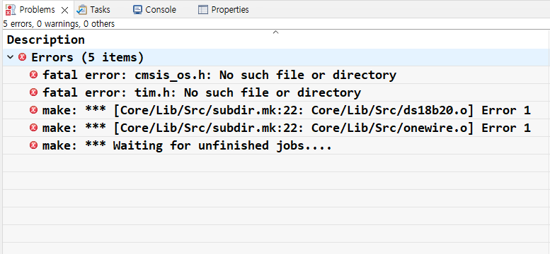

- 나는 `cmsis_os.h` 파일을 갖고있지 않다.
- 이 때 코드를 보면

```c
#if (_DS18B20_USE_FREERTOS==1)
#include "cmsis_os.h"
#define	Ds18b20Delay(x)			osDelay(x)
#else
#define	Ds18b20Delay(x)			HAL_Delay(x)
#endif
```

-`DS18B20_USE_FREERTOS`의 값이 1 즉, FREERTOS를 활성화 할 때 `cmsis_os.h` 파일을 include해야하는 것으로 보인다.

- 하지만 해당 라이브러리를 제공해준 사이트에가면 나는 FreeRTOS는 활성화하지 않아도 된다고 한다.
  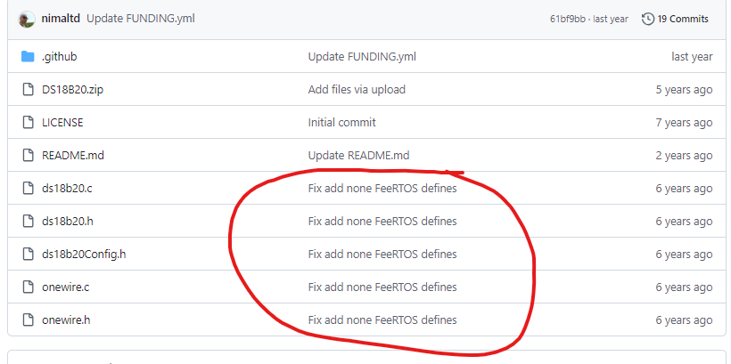

- `DS18B20_USE_FREERTOS`의 값을 0으로 비활성화하고 디버깅
- `else`문에 따라 osDelay(x)에서 HAL_Delay(x)사용으로 변경
- `tim.h`도 없기 때문에 주석처리 해주자

- 새로운 err가 생겼다.

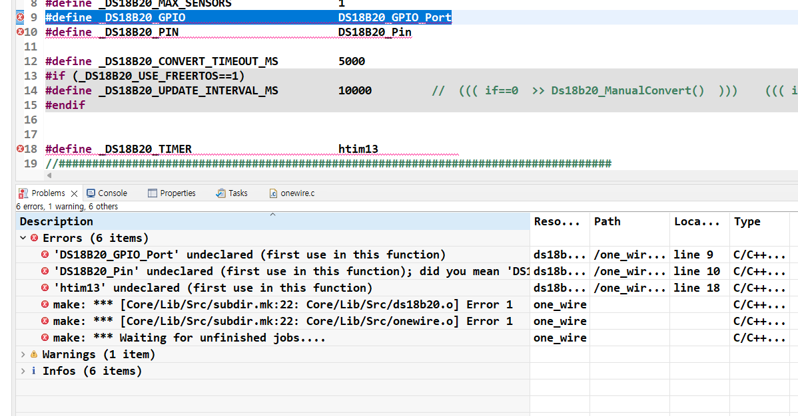

##### err 1: DS18B20 GPIO setting이 필요하다.

- 데이터시트에 나와있는데로 GPIO를 setting해준다.

  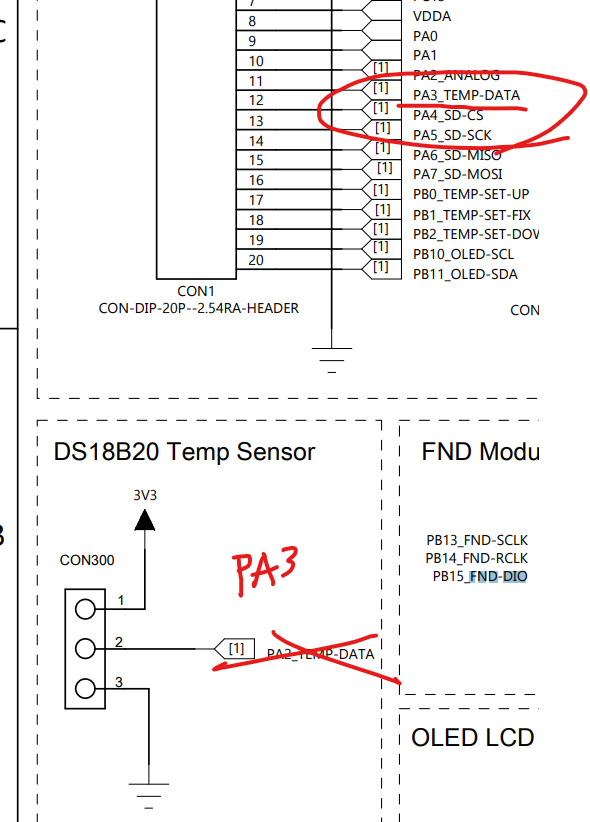

  - IOC mode에서 PA3 pin에 대한 GPIO 옵션을 설정해주고
  - DS18B20d에 대한 GPIO Port, Pin값을 수정해준다.

##### err 2: Timer를 사용할 수 있도록 옵션 setting이 필요하다.

- `htim13` 핸들러가 없기때문에 타이머 핸들러를 새로 만들어줘야한다.

  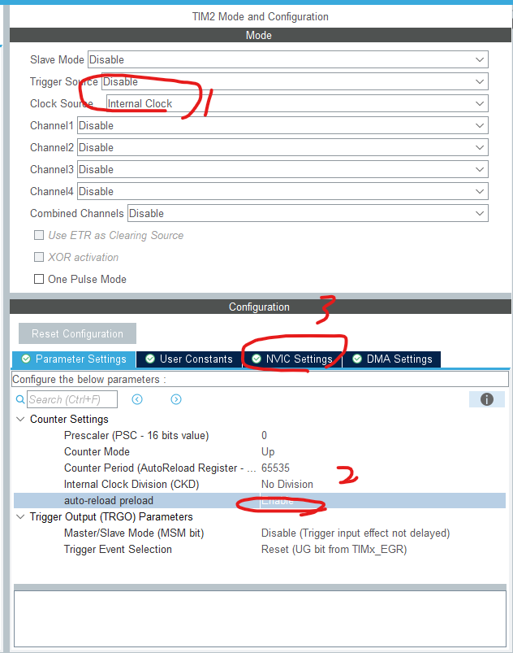

- 1, 2, 3번 순서대로 옵션 설정(3번은 Interrupt 사용으로 옵션 체크)
- save & code generation
- ` htim2` timer 핸들러가 글로벌 변수로 `main.c`에 선언됨
- 생성된 htim2 핸들러를 가져와서 수정
- 최종 수정 상태 & 수정완료
  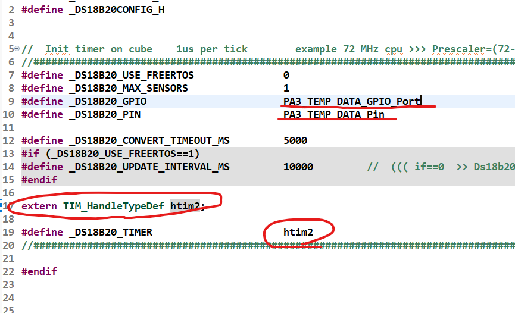

### 타이머 옵션 개념

- 일단 ds18b20 library를 제공해준 사이트에 의하면
  - (온도설정 1-wire chip stm32에 porting library)
- Config a GPIO and a timer on CubeMX. 1us per tick example 72MHz >>>
  - Prescaler = (72-1) counter
  - period = 0xFFFF
  - 와 같이 setting하라고 한다.

#### 타이머 옵션 개념

- 클럭 주파수, Prescaler, Counter Period가 서로 상호작용하여 원하는 시간마다 인터럽트를 발생시키는 것을 목표
  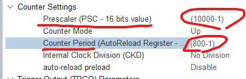

#### 1. Prescaler

- 클럭 신호를 나누는 역할
- Prescaler가 `10000-1`로 설정되었다면 10000개의 clk 신호마다 타이머 Counter값이 1개 증가
- 원래 클럭 주파수가 8MHz일 때 Prescaler값인 1만으로 나누면 타이머의 주파수가 800Hz가 된다.
- 즉, Prescaler = (10000-1)의 의미는 >>> 8MHz를 800Hz로 줄이는 역할
  - 타이머 카운터는 800Hz로 동작한다.
  - Prescaler에 의해 1초에 8MHz가 아닌 800Hz가 됨

#### 2. Counter Period

- 카운터가 몇 번 증가해야 인터럽트가 발생할지를 정의

if) Counter Period = (800-1) 이라면

- 타이머 카운터는 0~799까지를 한주기로 Interrupt가 발생한다.

#### 예시1 ) 800MHz를 1초마다 Interrupt를 발생시키려면???

1. Prescaler에 의해 클럭이 800Hz로 줄어들게된다.
2. Counter Period = (800-1)

- 800번의 타이머 카운트를 의미
- 1s/800Hz 동안 카운터가 800번 증가
- **즉, 800Hz 주파수에서 800번동안 timer count가 증가하면 1초가 지나고 Interrupt가 발생된다.**

#### 예시2 ) 타이머로 2초마다 LED를 깜빡이게 하려면?

- **클럭 주파수**: MCU의 클럭은 16MHz입니다.

  - 즉, 1초에 16,000,000번 클럭이 발생합니다.

- **프리스케일러(Prescaler)**
  - 프리스케일러 = (16000-1) 으로 설정하면
  - 16MHz 클럭이 1kHz(즉, 1000Hz)로 줄어듭니다.
  - 이제 타이머의 카운터가 **1us(0.001초)**마다 1씩 증가합니다.
- **카운터 주기 설정 (Counter Period)**
- 2초마다 타이머가 인터럽트를 발생시키게 하고 싶을 때
- 현재 타이머는 1us마다 카운터가 1씩 증가
- 따라서, 2초 동안 1ms마다 증가하려면, 타이머는 2000번 카운터를 증가해야 합니다.
- **카운터 주기(Counter Period)**를 2000으로 설정하면, 1us마다 카운터가 증가하여
- 2초에 한 번 카운터가 2000에 도달하고, 그때 인터럽트가 발생합니다.

**결론**

- **Prescaler = (16000-1)** => 클럭 주파수를 16MHz에서 1kHz로 줄임(1us마다 타이머가 한 번씩 카운터 1씩 증가).

- **Counter Period = 2000**) 카운터가 2000에 도달할 때 인터럽트 발생(2초에 한 번).

#### 예시3 ) 0.5초마다 LED 깜빡이기

- **클럭 주파수 16MHz**
- **Prescaler** = (16000-1)으로 설정 ==> 1kHz로 줄임 ==> 1us마다 counter값 1씩 증가
- **Counter Period = 500** ==> 0.5초마다 LED를 깜빡이는 Interrupt를 발생시키기위하여 값을 500으로 설정

#### 타이머 옵션 개념 실습1

8MHz를 Prescaler를 통해 10000으로 나누어서 Counter Period를 800으로 설정해서 1초마다 인터럽트를 발생시켜보자

- 1. interrupt 파일에 가서 멤버 타이머 변수를 선언한다.
     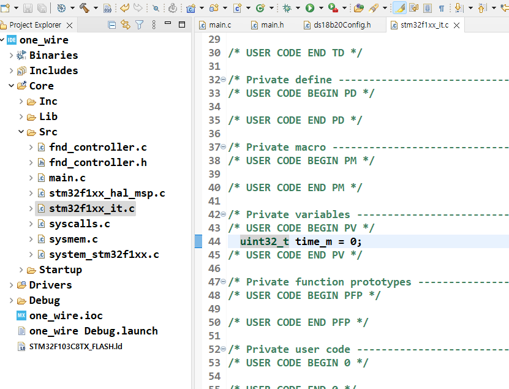
  - 그리고 타이머가 울릴때마다 1씩 값을 증가시킨다.

```c
void TIM2_IRQHandler(void)
{
  /* USER CODE BEGIN TIM2_IRQn 0 */
	time_m++;
  /* USER CODE END TIM2_IRQn 0 */
  HAL_TIM_IRQHandler(&htim2);
  /* USER CODE BEGIN TIM2_IRQn 1 */

  /* USER CODE END TIM2_IRQn 1 */
}
```

- 2. 타이머가 동작하기 위해서 `MX_TIM2_Init();` 함수가 호출된 후에 Counter를 start를 해야한다.
     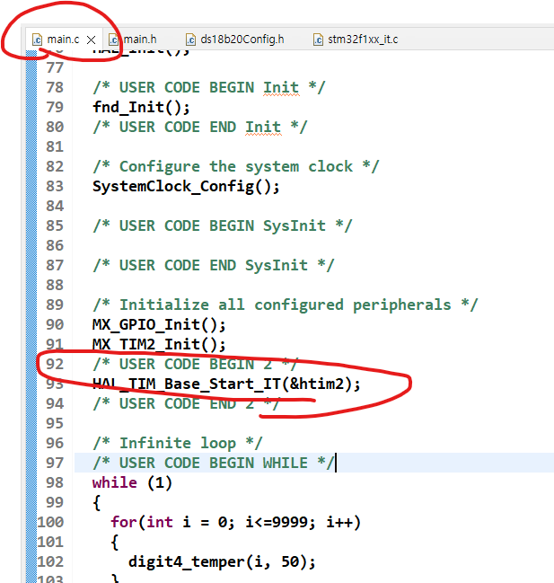

  - 위 **HAL드라이브** 함수를 호출하여 `타이머 카운터`와 `인터럽트`를 시작한다.

- 3. 결과
     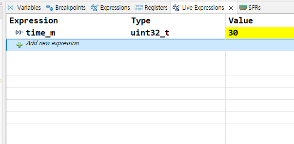
  - 1초마다 타이머 값이 1씩 증가함을 알 수 있다.

#### 타이머 옵션 개념 실습2

- 1us per tick 단위로 interrupt를 발생시켜보자
  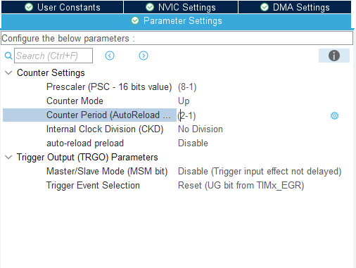
- main코드는 그대로

### library 작성자가 요구한 timer 옵션값 설정

1. ~~Enable FreeRTOS~~
2. **Config a Gpio and a timer on CubeMX . 1us per tick example 72 MHz cpu >>> Prescaler=(72-1) counter period=0xFFFF**
3. Select "General peripheral Initalizion as a pair of '.c/.h' file per peripheral" on project settings.
4. Config your ds18b20Config.h file.
5. call Ds18b20_Init(osPriorityNormal) on your app.
6. You can see result on debug . watch : ds18b20.

#### 현재 나의 Clock Configuration 옵션상태는 8MHz cpu이므로 >> Prescaler=(8-1), `counter period`=0xFFFF으로 설정

#### ioc모드의 Clock Configuration 옵션에서 8MHz cpu를 72MHz로 바꾸고 위 라이브러리 제공자가 설정한 값 그대로 재현해보기

- 내부 clock으로는 72MHz를 설정할 수 없으므로 외부클럭을 사용한다.
  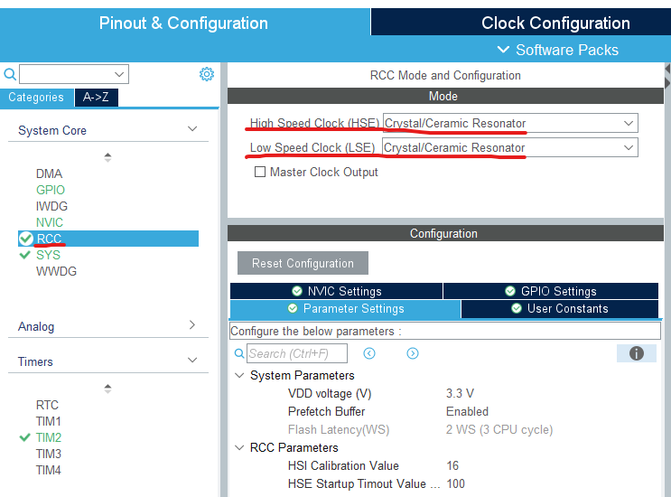
- 위 같이 설정하면 아래 그림의 외부 클럭이 활성화된다.
  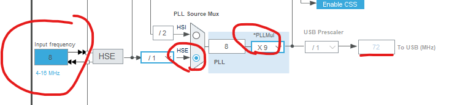

  - 고속 버스옵션으로 72MHz를 맞춰준다.

- 이제 라이브러리 제공자의 옵션데로 설정이 가능하다.
  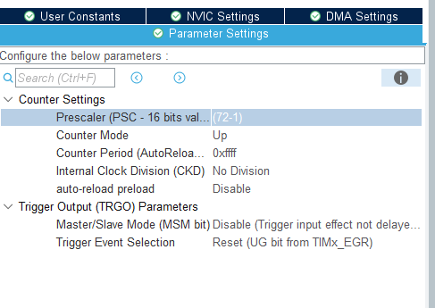

- **counter period**를 0xFFFF로 설정한 이유
  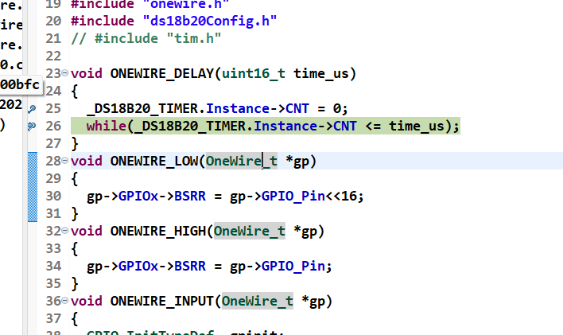
  - time_us 값은 480으로 고정되어 있다.
    - (참고로 time_us값이 480인 이유는 ctrl+h로 추적하면 나옴)
  - 근데 0xFFFF가 아닌 480 이하의 숫자를 넣으면 위 코드대로 무한루프에 빠지게된다.
  - 따라서 안전하게 16진수 0xFFFF 넣은것
  - time_us값은 옵션에서 설정한 counter_period값인걸 알 수 있다.

### Library를 사용하는법

5. **call Ds18b20_Init(osPriorityNormal) on your app.**

- Ds18b20_Init(osPriorityNormal)을 호출하라
  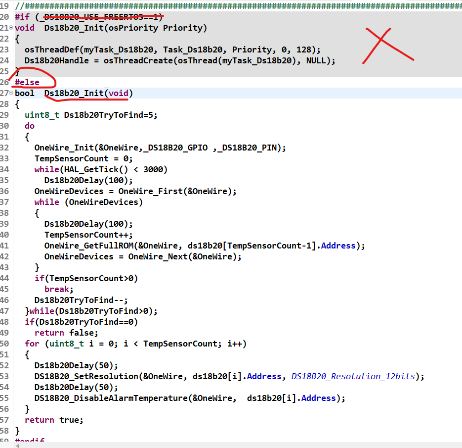
- \_DS18B20_USE_FREERTOS를 비활성화 했으므로
- bool Ds18b20_Init(void) << 이것을 호출한다.

### 머리가 너무 복잡해서 나머지는 나중에 정리하기 8분남은 시점부터
