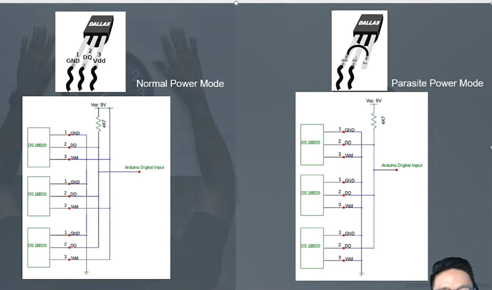

> ### **모드것을 새롭게 공부할 때 고려해야 할 점**
>
> - 어디서 사용할까?
> - 왜 사용할까?
>
> #### 프로토콜 문서를 만들어 정리해보자
>
> #### POE 시스템이 무엇일까?
>
> - power 선을 lan선에 담아서 보내는 구조 (UTP케이블)

### 1-Wire 통신의 장점

- **딱 두선으로만 전원공급과 데이터 통신이 가능**하다.
  - 적은 개수의 선을 사용하기 때문에 복잡도가 낮다.
  - 또한 비용이 적게든다. ==> 장거리 통신에서 전선을 적게 사용한다는 것은 어마어마한 장점이다.

## 1-Wire 통신의 2가지 모드

### Normal Power Mode

- 신호선(DQ)과 전원 공급선이 연결되어있다.
- GND선 끼리만 따로 연결되어 구분되어있다.
- 전원선과 연결된 DQ선은 최종적으로 stm32 main chip과 연결된 상태이다.

#### Parasite Power Mode

- 5V 전원선이 DQ(신호선)에만 연결되어있다.
- GND와 Vdd가 묶여서 접지로 연결되어있다.
  - 그림을 보면 서로 묶여있는걸 볼 수 있다.

#### 위 구조를 보면서 알 수 있는것들

1. 장거리에 불리(노이즈에 약하다.)

- 선이 길어질수록 전압이 약해지고 주변신호의 영향을 많이 받는다.

2. 주소 체계 방식

- 그림을 보면 Master - Slave 통신 체계인것을 알 수 있다.
- 이 때 모든 slave node들이 동시에 응답을 하게되면 main칩은 여러 신호들이 충돌된 신호를 받게되고 정상적인 통신이 불가능해진다.
- 주소 체계 방식으로 선택한 slave노드의 주소도 같이 전달하여 해당 slave에게서만 response받도록 설정할 수 있다.

3. 저속 작동방식(time base방식)

- clk을 사용하지 않는 time base의 비동기 방식이다.

4. 간단해서 많은 수요

- 하드웨어적인 구성이 간단하다.
- 따라서 복잡도가 낮다.
- 비용도 절감된다.

5. 혼합해서 사용시 괜찮을듯하다.
