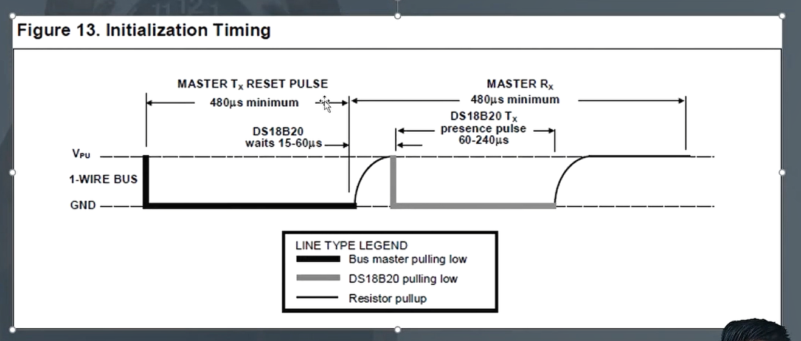
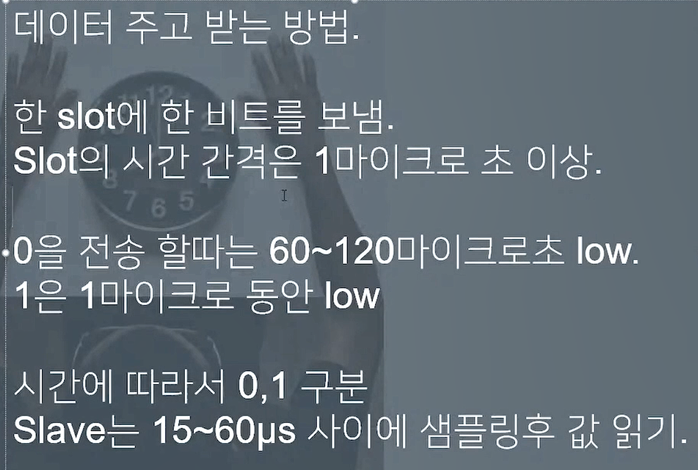
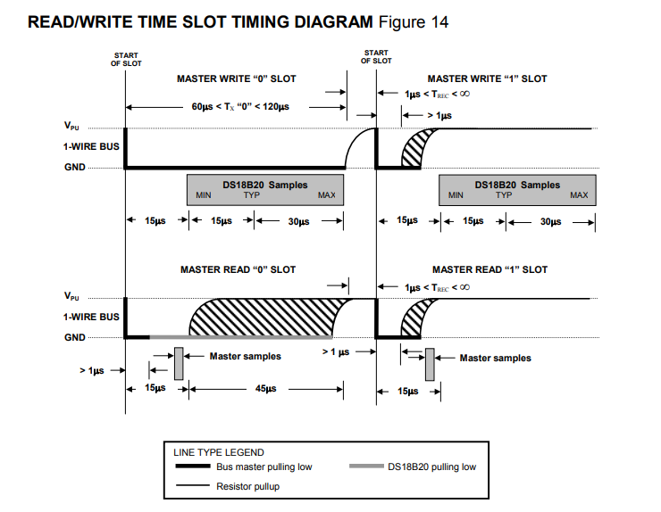

#### GND 복습

- 모든 통신에서 공통 기준점으로 동작
- 안정적인 통신이 가능

### 1-wire 통신 해석하기

#### 1-wire 개념

- Data와 GND 두 개의 선으로 통신을 구성.
- GND는 통신선의 신호를 구분하는 기준선 역할.
- LOW 전압을 일정 시간동안 transmit하는 것으로 신호를 구분하는 protocal

#### 그림 해석



- Initialization Timing: 통신 시작을 의미
- Reset Pulse: 시작을 뜻함
- **Bus Master Pulling Low**선을 보고 최소한 480us동안 LOW를 유지
  - 일정한 간격으로 시간을 나누는 bps시스템이 아닌것을 알 수 있음
  - 1-wire통신을 시작하기위해 Master는 위 신호를 Slave에 전송한다.
- **Resistor pull up**: DS18B20 waits 15-60us: High로 올리는데 기다리는 시간

- **DS18B20 pulling low**: Slave가 Master에게 자신이 존재한다는 것을 알리는 신호

  - 60~240us동안 Low를 유지

- 아래 코드는 위 그림의 전체적인 과정을 코딩한것이다.

```c
// onewire.c
inline uint8_t OneWire_Reset(OneWire_t* OneWireStruct)
{
	uint8_t i;

	/* Line low, and wait 480us */
  // Master가 통신을 시작하기위해 LOW상태로 480us를 유지한 신호를 Slave에게 전달
	ONEWIRE_LOW(OneWireStruct);
	ONEWIRE_OUTPUT(OneWireStruct);
	ONEWIRE_DELAY(480);
	ONEWIRE_DELAY(20);
	/* Release line and wait for 70us */
  // Slave가 Master에게 자신의 존재를 알리는 신호
	ONEWIRE_INPUT(OneWireStruct);
	ONEWIRE_DELAY(70);
	/* Check bit value */
	i = HAL_GPIO_ReadPin(OneWireStruct->GPIOx, OneWireStruct->GPIO_Pin);

	/* Delay for 410 us */
	ONEWIRE_DELAY(410);
	/* Return value of presence pulse, 0 = OK, 1 = ERROR */
	return i;
}
```

## 명령어 종류

- Slave는 Rom code(주소)를 갖는다.

- Master가 Reset Pulse => 즉, slave에게 통신시작을 알리고
- Slave가 presence pulse을 통해 Master에게 자신의 존재를 알리면
  여러가지 명령어들을 보낼 수 있다.

### ROM command: 장치를 선택하기 위한 명령어

- 1-wire 통신을하는 모든 장치들이 통합적으로 지키는 약속

#### 1. Search ROM: 0xF0

- 1-wire 버스에 연결된 모든 slave장치들의 ROM code를 읽는다.
- Main chip(Master)에서 모든 Slave 장치들의 주소값을 read
  - **여러 Slave중 어떤 Slave가 먼저 응답을 할까?**

#### 2. Match ROM: 0x55(특정 장치 주소값)

- 특정 장치를 선택하는 명령어
- **1. Match ROM Command를 trasmit한 후**
- **2. 64비트의 ROM code를 전송한다.**
  - 전송한 ROM code에 맞는 slave장치에 접근하기 위해 이 command를 사용
- 나머지 slave 장치들은 reset pulse를 기다린다.
  - **reset pulse**: Master가 특정 slave에게 1-wire통신을 시작한다고 알리는 신호

#### 3. Skip ROM: 0xCC

- 모든 Slave 장치들에게 동시에 command를 trasmit할 때 사용

#### 4. 기타 명령어

- **Alarm search: 0xEC**
  - slave장치의 alarm flag가 set상태인지 확인하는 명령어

#### DS18B20의 메모리는 scratchpad라고 부른다.

- 메모리는 우리가 생각하는 물리적인 메모리가 아닌 경우가 많다.
- 개념적인 메모리
  - 변수, 배열같은 느낌
- **즉, scratchpad는 어떤 특정한 정보가 모여있는 공간**

### Function command: 장치에게 특정 동작을 수행하기 위한 명령어

- 포괄적인 프로토콜에대한 설명임
- 장치 제조사마다 다르다. ==> 센서의 기능이 다르기 때문...
- 종종 프로토콜에 따라서 Function까지 정의된 경우가 있다.
  - 특정 기능까지 정의한 것
- 그런 경우 예외가 있으면 곤란하고, 복잡하다.
  > - **표준화 작업**: 제품을 만들때 해당 sensor에서 정의하는 func 인터페이스를 지켜서 만들면 바로바로 그 sensor의 기능을 사용할 수 있다.
  > - 하지만 여러가지를 고려해서 설계했기 때문에 굉장히 복잡하다는 단점이 있다.

#### 1. Convert T: 0x44

- 온도의 변환 시작
- 신호선으로 전원을 공급받는 경우 이 command를 trasmit한 뒤
- 신호선을 high상태로 올려서 온도를 변환하는동안 전원을 공급해야함

**온도 변환시간 93.75ms(9bit)~750ms(12bit)**

- 컴퓨터에게 있어서 굉장히 오랜시간을 할당한다.
- 따라서 1-wire방식은 절대 **고속통신이 되는 구조가 아니다.**

#### 2. Write scratchpad:0x4E

- 3바이트의 데이터를 장치의 scratchpad에 사용한다.
- Rom command를 통해 addr을 보내 chip을 선택하고 Write scratchpad를 명령어를 통해서 해당 slave의 3byte 데이터를 읽어온다.

#### 3. Read scratchpad:0xBE

- scratchpad의 값을 읽어온다.
- GPIO output mode로 설정후 `Rom command`를 통해 addr을 보내 slave를 선택
- 그 후 GPIO Input mode로 설정한 후 `Read scratchpad`를 통해 데이터를 읽어온다.

#### 4. Copy scratchpad:0x48

- Scratchpad값을 EEPROM으로 복제하여 저장한다.
  - scratchpad는 휘발성 메모리
  * 따라서 비휘발성 메모리인 EEPROM에 저장
- 신호선으로 전원을 공급할 때 command 전송 후 신호선을 10us동안 high상태 유지

#### 5. Recall E^2: 0xB8

- 현재 알람 쓰레스 홀드 값(TH, TL) 그리고 ==>
  - **쓰레스 홀드값이란?**
  * 어떤 기준값을 의미
  * 기준치를 넘으면 alarm 발생
- ==> configuration data를 EEPROM(copy 명령어로 저장한 데이터)에서 불러와서
- scratchpad(DS18B20의 메모리) 2, 3, 4바이트에 기록

#### 6. Read Power Supply: 0xB4

- 전원 공급 출저확인
- VDD핀 or 신호선

### 그래서... 이런 명령어는 어떻게 보내는걸까?

- 소스를 보는게 가장 빠르다...
  
- 0 or 1을 transmit 할 때도 GPIO를 LOW로 하는것
- 다른 부품처럼 1=High, 0=LOW가 아니라 LOW, High 구분을 시간으로한다.

  - 절대 빠를수 없는 통신방식

- Slave는 master가 보낸 신호(1bit)를 15~60us 사이에 샘플링 후 값을 읽어내야한다.
  - master가 또 1bit 보내면 slave가 다시 (1bit)를 15~60us 사이에 샘플링 후 값을 read


위 설명들이 의미하는 그림

