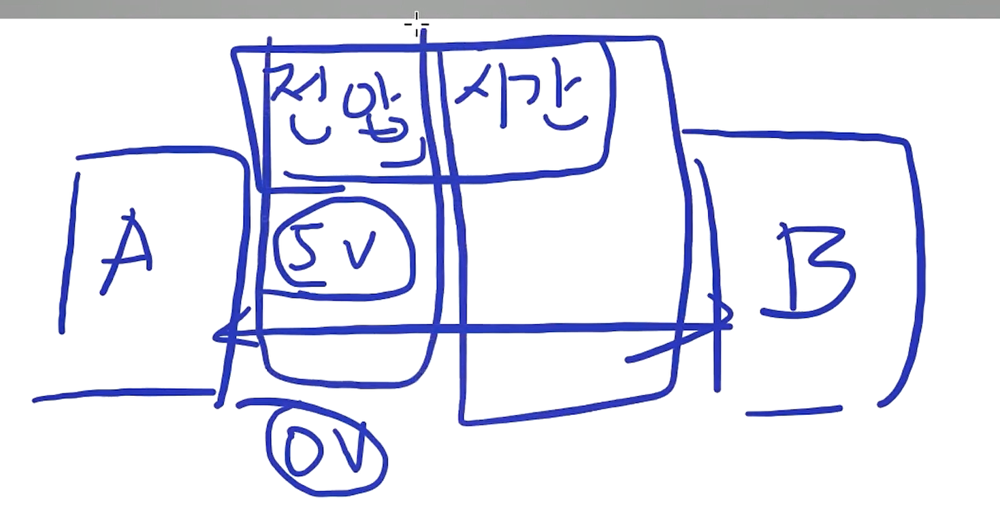

#### GND 복습

- 모든 통신에서 공통 기준점으로 동작
- 안정적인 통신이 가능

### 1-wire 통신 해석하기

#### 1-wire 개념

- Data와 GND 두 개의 선으로 통신을 구성.
- GND는 신호의 전압 기준점 역할을 하여 High와 Low 신호를 구분.
- Data 선을 통해 1과 0을 전송하며, 전압 변화를 통해 데이터를 구별.
- **bps(Bits per Second)** 는 전송 속도를 조절하며, 일정한 시간 간격에 따라 비트가 전송됨.
  

#### 그림 해석


- Initialization Timing: 통신 시작을 의미
- Reset Pulse: 시작을 뜻함
- **Bus Master Pulling Low**선을 보고 최소한 480us동안 LOW를 유지
  - 일정한 간격으로 시간을 나누는 bps시스템이 아닌것을 알 수 있음
  - 1-wire통신을 시작하기위해 Master는 위 신호를 Slave에 전송한다.
- **Resistor pull up**: DS18B20 waits 15-60us: High로 올리는데 기다리는 시간

- **DS18B20 pulling low**: Slave가 Master에게 자신이 존재한다는 것을 알리는 신호

  - 60~240us동안 Low를 유지

- 아래 코드는 위 그림의 전체적인 과정을 코딩한것이다.

```c
// onewire.c
inline uint8_t OneWire_Reset(OneWire_t* OneWireStruct)
{
	uint8_t i;

	/* Line low, and wait 480us */
  // Master가 통신을 시작하기위해 LOW상태로 480us를 유지한 신호를 Slave에게 전달
	ONEWIRE_LOW(OneWireStruct);
	ONEWIRE_OUTPUT(OneWireStruct);
	ONEWIRE_DELAY(480);
	ONEWIRE_DELAY(20);
	/* Release line and wait for 70us */
  // Slave가 Master에게 자신의 존재를 알리는 신호
	ONEWIRE_INPUT(OneWireStruct);
	ONEWIRE_DELAY(70);
	/* Check bit value */
	i = HAL_GPIO_ReadPin(OneWireStruct->GPIOx, OneWireStruct->GPIO_Pin);

	/* Delay for 410 us */
	ONEWIRE_DELAY(410);
	/* Return value of presence pulse, 0 = OK, 1 = ERROR */
	return i;
}
```

### 명령어 종류

- Slave는 Rom code(주소)를 갖는다.

- Master가 Reset Pulse => 즉, slave에게 통신시작을 알리고
- Slave가 presence pulse을 통해 Master에게 자신의 존재를 알리면
  여러가지 명령어들을 보낼 수 있다.

#### ROM command: 장치를 선택하기 위한 명령어

- 1-wire 통신을하는 모든 장치들이 통합적으로 지키는 약속

#### Function command: 장치에게 특정 동작을 수행하기 위한 명령어
