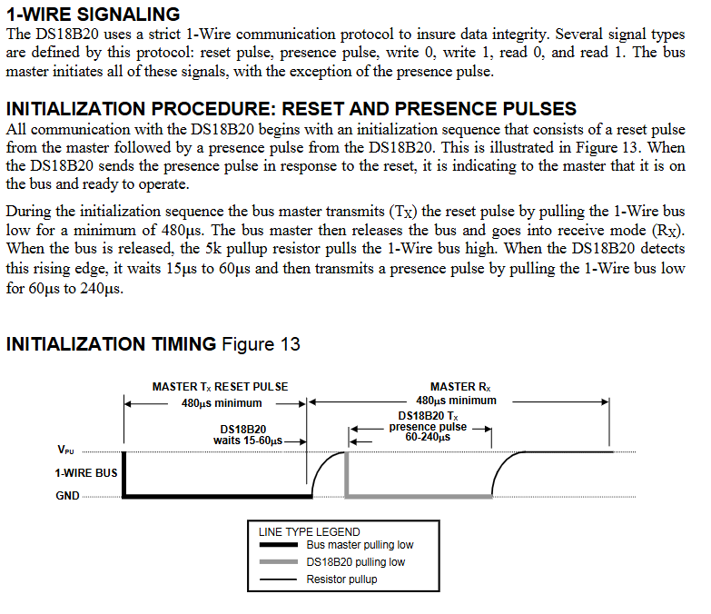
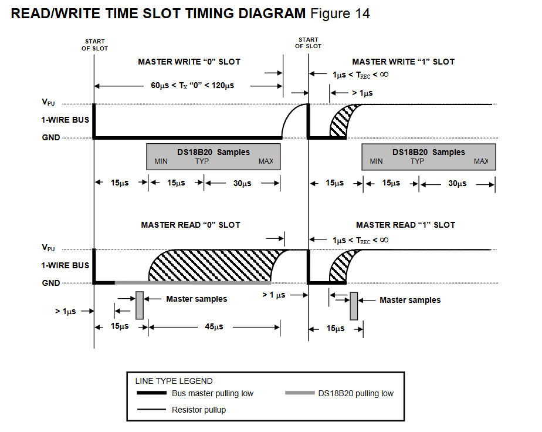

새로운것을 공부할 때 고민하기

- 어디다 사용할까?
- 굳이 왜 사용하까?
- 프로토콜 문서를 만들어보기(장단 bb점 파악하기)

# 1-Wire Protocal

## 장점

- 2개의 선(전원선, 통신선)으로 구성되어 양방향 통신이 가능하다.
  - 적은 선의 개수를 사용하기 때문에 비용 절감

## 종류

- parasite power mode는 통신선으로 전원공급까지 한다!

## 특징

- 장거리 통신에 약하다. (하나의 통신선을 사용하기 때문에)
- 주소체계 사용
- 비용 절감
- 간단한 구성

# 1-Wire 통신

- 초기화: 컴퓨터를 작동하는 데 필요한 모든 프로그램의 내용을 최초 설정한 값으로 복귀시키는 일.

## Initialization Timing

### Several signal types

- reset pulse
- presence pulse
- write 0, write 1
- read 0, read 1
- presence pulse 신호를 제외한 모든 신호는 Master로부터 시작된다.

### INITIALIZATION PROCEDURE

- 모든 통신은 Initialization Procedure로 시작된다.
- Master가 reset pulse 신호를 보내면 DS18B20은 presence pulse로 응답한다.
  - Slave(DS18B20)가 Master에게 ready to operate를 알림

#### INITIALIZATION PROCEDURE: RESET PULSE & PRESENCE PULSE

- TX transmit mode
- 최소 480ms동안 1-wire bus를 low로 유지
- 그 후 TX(Output) mode 해제후 RX(Input) mode로 변경(receive mode)
- TX mode 해제시 5k pullup 저항은 1-wire bus를 High로 올린다.
- DS18B20은 rising edge에서 15~60us wait... 그 후 presence pulse신호를 보내기 위해 1-wire bus를 low로 60us~240us 유지한다.

## Master(STM32F103)와 Slave(DS18B20) 통신

- 아래는 15p~17p 내용을 번역후 요약한 것

### READ/WRITE TIME SLOTS

- MASTER write to the DS18B20
- Master read from the DS18B20
- 1BIT는 1-SLOT당 1-WIRE BUS를 통해 전송된다.

### Write time slots

- All write time slots 최소 60us를 지속하며 그리고 개별 slot 사이에서 최소 1us 회복 시간을 가져야한다.
- Master가 1-wire bus를 low로 당기는 순간 write time slot이 시작된다.

#### Write 1

- 서Master는 Write 1 time slot에 **pulling low한 후 1~15us**내에 release해야한다.
- release된 후에는 5k pullup저항이 1-wire bus를 high상태로 만든다.

#### Write 0

- Master는 Write 1 time slot에서 **low pulling한 후 최소 60us~120us**를 low를 유지해야 한다.
- release된 후에는 5k pullup저항이 1-wire bus를 high상태로 만든다.

#### Write후 DS18B20

- Master가 Write time slot작업을 시작하면 DS18B20(slave)는 15us~60us동안 Sample작업을 지속한다.
  - sampling동안 Diagram에서 LOW로 내려가는 부분은 Master가 아니라 DS18B20이 LOW로 내리는 부분이니깐 햇갈리지말자
  - 1-wire 통신으로 master와 slave가 라인을 공유 때문에 햇갈릴 수 있다.
- sampling동안 1-wire bus가 high이면 Slave는 1을 입력받는다.
- sampling동안 1-wire bus가 low이면 Slave는 0을 입력받는다.

### Read time slots

- Master의 read time slot issue가 있어야지만 DS18B20(slave)는 data를 전송가능
  - 따라서 Master가 read time slot을 generate하기 위해서는 `read Scrachpad issue` or `Read power supply command` 그리고 `DS18B20 function cammand`인 `ConverT[44H]` or `Recall E^2[B8H]` 명령어가 필요하다.
- 최소 `60us must be and 1us recovery time between slots`
- read time slot을 시작하기 위해서 Master가 1-wire bus를 최소 1us를 low후 release
- 그 후 Master가 read time slot 시작하면 Slave는 `1` or `0` bit를 bus로 전송
- **slave가 전송한 data는 read time slot시작 후 15us내로는 유효**
  - master는 slot 시작후 15us 이내에 bus를 해제하고 bus상태를 sampling해야한다.

#### Read 1

- slave는 Master sampling state일 때 bus가 high이면 1을 전송

#### Read 0

- slave는 Master spamling state일 때 bus가 LOW이면 0을 전송
  - end of the time slot 지점에서 bus를 해제하고, 풀업 저항에 의해 대기 상태인 high state로 return

### ETC...

- **GND**: 1-Wire bus가 (High or Low)상태인지 구분하는 기준선

# 명령어의 종류

## Rom command

- 장치를 선택하기 위한 명령어
- 따라서 어떤 장치든 동일한 명령어를 사용한다.

### Search ROM: 0xF0

- 1-wire버스에 연결된 모든 slave장치들의 rom code를 읽는다.

### Match ROM: 0x55

- 위 명령어를 송신후 64bit의 rom code를 송신한다.
  - rom code에 맞는 slave를 선택하기 위해서
- 나머지 slave들은 reset pulse(초기설정으로 회귀)을 기다린다.

### Skip ROM: 0xCC

- 모든 장치들에게 동시에 command를 송신하기위해서 사용

### Alarm search ROM: 0xEC

- slave장치의 alarm flag가 set상태인지 확인할 때 사용

## function command

- 장치에게 특정 동작을 수행시키기위한 명령어
- 당연히 장치마다 기능이 다르기때문에 제조사마다 command가 다르다.
- 하지만 종종 프로토콜마다 function기능까지 정의된 경우도있다.
  - 이런경우 예외가 있을경우 매우 복잡하다.

### Convert T: 0x44

- 변환된 온도를 read
- 신호선으로 전원을 공급받는 경우 위 명령어를 보내고 신호선을 High로 올려서 온도가 변하는동안 전원을 공급받는다.
- 외부 전원일 경우: 진행(0), 완료(1) 응답이온다.
- 온도 변환시간: 93.75ms(9bit) ~ 750ms(12bit)

### Write scratchpad: 0x4E

- 3바이트의 데이터를 장치의 scratchpad에 쓴다.

### Read scratchpad: 0xBE

- Scratchpad의 값을 읽는다.

### copy scratchpad: 0x48

- scratchpad(휘발성)값을 EEPROM(비휘발성)에 저장한다.
- if) 신호선으로 전원을 공급하는 경우
  - command를 송신후 신호선을 10us동안 high상태 유지

### Recall E^2: 0xB8

- 현재 Alarm쓰레드 홀드 값(TH, TL) configuration data를 EEPROM에서 불러와서 Scratchpad의 2,3,4 바이트에 기록
- **쓰레드 홀드 값**: alarm을 작동시키는 기준값

### Read Power Supply: 0xB4

- 전원 공급 출저 확인
- VDD or 신호선

## scratchpad

- DS18b20의 메모리를 부르는 말
- 물리적인 형태가 아니고 변수나 배열같은 데이터 공간
