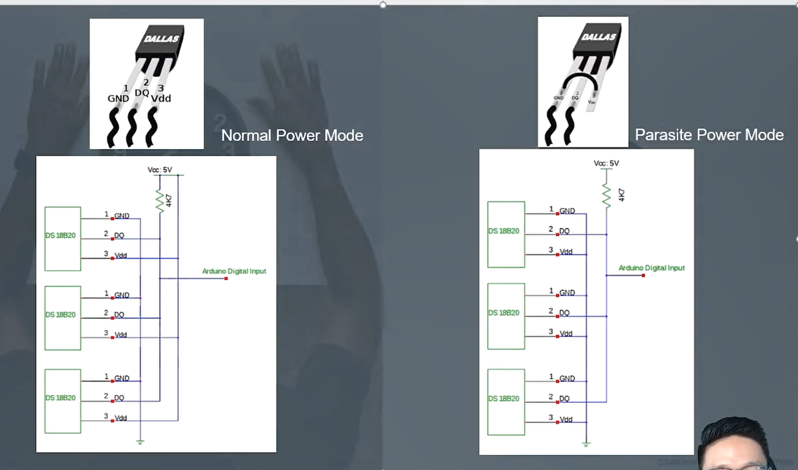

새로운것을 공부할 때 고민하기

- 어디다 사용할까?
- 굳이 왜 사용하까?
- 프로토콜 문서를 만들어보기(장단 bb점 파악하기)

# 1-Wire Protocal

## 장점

- 2개의 선(전원선, 통신선)으로 구성되어 양방향 통신이 가능하다.
  - 적은 선의 개수를 사용하기 때문에 비용 절감

## 종류

- parasite power mode는 통신선으로 전원공급까지 한다!

## 특징

- 장거리 통신에 약하다. (하나의 통신선을 사용하기 때문에)
- 주소체계 사용
- 비용 절감
- 간단한 구성

# 프로토콜 종류

## only HW

- SPI

## HW + SW

- 1-wire 통신 프로토콜

## only SW

- layer 구조인 경우가 많음
- 이더넷=>tcp=>http
- 새로운 Protocal을 배울때는 해당 protocal의 base가 되는 프로토콜을 미리 어느정도 알고있는게 좋다.

# 1-Wire 통신

- 초기화: 컴퓨터를 작동하는 데 필요한 모든 프로그램의 내용을 최초 설정한 값으로 복귀시키는 일.

## Initialization Timing

- **GND**: High or Low인지 구분하는 기준선
- Baud Rate 방식과는 달리 일정시간을 Low로 떨어뜨리는것에 따라 1 or 0을 구분한다.

  - 둘다 일정시간동안 LOW로 떨어뜨려서 1과 0을 표현한다.

- OUTPUT mode로 Master가 최소 480us를 LOW로 떨어뜨려 slave에게 RESET PULSE 즉, 시작을 알린다.
- 15~60us wait
- Input mode로 변경하여 High상태로 돌린다음
- 다시 60~240us동안 LOW신호를 수신하여 slave로부터 presence pulse 신호를 받는다.

# 명령어의 종류

## 1-wire 통신 요약

Master가 reset pulse신호를 slave로 송신해서 통신 시작을 알리고 slave로 부터 presence pulse신호를 수신받는다.

## Rom command

- 장치를 선택하기 위한 명령어
- 따라서 어떤 장치든 동일한 명령어를 사용한다.

### Search ROM: 0xF0

- 1-wire버스에 연결된 모든 slave장치들의 rom code를 읽는다.

### Match ROM: 0x55

- 위 명령어를 송신후 64bit의 rom code를 송신한다.
  - rom code에 맞는 slave를 선택하기 위해서
- 나머지 slave들은 reset pulse(초기설정으로 회귀)을 기다린다.

### Skip ROM: 0xCC

- 모든 장치들에게 동시에 command를 송신하기위해서 사용

### Alarm search ROM: 0xEC

- slave장치의 alarm flag가 set상태인지 확인할 때 사용

## function command

- 장치에게 특정 동작을 수행시키기위한 명령어
- 당연히 장치마다 기능이 다르기때문에 제조사마다 command가 다르다.
- 하지만 종종 프로토콜마다 function기능까지 정의된 경우도있다.
  - 이런경우 예외가 있을경우 매우 복잡하다.

### Convert T: 0x44

- 온도의 변환을 시작
- 신호선으로 전원을 공급받는 경우 위 명령어를 보내고 신호선을 High로 올려서 온도가 변하는동안 전원을 공급받는다.
- 외부 전원일 경우: 진행(0), 완료(1) 응답이온다.
- 온도 변환시간: 93.75ms(9bit) ~ 750ms(12bit)

### Write scratchpad: 0x4E

- 3바이트의 데이터를 장치의 scratchpad에 쓴다.

### Read scratchpad: 0xBE

- Scratchpad의 값을 읽는다.

### copy scratchpad: 0x48

- scratchpad(휘발성)값을 EEPROM(비휘발성)에 저장한다.
- if) 신호선으로 전원을 공급하는 경우
  - command를 송신후 신호선을 10us동안 high상태 유지

### Recall E^2: 0xB8

- 현재 Alarm쓰레드 홀드 값(TH, TL) configuration data를 EEPROM에서 불러와서 Scratchpad의 2,3,4 바이트에 기록
- **쓰레드 홀드 값**: alarm을 작동시키는 기준값

### Read Power Supply: 0xB4

- 전원 공급 출저 확인
- VDD or 신호선

## scratchpad

- DS18b20의 메모리를 부르는 말
- 물리적인 형태가 아니고 변수나 배열같은 데이터 공간

## Master-Slave 통신

- Master는 Slave에게

  - 1slot당 1bit씩 전송
  - 슬롯의 시간간격은 1micro초

- `0`과 `1`을 구분하는 기준은 라인을 Low로 유지하는 시간에 따라 결정됨

  - `0`전송시 60~120us동안 Low로 유지
  - `1`전송시 1~15us동안 low로 유지

### Slave 샘플링

- slave는 명령을 받은 후 15~60us사이에 라인을 샘플링한다.

### Slave 응답

- Slave가 데이터를 전송하기 위해 Master는 최소 1 Micro초 동안 라인을 Low로 당겨야하며, 그 후 Slave가 데이터를 전송

- Slave는 0을 표현할 때 15us동안 low로 내린다.

- Slave는 1을 표현할 때 1us동안 low로 내린다.

### Master 읽기

- Master는 Slave가 전송한 데이터를 15마이크로초 내에 읽어야하며, 이 타이밍에 맞춰 데이터를 sampling해야한다.

## DB18B20 센서 데이터시트 15~17p 번역 및 이해하고 강의내용과 대조해보기
