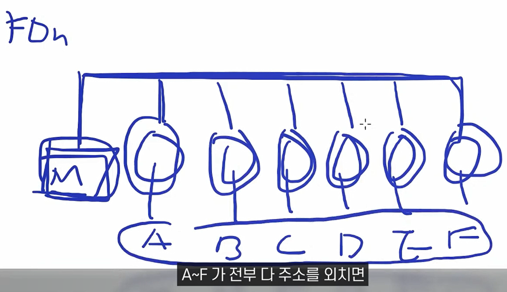
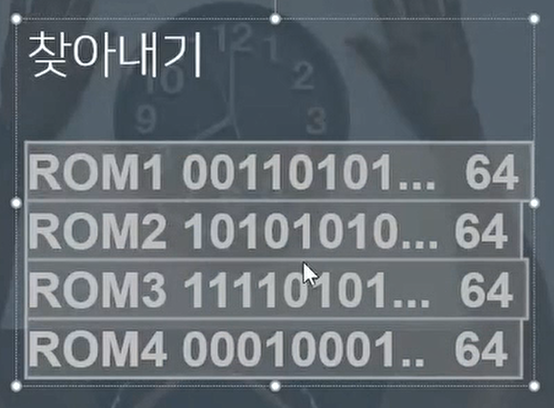
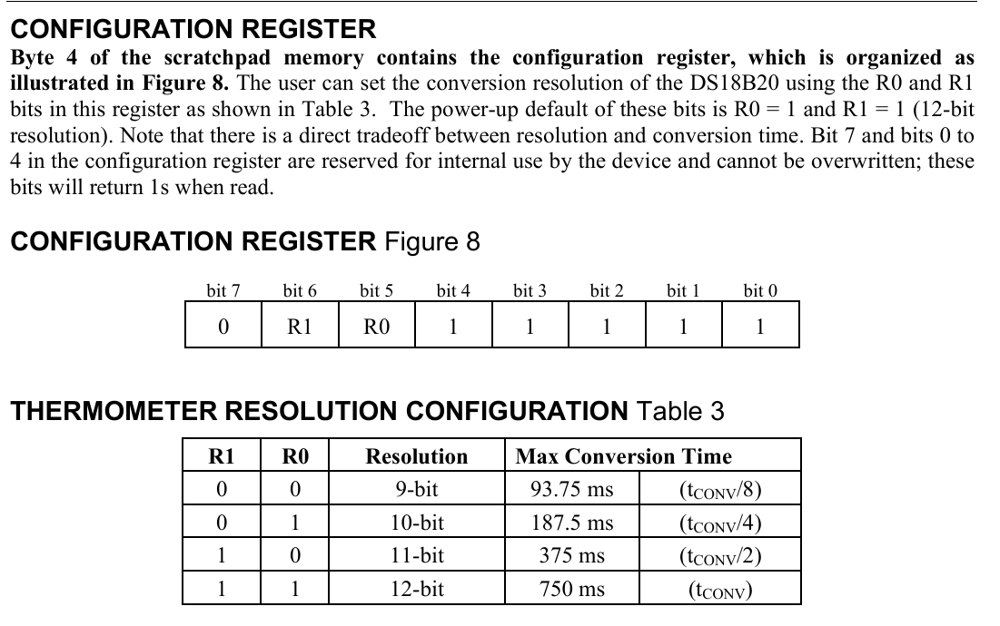

### 1-wire 통신방식 이해하기

- 논리를 파악하고 코드를 보는 방식이 가장 쉽다.
- 무엇인가를 할 때 벽이 느껴지는 이유

  - 그 내용이 어려워서가 아니다.
  - 그 내용을 이해하기위한 자료나 기초지식이 없기 때문이다.
  - 이 때는 **내가 모르는 영역이 어디인가를 빠르게 파악하고 그것을 학습해라**
  - 그러면 늦게가는거 같아도 결국에는 빠르다.

### Rom Search: 0xF0의 원리



- 동작 원리가 무엇일까?
  - A~F 모두가 response 신호를 보내면 Master는 어떻게 신호를 구분하고 인식할까?
  - A~F 신호가 모두 겹쳐서 전달될텐데?

#### 시작

- Master가 Reset Pulse(Initialization Timing)를 보낸다.
- Slave가 presence pulse로 응답한다.
- 1-Wire에 연결된 모든 Slave장치의 Rom-code를 읽기위해서 `Rom Search: 0xF0`를 보낸다.
- 동작원리에 따라 bit를 read

#### ROM Search 동작원리

- 0. Master가 `0xF0`를 보낸다.
- 1. 1Bit read
- 2. bit의 보수를 읽는다.
- 3. 0 or 1을 Write한다.

##### 예시) Master가 Slave장치들의 주소값들을 읽는법



- 0. 제일 먼저 Rom Search: 0xF0 명령어를 보내서 Slave들이 주소를 보낼 준비를한다.

- 연결된 slave들이 각각 1bit씩 보낸다.
- 이 때 **여러가지 경우의 수**가 나오는데

  - **1, 0 bit들이 섞여있을 때** ==> **00**(1의 신호는 0의 신호로부터 먹히기 때문)
  - **연결된 장치들의 비트가 모두 0일 때** ==> **01**(처음에는 0 그리고 보수를 취할 때 1이 전송)
  - **연결된 장치들의 비트가 모두 1일 때** ==> **10**(처음에는 1 그리고 보수를 취할 때 0이 전송됨)
  - **연결된 장치가 없을 때** ==> **11**(연결된 장치가 없음...나올 수 없는 수)

- **위 그림을 보고 내가 직접 끄적이면서 논리흐름을 따라가보자**

## 함수 **Ds18b20_Init()** 소스분석

- 오제이 센세가 공부한 방식이 담겨있다....
- 나중에 공부법 따라할때 참고해보자
- `39분 남았을때부터 보면됨`

### 소스 구조

크게보면은...

- 칩 자체에 대한 클래스 그리고...
- one-wire protocal에 대한 클래스로 구성된다.

### 소스 분석

```c
bool	Ds18b20_Init(void)
{
	uint8_t	Ds18b20TryToFind=5;
	do
	{
		OneWire_Init(&OneWire,_DS18B20_GPIO ,_DS18B20_PIN);
		TempSensorCount = 0;
		while(HAL_GetTick() < 3000)
			Ds18b20Delay(100);
		OneWireDevices = OneWire_First(&OneWire);
		while (OneWireDevices)
		{
			Ds18b20Delay(100);
			TempSensorCount++;
			OneWire_GetFullROM(&OneWire, ds18b20[TempSensorCount-1].Address);
			OneWireDevices = OneWire_Next(&OneWire);
		}
		if(TempSensorCount>0)
			break;
		Ds18b20TryToFind--;
	}while(Ds18b20TryToFind>0);
	if(Ds18b20TryToFind==0)
		return false;
	for (uint8_t i = 0; i < TempSensorCount; i++)
	{
		Ds18b20Delay(50);
    DS18B20_SetResolution(&OneWire, ds18b20[i].Address, DS18B20_Resolution_12bits);
		Ds18b20Delay(50);
    DS18B20_DisableAlarmTemperature(&OneWire,  ds18b20[i].Address);
  }
	return true;
}
```

- 위 코드를 보면서 분석내용을 읽을것

### void OneWire_Init(OneWire_t* OneWireStruct, GPIO_TypeDef* GPIOx, uint16_t GPIO_Pin) 분석

- DS18B20과 1-wire protocal connetion을 위한 GPIO port, pin 설정
- TIM2 설정 및 타이머 시작

### OneWire_First(&OneWire); 분석

#### OneWire_ResetSearch(OneWire_t\* OneWireStruct) 분석

- 여러 slave들의 rom_code를 읽기위해 설정한 분기점을 초기설정으로 return

#### OneWire_Search(OneWire_t\* OneWireStruct, uint8_t command) 분석

- `OneWireStruct->LastDeviceFlag`의 값이 1인경우: 모든 장치가 탐색되어 더이상 탐색할 장치가 없는경우
- `OneWireStruct->LastDeviceFlag`의 값이 0인경우: 탐색 중인 1-wire통신에서 더 탐색할 장치가 있을 경우

- **1-wire reset에서** Presence pulse의 값: 0 ==> slave탐색 성공
- **1-wire reset에서** Presence pulse의 값: 1 ==> slave탐색 실패
  - 이 때는 분기점 체크를 초기화

#### Issued Search Command

- Search_ROM [F0] 명령어를 통해 모든 slave의 Rom_code를 read

#### do~while문에서 Search loop에 들어간 후 rom_code를 얻는다.

위 함수에서

- 장치를 찾은 경우 1을 반환
- 장치를 찾지 못한 경우 0을 반환

#### OneWire_GetFullROM(&OneWire, ds18b20[TempSensorCount-1].Address);

- Ds18b20Sensor_t ds18b20[_DS18B20_MAX_SENSORS].address[8]; 변수에 읽어들인 Rom_code를 저장한다.

#### DS18B20_SetResolution(&OneWire, ds18b20[i].Address, DS18B20_Resolution_12bits);

- DS18B20 해상도 설정
  
- 온도의 정밀도를 표현

#### DS18B20_DisableAlarmTemperature(&OneWire, ds18b20[i].Address);

- 온도센서의 알람을 해지함
