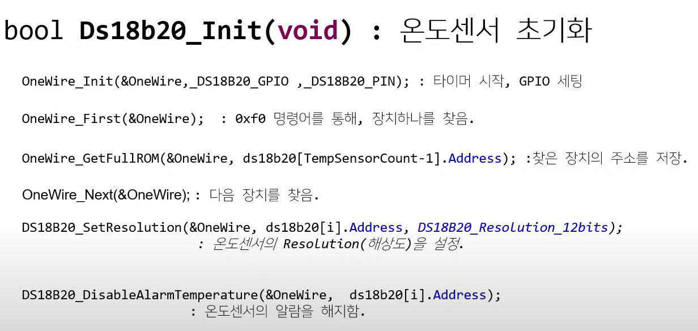
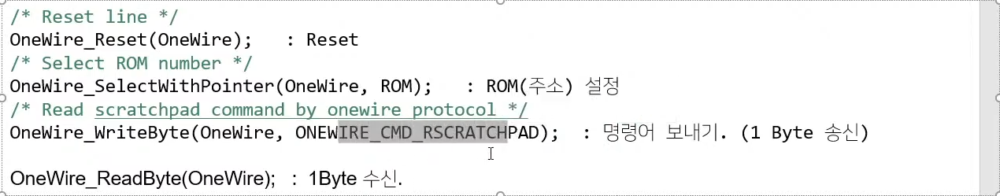
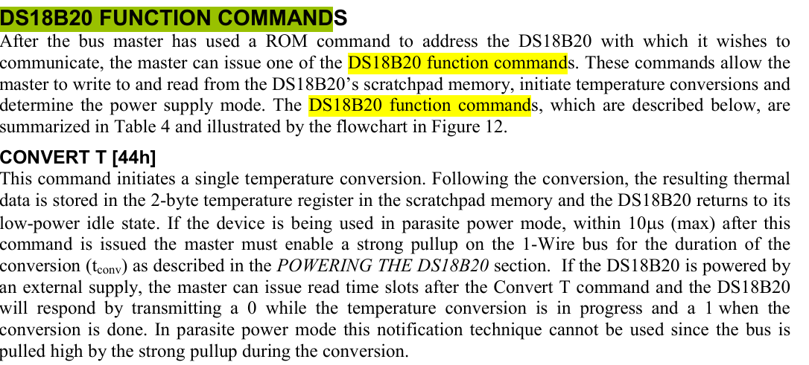
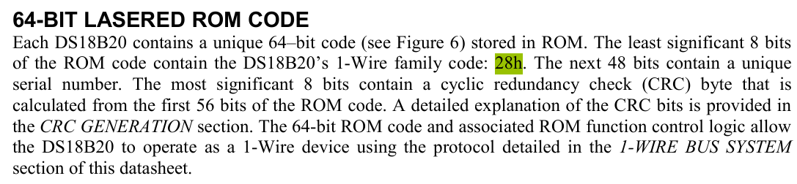
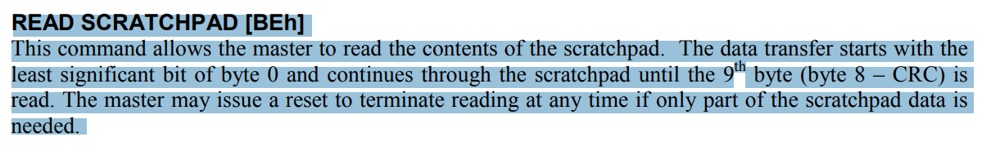

## Ds18b20_ManualConvert(void) 분석하기

### DS18B20_StartAll 분석

- 온도변환 시작코드

```
void DS18B20_StartAll(OneWire_t* OneWire)
{
	/* Reset pulse */
	OneWire_Reset(OneWire);
	/* Skip rom */
	OneWire_WriteByte(OneWire, ONEWIRE_CMD_SKIPROM);
	/* Start conversion on all connected devices */
	OneWire_WriteByte(OneWire, DS18B20_CMD_CONVERTTEMP);
}
```

- 1. one-wire Reset
- 2. **ONEWIRE_CMD_SKIPROM**
     ==> oxCC(Skip Rom 명령어): 모든 Slave 장치들에게 동시에 명령어를 송신
- 3. **DS18B20_CMD_CONVERTTEMP**
     ==> Convert T: 0x44
     - 외부 전원으로부터 전력을 공급받는 경우
     - **Master가 read time slot을 생성할 수 있으며 Convert T 명령을 한 후 DS18B20은 온도가 변환되는 동안 0을 응답하고 온도변환이 끝나면 1을 응답한다.**
     - 즉, 외부전력 모드에서 **온도변환이 진행중이면(0), 완료되면(1)**을 반환
     - 관련 문서 

### AllDone(&OneWire) 함수

- 위 datasheet 해석에 따라 온도 변환이 완료됐는지 진행중인지 판단하는 함수

```c
uint8_t DS18B20_AllDone(OneWire_t* OneWire)
{
	/* If read bit is low, then device is not finished yet with calculation temperature */
	return OneWire_ReadBit(OneWire);
}
```

- 외부에서 전원을 공급받는 경우
- 온도변환이 진행중이면 0 완료되면 1이 나온다.

```
while (!DS18B20_AllDone(&OneWire))
	{
		Ds18b20Delay(10);
		Ds18b20Timeout-=1;
		if(Ds18b20Timeout==0)
			break;
	}
```

- Ds18b20Timeout의 값은 500
- 온도변환이 성공할 때까지 500번 반복
- 온도 변환이 성공하면 while문을 나온다...
- 온도 변환이 성공하지 못하더라도 Timeout이 0이되면 나온다...

### 온도변환 성공 or 실패

```c
if(Ds18b20Timeout>0)
	{
    // 온도변환이 성공한 경우
    // Timeout의 값이 0이 되기전에 온도변환에 성공해서 1의 값이되어 while문을 나오기 때문이다.
		for (uint8_t i = 0; i < TempSensorCount; i++)
		{
			Ds18b20Delay(100);
			ds18b20[i].DataIsValid = DS18B20_Read(&OneWire, ds18b20[i].Address, &ds18b20[i].Temperature);
		}
	}
	else
	{
    // 온도변환이 실패한 경우
    // Timeout이 0이 될때까지 LOW상태 즉, 온도변환중이기 때문
		for (uint8_t i = 0; i < TempSensorCount; i++)
			ds18b20[i].DataIsValid = false;
	}
```

#### 온도변환이 성공했을때 코드 분석

```c
for (uint8_t i = 0; i < TempSensorCount; i++)
{
	Ds18b20Delay(100);
	ds18b20[i].DataIsValid = DS18B20_Read(&OneWire, ds18b20[i].Address, &ds18b20[i].Temperature);
}
```

- **DS18B20_Read**: 온도정보를 읽어오는 코드

#### DS18B20_Read 분석하기

##### 1. Family code를 통해서 ROM code가 옳바른 코드인지 확인

```c
	/* Check if device is DS18B20 */
	if (!DS18B20_Is(ROM)) {
		return false;
	}
```



- Rom Code에는 1-wire family code 28Hex값이 포함됨

##### 2. Family code가 포함됬다면? 온도변환이 끝났는지(1) 진행중(0)인지 확인하여 온도변환 성공여부를 확인한다.

```c
/* Check if line is released, if it is, then conversion is complete */
	if (!OneWire_ReadBit(OneWire))
	{
		/* Conversion is not finished yet */
		return false;
	}
```

##### 3. Reset Pulse / Rome code(장치) 선택 / 메모리정보(온도정보) 읽기

```c
	/* Reset line */
	OneWire_Reset(OneWire);
	/* Select ROM number */
	OneWire_SelectWithPointer(OneWire, ROM);
	/* Read scratchpad command by onewire protocol */
	OneWire_WriteByte(OneWire, ONEWIRE_CMD_RSCRATCHPAD);

  /* Get data from to read scratchpad data*/
	for (i = 0; i < 9; i++)
	{
		/* Read byte by byte */
		data[i] = OneWire_ReadByte(OneWire);
	}
  // CRC: 오류를 검출하는 코드
	/* Calculate CRC */
	crc = OneWire_CRC8(data, 8);

	/* Check if CRC is ok */
	if (crc != data[8])
		/* CRC invalid */
		return 0;
```



- master가 scratchpad의 내용을 읽는다.
- 데이터 전송은 최하위 비트(0 byte)부터 시작되고 scratchpad의 9번째(byte 8 - CRC) byte를 읽을때까지 지속된다.
- master가 오직 part of scratchpad data만 필요할 경우 reading을 종료하는 명령을 할 수도 있다.

##### 5. 가져온 온도 정보를 저장하고 음수면 양수로 변경

```c
/* First two bytes of scratchpad are temperature values */
	temperature = data[0] | (data[1] << 8);

	/* Reset line */
	OneWire_Reset(OneWire);

	/* Check if temperature is negative */
	if (temperature & 0x8000)
	{
		/* Two's complement, temperature is negative */
		temperature = ~temperature + 1;
		minus = 1;
	}

```

##### 6. 온도값 구하기(정수+소수)

```c
/* Get sensor resolution */
	resolution = ((data[4] & 0x60) >> 5) + 9;


	/* Store temperature integer digits and decimal digits */
	digit = temperature >> 4;
	digit |= ((temperature >> 8) & 0x7) << 4;

	/* Store decimal digits */
	switch (resolution)
	{
		case 9:
			decimal = (temperature >> 3) & 0x01;
			decimal *= (float)DS18B20_DECIMAL_STEPS_9BIT;
		break;
		case 10:
			decimal = (temperature >> 2) & 0x03;
			decimal *= (float)DS18B20_DECIMAL_STEPS_10BIT;
		 break;
		case 11:
			decimal = (temperature >> 1) & 0x07;
			decimal *= (float)DS18B20_DECIMAL_STEPS_11BIT;
		break;
		case 12:
			decimal = temperature & 0x0F;
			decimal *= (float)DS18B20_DECIMAL_STEPS_12BIT;
		 break;
		default:
			decimal = 0xFF;
			digit = 0;
	}

	/* Check for negative part */
	decimal = digit + decimal;
	if (minus)
		decimal = 0 - decimal;


	/* Set to pointer */
	*destination = decimal;

```
