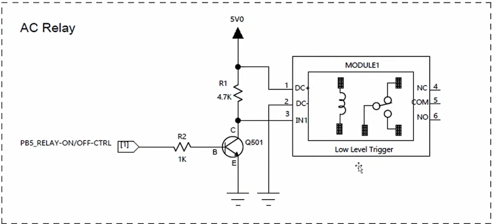

### 필요 준비물

- 7segment => 온도표현
- 온도센서 => 온도정보
- 드라이기 => 온도정보
  - 드라이기 스위치 on/off 프로그램

### 릴레이란?

- 스위치 역할
- 5v와 0v로 ON & OFF 역할
- 낮은 전압(input)으로 높은 전압 제어(output)

#### 원리

- 내부에 전자석(코일)을 포함
- 코일은 전기가 흐르면 자성이 생기고 전기가 흐르지 않으면 자성이 사라짐
- 즉, 전원을 공급하면 릴레이 내부에 전자석이 자석이되어 옆에 있던 철편을 끌어당겨 OFF => ON이된다.
- 전자석은 전류가 흐를 때만 자석이되고, 전류를 끊으면 자석의 성질을 잃는다.
- 직선보다 코일처름 감아주는게 힘이 더 강해진다.

### LOW Level Trigger로 설정



- 평상시 High에서 OFF => LOW에서 ON
- 딥 스위치를 L로 설정하자
- stm32 출력전압은 3.3V
- 하지만 릴레이는 5V전압을 사용하므로 트랜지스터를 이용해 전압을 증폭해주자.

### 작동 원리

- **GPIO PB5가 LOW일 때**: 트랜지스터가 끊긴 상태 따라서 5V전압이 모듈(IN1)에 흐른다.(4와 5가 붙은상태)
- **GPIO PB5가 HIGH일 때**: 트랜지스터가 연결된 상태 따라서 5V전압이 GND에 빠져나가 모듈(IN1)에는 0V가 흐른다. (5와 6이 붙은상태)

### 회로도를 보고 직접 구성 RELAY on/off 실습

```c
HAL_GPIO_Toggle(prot, pin);
HAL_Delay(1000);
```

위 코드를 사용해서 드라이기 on/off 구현해보기
