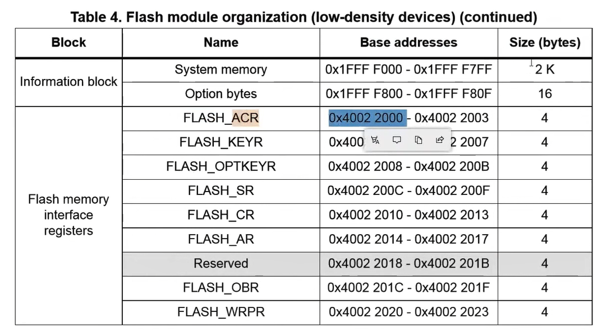
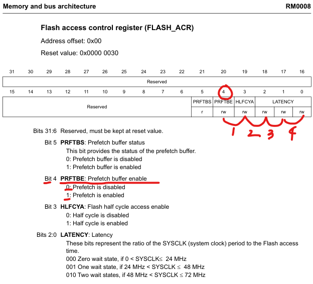

### 지금까지 작성한 코드들을 바탕으로 데이터시트 이해해보기

## 레퍼런스 메뉴얼

- 레퍼런스에서 55p FLASH_ACR의 BASE address를 보면 주솟값이 아까 코드에서 도출한 값과 같다는것을 알 수 있다.

- **59p 설명**: The FLASH_ACR register is used to enable/disable prefetch and half cycle access, and to
  control the Flash memory access time according to the CPU frequency. The tables below**
  provide the bit map and bit descriptions for **this register.
  - FLASH_ACR 레지스터는 **프리페치** 및 반주기액세스를 활성화/비활성화하는 데 사용됩니다.
  - CPU 주파수에 따라 플래시 메모리 액세스 시간을 제어
  - 아래 테이블에서 이 레지스터에 대한 비트맵과 비트 설명을 제공한다.

#### 위 reference를 통해 알 수 있는 것

- Flash_ACR 레지스터는 Prefetch buffer의 enable/disable을 control한다.
- Bit 4의 자리를 1로 설정함으로서 **PRFTBE**를 활성화
- **즉, 플레시 메모리의 프리페치 기능을 활성화**

## Flash

- `MCU`에서 프로그램 코드와 데이터를 저장하는 **비휘발성 메모리**
- 빠른 읽기 속도, 내구성 등의 장점으로 `MCU` 저장 장치로 널리 사용됨

## prefetch

- `MCU`이 프로그램 실행 속도를 높이기 위해 **미리 데이터를 로딩**하는 기술
- 가까운 미래에 필요로 할 **데이터**와 **명령어**를 예측하여 `Flash` 메모리로부터 `SRAM(빠른 메모리)`에 해당 데이터들을 미리 로드

## Buffer

- 데이터를 임시로 저장하는 공간
- 데이터 전송 과정을 매끄럽게 하고 지연을 최소화하는 역할

- ### Flash Prefetch Buffer

  - `플레시 메모리`에서 가져온 데이터를 `SRAM`으로 전송하기 전에 일시적으로 보관하는 저장소

- ### description
  1.  os에서 `SRAM`에 실행 파일이 사용하는 시스템 자원을 미리 저장
  2.  프로그램 실행 시 buffer에 저장된 프리패치 파일을 모두 메모리에 로드
  3.  실제 사용할 때에는 메모리 매핑만을 수행하여 사용할 수 있도록하여 실행 속도를 향상시킴

### 결론: `Flash_ACR` 레지스터 기능: 플레시 메모리의 프리패치 기능을 활성화 한 것

#### TIP!

> 영어를 알아도 이해가 안되는 이유는 백그라운드 지식이 부족하기 때문이다.
