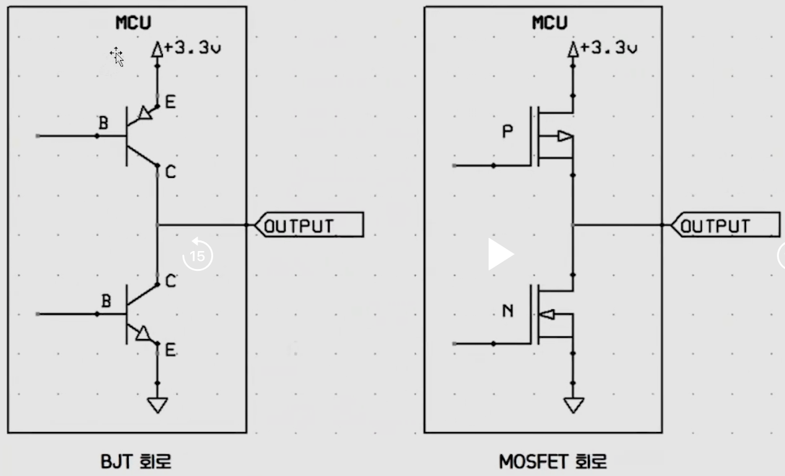
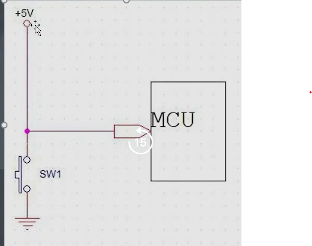
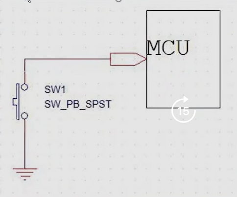

# GPIO 옵션 설정 분석하기

## 추가 지식
- GPIO Output mode에서 pull-up/down을 설정하는 이유는 핀의 초기 상태를 결정하기 위해서이다.
- output level을 high로 설정하더라도 Pull-down모드로 설정했더라면 초기화 과정에서는 초기 상태가 low로 있다가 끝나면 high로 변한다.
- 짧은 순간이지만 어떤 문제가 발생할지 모른다.
- 따라서 초기 상태값도 신경써서 옵션값을 결정짓도록 하자

## GPIO output level

- 설정한 pin의 초기 값을 설정

### `High`: 전원 on일 때 해당 pin의 state를 전압이 출력되도록 설정
- `pin = 1`

```c
HAL_GPIO_WritePin(GPIO_LED_GPIO_Port, GPIO_LED_Pin, GPIO_PIN_SET); // High 옵션 설정에 따른 코드 세팅
```

### `Low`: 전원 off일 때 해당 pin의 state를 전압이 출력되지않도록 설정
- `pin = 0`
```c
HAL_GPIO_WritePin(GPIO_LED_GPIO_Port, GPIO_LED_Pin, GPIO_PIN_RESET); // Low 옵션 설정에 따른 코드 세팅
```

### 아래의 코드를 기억해보자

```c
if(!HAL_GPIO_ReadPin(GPIO_SW_GPIO_Port, GPIO_SW_Pin))
	  {
		  HAL_GPIO_WritePin(GPIO_LED_GPIO_Port, GPIO_LED_Pin, 0);
			// Low모드로서 chip에서 0V 전원 즉, 전류가 흐르지 않는다.
	  } else
	  {
		  HAL_GPIO_WritePin(GPIO_LED_GPIO_Port, GPIO_LED_Pin, 1);
			// High모드 chip에서 3.3V 전류가 흐른다.
			// 회로도를 보면 양쪽에서 3.3V가 출력돼서 전압차가 사라져 LED가 꺼진다.
	  }
	  HAL_Delay(100);
```

## GPIO Output mode

### Output Pin

- **Output pin**은 `외부 장치`(ex. LED)에 신호를 보내어 장치를 제어
  - `논리적 HIGH 상태(5V 또는 3.3V)` 또는 `논리적 LOW 상태(0V)`를 설정하여 **외부 장치의 동작을 제어**
  * 예시: LED를 켜고 끄는 것
- `전류 공급`: **출력 핀이 HIGH 상태**일 때 외부 장치에 전류를 공급
- `전류 차단`: **출력 핀이 LOW 상태**일 때 외부 장치로의 전류 흐름을 차단

### `Output Push Pull` mode

- `MCU`에서 출력하는 **3.3V**를 제어할 때 사용하는 mode
- `High`mode와 `Low`mode를 자유롭게 제어할 수 있다.
  - **즉, LED 제어에 사용하는 mode.**
- **0v**, `그라운드` 부분이 `기준점`이다.

  - 일반적으로 `그라운드`는 **0v**로 본다.

- 전류는 항상 `높은 전압`에서 `낮은 전압`으로 흐르게 되어있다.

  - 따라서 **3.3v**에서 `OUTPUT`으로 전류가 흐른다.

- 전압은 항상 상대적이다. => `그라운드`가 1v면 전압은 (3.3 - 1)v **즉, 2.2v**이다.
  
- `sw1`이 닫히면 `output`으로 **3.3v**의 전압 출력
  - **GPIO output level**: `High`
- `sw2`가 닫히면(sw1은 열림) `OUTPUT`의 잔류 전류들이 그라운드 방향으로 흐른다.

  - `Output` 방향으로는 전류가 흐르지 않는다.(Oupput 방향으로는 0V의 전류가 흐른다)
  - **GPIO output level**: `Low`

  #### Output Push Pull을 구성하는 회로 방식

  - 아래 둘 다 `Output Push Pull`회로
    - **BJT** 회로
    - **MOSFET** 회로
      

### Output Open Drain


- `MCU`에서는 **3.3V**가 출력되고 있으나 아무것도 연결된게 없다.
- **Ground만 switching하는 mode**

  #### Low Level 상태

  - sw2가 닫혀있을 경우 `OUTPUT` 방향으로는 **0V**가 출력

  #### sw2 Open시 Floating 상태.

  - `Floating 상태란?`: sw2가 열려있는 상태로서 해당 회로가 `Low`인지 `High`인지 모르는 **중간 상태**

    - OUTPUT에 남아있는 잔유 전류들이 낮은 전압으로 흐르기 때문에 `High mode`인지 `Low mode`인지 확실히 구분 할 수 없다.

    - **따라서 LED를 제어하기 위해서는 `open drain mode`를 사용하면안된다.**

    - **`sw2`를 열어봤자 `floating`상태이기 때문에 `LED`를 제어할 수 없기 때문이다.**

  #### Open drain mode의 회로구성 방식

  - 아래 그림의 기본적인 원리는 위 그림과 같다.
    
  - BJT 회로
  - MOSFET 회로

  #### 그러면 open drain회로는 어떤 경우에 사용하는가?

  - MCU에서 나오는 전원의 전압이 턱없이 부족하여 외부의 더 높은 전원이 필요할 때 Ground만 swiching 하기 위해서 사용

  

  - **MUC**에서 나오는 전압은 3.3V로 정해져 있다.
  - 따라서 더 높은 전압을 출력하기 위해서는 별도의 회로가 필요하다.

  - `if` 어떤 `IC chip`이 **5v**에서 동작한다면?
    - MCU에서 공급하는 3.3V는 의미가 없다.
    - 따라서 별도의 **5V**전원을 둔다.
    - `sw2`가 닫힌 상태라면 전류의 특성에 의해 `접지 그라운드(0V)`쪽으로 **5V**가 출력된다.
      - `IC CHIP` 방향으로 **0V** 출력
    - `sw2`가 열린 상태라면 전원의 **5V** 전압은 `IC Chip`으로 출력된다.

  ### 실전!

  실습한 `LED, Button`회로도를 보고 위 이론을 적용해 해석해보자
  

  #### pc13 pin

  ```c
  HAL_GPIO_WritePin(GPIO_LED_GPIO_Port, GPIO_LED_Pin, 0); // LED work at LOW
  HAL_Delay(100);
  HAL_GPIO_WritePin(GPIO_LED_GPIO_Port, GPIO_LED_Pin, 1); // LED don't work at HIGH
  HAL_Delay(100);
  ```

  - `PC13`부분이 `LOW` 상태 즉, **0V**로 출력되면 전위차에 따라 **3.3V**전압은 `<-` 방향으로 출력된다.
    즉, `LED`가 켜진다.

  - 반대로 `PC13`부분이 `HIGH` 상태 즉, **3.3V**로 출력되면 양쪽 전압이 같으므로 전류는 어느방향으로도 흐르지않는다.
    => 즉, `LED`가 꺼진다.

## GPIO Input mode

- 입력값이 무엇인지 판별할 때 사용하는 mode
- MCU에서 **외부 장치**나 **센서**의 신호를 읽기 위해 사용되는 설정

### 외부 신호 감지

- GPIO Input Mode를 통해 마이크로컨트롤러는 `외부 장치`나 `센서`에서 들어오는 **전압 변화를 감지**

  - 버튼 누름 감지
  - 센서 값 변화를 감지

- 디지털 신호 처리
  - 입력 핀의 상태는 일반적으로 디지털 신호로 처리
    - High
    - Low
  - 마이크로컨트롤러는 이러한 상태 변화를 통해 적절한 로직을 수행

## GPIO Pull-up/Pull-down

> **핵심**
>
> 1. **Pull up: 높은 전압을 전원쪽에 묶어놨다. 기본값이 1**
> 2. **Pull down: 높은 전압을 ground쪽에 묶어놨다. 기본값이 0**

- 일반적으로 노이즈나 충격에 강한 `Pull-up 저항`을 더 많이 사용
- 주로 `입력 모드`에서 사용된다.
- `GPIO Output mode`의`Open drain mode`에서 사용된다.
  - **즉, Output mode에서 `Pull-up/Pull-down 저항`은 외부 전원 회로와 결합해서 사용할 때만(즉, open drain mode에서만) 사용되는 옵션이다.**

### Floating이란?


- **Vcc**란? 전원 IC가 동작하기 위한 전원
- 디지털 신호 `High` or `Low` 즉, `0` or `1`이 확실하게 구분되지 않는 경우
- 정전기 및 잡음에 의해서 오류가 생겨 floating 상태가 발발할 수 있다.

### 풀업/풀다운 저항기의 필요성

- `Floating 상태 방지`: 입력 핀이 아무것도 연결되지 않은 상태에서는 외부 간섭에 의해 불안정한 전압을 가질 수 있습니다. 이를 방지하기 위해 풀업 또는 풀다운 저항기를 사용
- **풀업 저항기**: 핀이 기본적으로 HIGH 상태를 유지
- **풀다운 저항기**: 핀이 기본적으로 LOW 상태를 유지.

### pull up 저항


- **높은 전압 상태를 유지한다.**
- `전원`과 `입력 핀` 사이에 `풀업 저항기`를 연결하여, 스위치가 열려 있을 때 입력 핀이 **5V 전압을 유지**
- `풀업 저항기`는 `floating 상태`를 방지하여 입력 핀이 `안정적인 HIGH 상태`를 유지하도록 한다.
- 저항값은 데이터시트에 사용된 값으로 쓰는게 좋다.
- 보통 IC2 1개에 4.7k를 붙인다.
- 많은 IC2를 쓰면 2.7k로 낮추기도 한다.

#### 위 그림에서 switch를 닫을 경우

- `ground`는 **0V**이다.

- `전류 흐름 특성`에 의해 `전원(5v)`과 `Input pin`에 있는 모든 전압이 `ground`방향으로 출력

- `Input pin`의 전압은 0V가 된다.**`(Low 상태)`**

#### 저항이 없을 경우



- 과전류가 흐른다...
- 쇼트가 일어난다.(전선이 타버린다... 칩도 망가진다...)

#### 전원이 없을 경우



- **스위치 off(안 누름)**: `floating` 상태가 된다.
  - 즉, `LOW`도 `High`도 아닌 이도저도 아닌 상태가 된다.
- **스위치 on(누름)**
  - 접지 방향으로 전압이 모두 출력 (즉, 전력이 0인 `LOW`인 상태)
  - IC의 전력이 항상 0인상태 => 작동 시킬 수 없는 회로

### Pull down 저항


- 저항을 그라운드 쪽에 붙여둔 회로
- `Ground`쪽에 전압이 묶여서 `기본값이 0` 즉, `Low` 상태이다.
- 스위치가 열려 있을 때 MCU 입력 핀을 안정적인 `LOW 전압`으로 유지하는 역할

  #### switch off(스위치 안누름)

  - 전류가 흐르지 않는다.
  - MCU에 있는 전류가 ground쪽으로 흐른다.
  - 항상 LOW level

  #### switch on

  - **전압이 MCU 방향을 출력되어 정상 작동**된다.
    - 상대적으로 저항값이 적은 MCU 방향으로 5V가 인가된다.
  - 저항 때문에 ground 방향으로는 전류가 흐르지 않는다.
    - 저항으로 인해 `전원 ==> GND` 사이의 전압차보다 `전원 ==> MCU`의 전압차가 더 커져서 MCU에는 5V가 인가된다.

  #### 저항이 없다면?


- **switch off**

  - `floating 상태`가 된다.
  - 왜? **GND**로 전류가 빠져나가지 않고 **floating 상태**가 되는가?
    > - **입력핀 고임피던스 상태**이기 때문에 전류가 거의 흐르지 않는다.
    > - **전자기 간섭(EMI)**: 주변 환경의 EMI는 입력 핀의 전압을 floating 상태로 만들 수 있다.
    > - **입력핀의 캐패시터(축전기, 콘덴서)**: 축전기의 전하를 유지하려는 특성이 floating 상태를 유발할 수 있다.
  - **즉, 저항이 floating 상태를 예방하는 것을 알 수 있다.**

- **switch on**: `쇼트`난다.
  - `+5V 전원`과 `접지(GND)` 사이에 저항이 거의 없는 경로
  - 즉시 과도한 전류가 흐르게되어 엄청난 열이 발생해 전선이 타버린다.
  - 이는 입력 핀에도 영향을 줘 보드가 타버리게 된다.

## Maximum output speed

- 논리값 변화 속도
- `High`-> `Low` or `Low` -> `High`
- 3.3V -> 0V or 0V -> 3.3V
  GPIO Output level 이 전환되는데 걸리는 속도 조절 옵션

## User Label

#define문을 사용하여 나중에 회로도 pin의 위치가 변경되어도
pin설정만 바꾸면 쉽게 코드를 수정할 수 있다.

### 결론
\

#### PA0
- 끝단이 GND이다.
- 그리고 바로위에 switch가 있다.
- 그러면 아래 그림과 일치한다.


- pull up 저항 회로로 생각할 수 있다.
- 만약 끝단이 3.3V였다면 전원에 스위치가 나오므로 pull-down 저항회로로 생각할 수 있다.(아래 그림 참고)


#### PA13
- 다이오드에서 삼각형이 `애노드` 일자 막대기가  `캐소드`이다.
  + 다이오드에서는 항상 `애노드`에서 `캐소드`방향으로만 전류가 흐른다.
- 끝단이 3.3V 전원이다.
- PA13은 OUTPUT모드의 Push Pull모드
- High상태이면 끝단의 3.3V와 전위차가 나지 않기때문에 전류가 흐르지 않는다.
- LOW상태이면 끝단의 3.3V로부터 전위차가 발생하여 애노드에서 캐소드방향으로 전류가 흐른다.