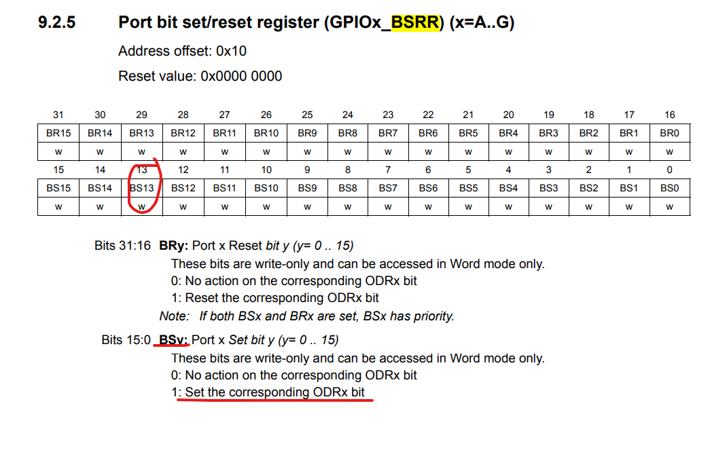
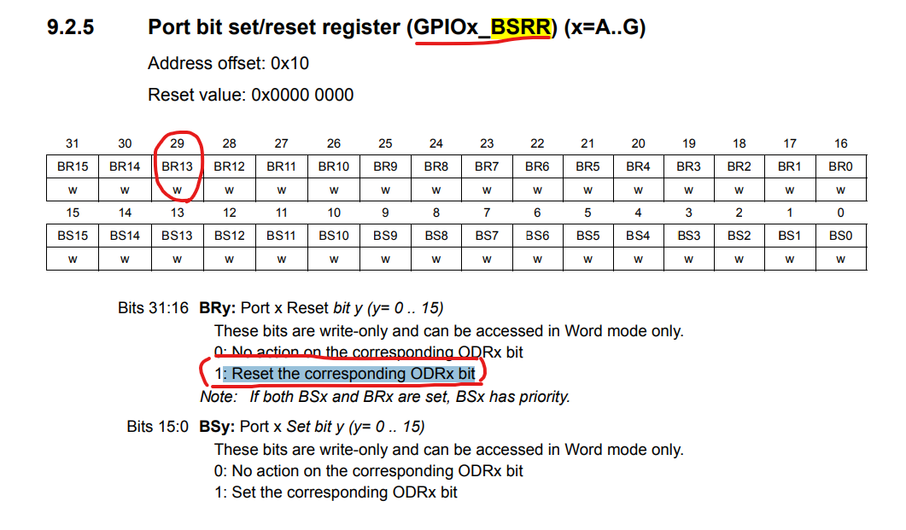

# HAL_GPIO_WritePin()이란?
```c
MX_GPIO_Init();
...

static void MX_GPIO_Init(void)
{

  /* GPIO Ports Clock Enable */
  __HAL_RCC_GPIOC_CLK_ENABLE(); // GPIOC clock enable
  __HAL_RCC_GPIOA_CLK_ENABLE();

  /*Configure GPIO pin Output Level */
  HAL_GPIO_WritePin(GPIO_LED_GPIO_Port, GPIO_LED_Pin, GPIO_PIN_SET); // 이 코드를 분석해보자!
}
```

## HAL_GPIO_WritePin(GPIO_LED_GPIO_Port, GPIO_LED_Pin, GPIO_PIN_SET);
```c
void HAL_GPIO_WritePin(GPIO_TypeDef *GPIOx, uint16_t GPIO_Pin, GPIO_PinState PinState)
{
  /* Check the parameters */
  assert_param(IS_GPIO_PIN(GPIO_Pin));
  assert_param(IS_GPIO_PIN_ACTION(PinState));

  if (PinState != GPIO_PIN_RESET)
  {
    GPIOx->BSRR = GPIO_Pin;
  }
  else
  {
    GPIOx->BSRR = (uint32_t)GPIO_Pin << 16u;
  }
}
```

### assert_param
- GPIO pin이 실질적으로 유효한가? 유효하지 않은가?
- 실질적으로 아무것도 하는게없다.
```c
#define assert_param(expr) ((void)0U)
```

### GPIOC->BSRR

#### Set the corresponding ODRx bit
- 해당되는 ODRx bit를 설정하라
- **ODRx**: 특정 핀의 출력 데이터를 제어하는 레지스터의 비트
  + Output Data Register

#### 요약 및 결론

### GPIO_LED_GPIO_Port
- GPIOC
- 0x40011000

### GPIO_LED_Pin
- GPIO_PIN_13
- 8192(10,000,000,000,000) 13번째 bit on

### GPIO_PIN_SET
- set: 1, reset: 0
```c
if (PinState != GPIO_PIN_RESET)
  {
    GPIOx->BSRR = GPIO_Pin;
  }
  else
  {
    GPIOx->BSRR = (uint32_t)GPIO_Pin << 16u;
  }
```
- 위 코드에서

  #### GPIO_PIN_SET == 1 일 때
  - `GPIOC->BSRR = GPIO_Pin_13;`
  - `*(0x40011010) = 10,000,000,000,000;`
  - GPIOC 포트에서 13번 pin의 bit 1로 set하여 high로 활성화
  #### GPIO_PIN_SET == 0 일 때
  - `GPIOx->BSRR = (uint32_t)GPIO_Pin << 16u;`
  - `*(0x40011010) = 10,000,000,000,000 << 16u;`
  - GPIOC 포트에서 29번 pin을 bit 1 setting한다.
    + Reset the corresponding ODRx bit
    + 해당되는 output data register bit값을 Reset하여 low로 설정
  
  - **결론은 GPIOC 포트에서 13번 pin의 bit값을 reset한다.**