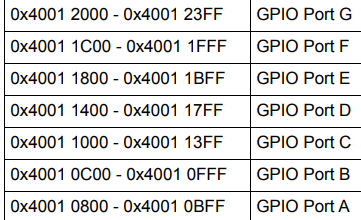
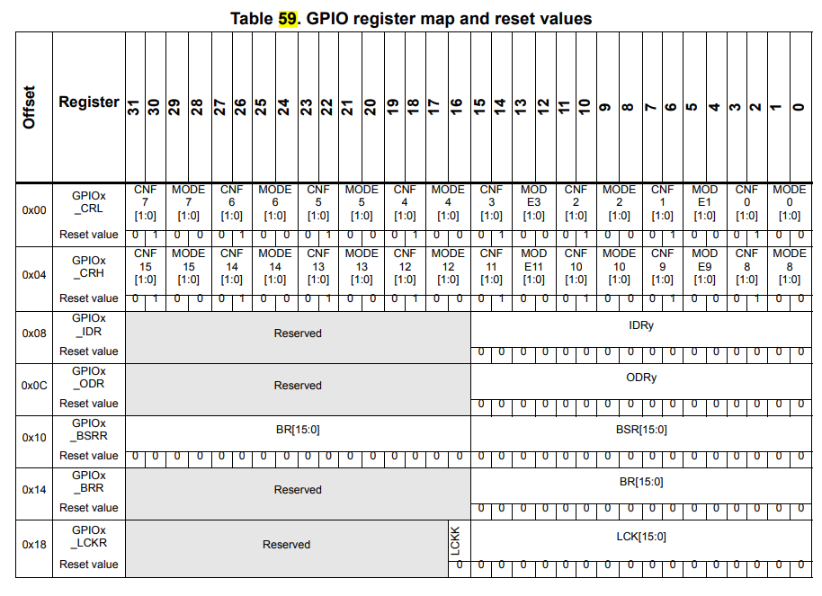
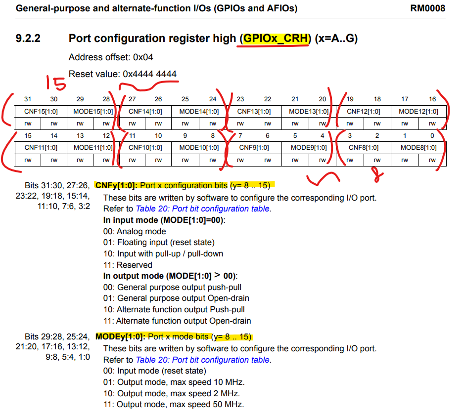

#### 저번시간에 못한 GPIO_Init 함수의 나머지 구조체 맴버변수를 분석해보자.

## GPIO_InitStruct 구조체 분석하기 

```c
  GPIO_InitTypeDef GPIO_InitStruct = {0}; // 구조체 정의

  GPIO_InitStruct.Pin = GPIO_LED_Pin; // pc13, 8192
  GPIO_InitStruct.Mode = GPIO_MODE_OUTPUT_PP; // 1
  GPIO_InitStruct.Pull = GPIO_NOPULL; // 0
  GPIO_InitStruct.Speed = GPIO_SPEED_FREQ_HIGH; // 3
  HAL_GPIO_Init(GPIO_LED_GPIO_Port, &GPIO_InitStruct);
  // 1arg: GPIO_LED_GPIO_Port: GPIOC 포트의 기본 레지스터 값(0x40011000)
  // 2arg: 방금 설정한 구조체의 주소값을 넘김
```
- IOC모드에서 설정한 옵션값이 코드에 반영된것을 알 수 있다.

### GPIO_InitTypeDef
```c
typedef struct
{
  uint32_t Pin; 
  uint32_t Mode;
  uint32_t Pull;
  uint32_t Speed;
} GPIO_InitTypeDef;
```

### HAL_GPIO_Init
- 방대한 양의 코드를 볼 수 있다.
- 1st arg: GPIOC Group Port
- 2nd arg: 13번 pin에 대한 옵션 설정 데이터가 저장된 구조체에 접근하기 위한 구조체 포인터 변수가 매개변수로 전달됨
```c
void HAL_GPIO_Init(GPIO_TypeDef  *GPIOx, GPIO_InitTypeDef *GPIO_Init)
{
  // 변수의 선언들 - 시작
  uint32_t position = 0x00u;
  uint32_t ioposition;
  uint32_t iocurrent;
  uint32_t temp;
  uint32_t config = 0x00u;
  __IO uint32_t *configregister; /* Store the address of CRL or CRH register based on pin number */
  uint32_t registeroffset;       /* offset used during computation of CNF and MODE bits placement inside CRL or CRH register */
  // 변수의 선언들 - 끝

  /* Check the parameters */
  assert_param(IS_GPIO_ALL_INSTANCE(GPIOx));
  assert_param(IS_GPIO_PIN(GPIO_Init->Pin));
  assert_param(IS_GPIO_MODE(GPIO_Init->Mode));

  /* Configure the port pins */
  while (((GPIO_Init->Pin) >> position) != 0x00u)
  {
    /* Get the IO position */
    ioposition = (0x01uL << position);

    /* Get the current IO position */
    iocurrent = (uint32_t)(GPIO_Init->Pin) & ioposition;

    if (iocurrent == ioposition)
    {
      /* Check the Alternate function parameters */
      assert_param(IS_GPIO_AF_INSTANCE(GPIOx));

      /* Based on the required mode, filling config variable with MODEy[1:0] and CNFy[3:2] corresponding bits */
      switch (GPIO_Init->Mode)
      {
        /* If we are configuring the pin in OUTPUT push-pull mode */
        case GPIO_MODE_OUTPUT_PP:
          /* Check the GPIO speed parameter */
          assert_param(IS_GPIO_SPEED(GPIO_Init->Speed));
          config = GPIO_Init->Speed + GPIO_CR_CNF_GP_OUTPUT_PP;
          break;

        /* If we are configuring the pin in OUTPUT open-drain mode */
        case GPIO_MODE_OUTPUT_OD:
          /* Check the GPIO speed parameter */
          assert_param(IS_GPIO_SPEED(GPIO_Init->Speed));
          config = GPIO_Init->Speed + GPIO_CR_CNF_GP_OUTPUT_OD;
          break;

        /* If we are configuring the pin in ALTERNATE FUNCTION push-pull mode */
        case GPIO_MODE_AF_PP:
          /* Check the GPIO speed parameter */
          assert_param(IS_GPIO_SPEED(GPIO_Init->Speed));
          config = GPIO_Init->Speed + GPIO_CR_CNF_AF_OUTPUT_PP;
          break;

        /* If we are configuring the pin in ALTERNATE FUNCTION open-drain mode */
        case GPIO_MODE_AF_OD:
          /* Check the GPIO speed parameter */
          assert_param(IS_GPIO_SPEED(GPIO_Init->Speed));
          config = GPIO_Init->Speed + GPIO_CR_CNF_AF_OUTPUT_OD;
          break;

        /* If we are configuring the pin in INPUT (also applicable to EVENT and IT mode) */
        case GPIO_MODE_INPUT:
        case GPIO_MODE_IT_RISING:
        case GPIO_MODE_IT_FALLING:
        case GPIO_MODE_IT_RISING_FALLING:
        case GPIO_MODE_EVT_RISING:
        case GPIO_MODE_EVT_FALLING:
        case GPIO_MODE_EVT_RISING_FALLING:
          /* Check the GPIO pull parameter */
          assert_param(IS_GPIO_PULL(GPIO_Init->Pull));
          if (GPIO_Init->Pull == GPIO_NOPULL)
          {
            config = GPIO_CR_MODE_INPUT + GPIO_CR_CNF_INPUT_FLOATING;
          }
          else if (GPIO_Init->Pull == GPIO_PULLUP)
          {
            config = GPIO_CR_MODE_INPUT + GPIO_CR_CNF_INPUT_PU_PD;

            /* Set the corresponding ODR bit */
            GPIOx->BSRR = ioposition;
          }
          else /* GPIO_PULLDOWN */
          {
            config = GPIO_CR_MODE_INPUT + GPIO_CR_CNF_INPUT_PU_PD;

            /* Reset the corresponding ODR bit */
            GPIOx->BRR = ioposition;
          }
          break;

        /* If we are configuring the pin in INPUT analog mode */
        case GPIO_MODE_ANALOG:
          config = GPIO_CR_MODE_INPUT + GPIO_CR_CNF_ANALOG;
          break;

        /* Parameters are checked with assert_param */
        default:
          break;
      }

      /* Check if the current bit belongs to first half or last half of the pin count number
       in order to address CRH or CRL register*/
      configregister = (iocurrent < GPIO_PIN_8) ? &GPIOx->CRL     : &GPIOx->CRH;
      registeroffset = (iocurrent < GPIO_PIN_8) ? (position << 2u) : ((position - 8u) << 2u);

      /* Apply the new configuration of the pin to the register */
      MODIFY_REG((*configregister), ((GPIO_CRL_MODE0 | GPIO_CRL_CNF0) << registeroffset), (config << registeroffset));

      /*--------------------- EXTI Mode Configuration ------------------------*/
      /* Configure the External Interrupt or event for the current IO */
      if ((GPIO_Init->Mode & EXTI_MODE) == EXTI_MODE)
      {
        /* Enable AFIO Clock */
        __HAL_RCC_AFIO_CLK_ENABLE();
        temp = AFIO->EXTICR[position >> 2u];
        CLEAR_BIT(temp, (0x0Fu) << (4u * (position & 0x03u)));
        SET_BIT(temp, (GPIO_GET_INDEX(GPIOx)) << (4u * (position & 0x03u)));
        AFIO->EXTICR[position >> 2u] = temp;


        /* Enable or disable the rising trigger */
        if ((GPIO_Init->Mode & RISING_EDGE) == RISING_EDGE)
        {
          SET_BIT(EXTI->RTSR, iocurrent);
        }
        else
        {
          CLEAR_BIT(EXTI->RTSR, iocurrent);
        }

        /* Enable or disable the falling trigger */
        if ((GPIO_Init->Mode & FALLING_EDGE) == FALLING_EDGE)
        {
          SET_BIT(EXTI->FTSR, iocurrent);
        }
        else
        {
          CLEAR_BIT(EXTI->FTSR, iocurrent);
        }

        /* Configure the event mask */
        if ((GPIO_Init->Mode & GPIO_MODE_EVT) == GPIO_MODE_EVT)
        {
          SET_BIT(EXTI->EMR, iocurrent);
        }
        else
        {
          CLEAR_BIT(EXTI->EMR, iocurrent);
        }

        /* Configure the interrupt mask */
        if ((GPIO_Init->Mode & GPIO_MODE_IT) == GPIO_MODE_IT)
        {
          SET_BIT(EXTI->IMR, iocurrent);
        }
        else
        {
          CLEAR_BIT(EXTI->IMR, iocurrent);
        }
      }
    }

	  position++;
  }
}
```

#### 분석 과정
- if (iocurrent == ioposition) 해당 조건문을 만족할 때 까지
- potion의 값과 ioposition의 값이 증가하여 
- ioposition값이 13번 pin과의 값과 같아질 까지 while문을 반복한다.

- if (iocurrent == ioposition) 해당 조건문을 만족한다면
- ```c
  switch (GPIO_Init->Mode)
      {
        case GPIO_MODE_OUTPUT_PP:
          config = GPIO_Init->Speed + GPIO_CR_CNF_GP_OUTPUT_PP;
          break;
      }
  ```
  - config = 3 + 0x00000000u = 3; 해당 값을 구하고 break 문
- ```c
  configregister = (iocurrent < GPIO_PIN_8) ? &GPIOx->CRL     : &GPIOx->CRH;
  ```
  - CRL: Control Register Low
  - CRH: Control Register High
  - configregister = &GPIOx->CRH = 0x40011004;
- ```c
  registeroffset = (iocurrent < GPIO_PIN_8) ? (position << 2u) : ((position - 8u) << 2u);
  ```
  - registeroffset = ((position - 8u) << 2u) = 20;
- 위 코드들은 몇번째 pin임을 확인하는 코드같다.

- ```c
  #define MODIFY_REG(REG, CLEARMASK, SETMASK)  WRITE_REG((REG), (((READ_REG(REG)) & (~(CLEARMASK))) | (SETMASK)))
  ```
- ```c
  MODIFY_REG((*configregister), ((GPIO_CRL_MODE0 | GPIO_CRL_CNF0) << registeroffset), (config << registeroffset));
  ```
  + REG: (*configregister) ==> (*0x40011004) ==> 0x44444444
  + CLEARMASK: ((GPIO_CRL_MODE0 | GPIO_CRL_CNF0) << registeroffset) ==>  15 << 20
  + SETMASK: (config << registeroffset) ==>  3 << 20


- #define READ_REG(REG)         ((REG))
```c
#define READ_REG(0x4444,4444)  (0x4444,4444)
```
  + 왜 이런 의미없는 연산을 하는가?
  + 이미 설정된 값이 있지만
  + 변화 시키고 싶은 bit가 있을때

- #define WRITE_REG(REG, VAL)   ((REG) = (VAL))
```c
WRITE_REG(0x4444,4444, (0x44444444) & (~(15 << 20) | 3 << 20))
WRITE_REG(0x4444,4444, 0x4444,4444 & 0xFF0F,FFFF | 0x0030,0000)
// 6번째 bit 자리를 변화시키고 싶은 상황
WRITE_REG(0x4444,4444, 0x4404,4444 | 0x0030,0000)
// 6번째 bit 자리를 변화시키고 싶은 상황
WRITE_REG(0x4444,4444, 0x4434,4444)
// 결과 *(0x40011004) = 0x4434,4444;
// ((REG) = (VAL)) *configregister = 0x4434,4444
```
### 중요한 건 이 행위들이 무엇인지는 데이터시트를 보고 쫒아가야한다.
#### 그리고 아래 코드들은
```c
GPIO_InitTypeDef GPIO_InitStruct = {0}; // 구조체 정의
GPIO_InitStruct.Pin = GPIO_LED_Pin; // pc13, 8192
GPIO_InitStruct.Mode = GPIO_MODE_OUTPUT_PP; // 1
GPIO_InitStruct.Pull = GPIO_NOPULL; // 0
GPIO_InitStruct.Speed = GPIO_SPEED_FREQ_HIGH; // 3
HAL_GPIO_Init(GPIO_LED_GPIO_Port, &GPIO_InitStruct);
```
#### 이 코드로 대처가 가능하다.
```c
volatile unsigned int * reg2 = 0x40011004;
*reg2 = (*reg2 & ~(15UL << 20U)) | (3U << 20U);
```

### GPIOx 그룹들의 주소 범위 (51p)


### GPIOx 그룹의 구성 (194p)

- 분석하면서 GPIOC 그룹의 레지스터 구조체와 구성이 똑같다.
```c
typedef struct
{
  __IO uint32_t CRL; // 각각 4byte 단위
  __IO uint32_t CRH;
  __IO uint32_t IDR;
  __IO uint32_t ODR;
  __IO uint32_t BSRR;
  __IO uint32_t BRR;
  __IO uint32_t LCKR;
} GPIO_TypeDef;
```
- 4byte 단위로 register가 나뉘어져있다.

#### GPIOx_CRH
- GPIO Control Register High
- GPIOx Group의 8번pin부터 15번pin까지를 다루는 레지스터

- MODE비트에서 Input mode와 Output mode를 bit값으로 설정
- CNF비트에서 INPUT/OUTPUT mode에 따라 각 옵션을 bit 설정