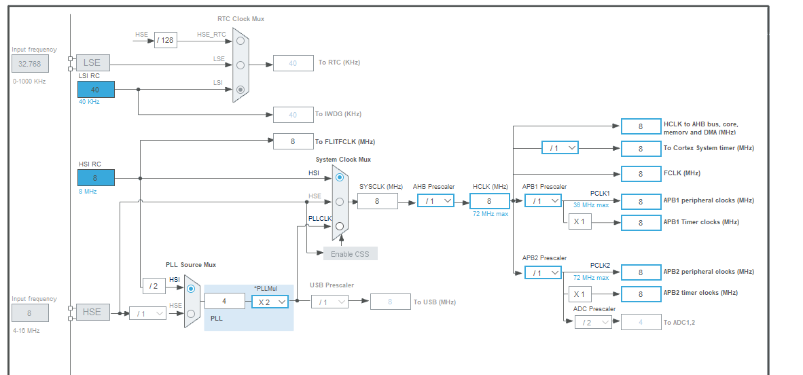

## IOC Mode의 Clock Configuration

### HSI

- **High-Speed Internal**, STM32칩 `내부에 내장된 고속 클럭 소스`

- STM32_Chip은 외부에 클럭 소스가 없어도 내부에서 생성되는 `HSI 고속 클럭 소스`를 사용해서 동작 할 수 있다.

- `8MHz`, 1초에 800만번 뛰는 주파수

- 내부에 있기 때문에 외부 환경에 영향을 덜받아 상대적으로 더 `안정적`이다.

- #### 전원을 키자마자 빠르게 사용할 수 있다.

- #### 용도: 초기 부팅 및 빠른 시작

### HSE

- **High-Speed External**

- STM32칩 `외부에 열결된 고속 클럭 소스`

- 사용자가 외부 `오실레이터`나 `크리스탈`을 연결하여 설정

- `HSE`는 **고정밀 타이밍**이 필요할 때 주로 사용

  - `통신 프로토콜`, `타이머` 등... **높은 정확도를 요구하는 경우에 사용**

- 외부에서 클럭 신호가 안정화될때까지 기다려야 하므로 상대적으로 **`HSI`보다 시작 시간이 느리다.**

#### STM32에서 기본적인 클럭 설정 할 때, 처음에는 HSI를 사용해서 빠르게 부팅한 뒤, 필요에 따라 HSE로 전환해서 사용하는 경우가 많다. => 빠른 시작과 높은 정확도 2가지를 동시에 만족시킬 수 있다.

## System Clock Mux

#### Multiplexer (Mux)란?

- 여러 개의 입력 신호 중 **하나를 선택**하여 하나의 출력으로 전달하는 디지털 신호
- **선택 신호(select signals)** 사용하여 입력 신호 중 어느 하나를 선택

#### System Clock Mux의 역할

- **클럭 소스 선택**: 다양한 클럭 소스(예: 내부 클럭, 외부 클럭, PLL 등) 중에서 하나를 선택하여 **시스템 클럭**으로 사용

  - **System Clock?**:

- **유연성 제공**: 마이크로컨트롤러가 여러 가지 클럭 소스를 사용할 수 있도록 하여, 상황에 따라 최적의 클럭 소스를 선택

## Prescaler

#### 기본 개념

- **Prescaler**는 `입력 클럭 신호`를 **나누어 주파수를 낮추는 회로**
- 다양한 주변 장치가 요구하는 클럭 속도를 맞추기 위해 사용
- 마이크로컨트롤러의 타이머, ADC, 통신 장치 등의 클럭을 조정하여 원하는 동작을 수행할 수 있게 합니다.

#### 주요 용도

- **타이머 및 카운터**: 타이머의 입력 클럭을 조정하여 다양한 타이머 주기를 설정할 수 있습니다.
- **ADC(Analog-to-Digital Converter)**: ADC의 클럭 속도를 조정하여 안정적인 변환을 수행할 수 있습니다.
- **UART**, **SPI** 등 통신 장치: 통신 속도를 조정하여 다양한 보드레이트를 지원
  - `보드레이트`

#### 예시

- 타이머의 주기를 조정하여 원하는 시간 간격으로 인터럽트를 발생
- ADC가 안정적으로 동작할 수 있는 최대 클럭 주파수가 1MHz일 때, 시스템 클럭이 16MHz라면, Prescaler를 16으로 설정하여 ADC 클럭을 1MHz로 조정
- 입력 클럭이 8MHz이고, Prescaler 값이 2라면, 출력 클럭은 4MHz가 됩니다.

> **Peripheral clock gating**
>
> In Run mode, the HCLK and PCLKx for individual peripherals and memories can be stopped
> at any time to reduce power consumption.
> To further reduce power consumption in Sleep mode the peripheral clocks can be disabled
> prior to executing the WFI or WFE instructions.
> Peripheral clock gating is controlled by the AHB peripheral clock enable register
> (RCC_AHBENR), APB1 peripheral clock enable register (RCC_APB1ENR) and APB2
> peripheral clock enable register (RCC_APB2ENR).

> #### Peripheral clock gating 번역
>
> - `run mode`에서, Peripheral devices와 Memory에 대한 `HCLK` 및 `PCLKx`는 전력 소비를 줄이기 위해 언제든지 중지될 수 있습니다.
>
>   - `HCLK`: `고속 버스 클록`, `시스템 버스 및 메모리 클록의 주 클록`
>   - `PCLKx`: `주변 장치 클록`, APB 버스에 연결된 주변 장치들의 클록 (APB1, APB2)
>
> - `Sleep Mode`에서 전력 소비를 더욱 줄이기 위해, `WFI` 또는 `WFE` 명령을 실행하기 전에 주변 장치 클록을 비활성화할 수 있습니다.
>   - `WFI(Wait For Interrupt)`: 인터럽트가 발생할 때까지 대기하는 명령
>   - `WFE(Wait For Event)`: 이벤트가 발생할 때까지 대기하는 명령
> - `Peripheral clock gating`은 **AHB 주변 장치 클록 활성화 레지스터 (RCC_AHBENR)**, **APB1 주변 장치 클록 활성화 레지스터 (RCC_APB1ENR)** 및 **APB2 주변 장치 클록 활성화 레지스터(RCC_APB2ENR)** 에 의해 제어됩니다.

### APB2 peripheral clock enable register (RCC_APB2ENR)

> #### AHB/APB bridges (APB)
>
> The two AHB/APB bridges provide full synchronous connections between the AHB and the
> 2APB buses. APB1 is limited to 36 MHz, APB2 operates at full speed (up to 72 MHz
> depending on the device).
> Refer to Table 3 for the address mapping of the peripherals connected to each bridge.
> After each device reset, all peripheral clocks are disabled (except for the SRAM and FLITF).
> Before using a peripheral you have to enable its clock in the RCC_AHBENR,
> RCC_APB2ENR or RCC_APB1ENR register.
> Note: When a 16- or 8-bit access is performed on an APB register, the access is transformed into a 32-bit access: the bridge duplicates the 16- or 8-bit data to feed the 32-bit vector.

> #### 번역
>
> AHB/APB 브리지 (APB)
>
> - 두 개의 AHB/APB **Bridge**는 AHB와 두 개의 APB 버스 간에 **완전한 동기화 연결을 제공**
> - **APB1**은 36MHz로 제한되고, **APB2**는 최대 72MHz (장치에 따라 다름)로 동작합니다.
> - 각 **Bridge**에 연결된 주변 장치의 주소 매핑은 표 3을 참조하십시오.
> - 각 장치가 **리셋**된 후에는 **모든 주변 장치 클록이 비활성화**됩니다 (SRAM 및 FLITF는 예외)
> - 주변 장치를 사용하기 전에 `RCC_AHBENR`, `RCC_APB2ENR` 또는 `RCC_APB1ENR` 레지스터에서 해당 클록을 활성화해야 합니다.
>
> 참고:
> 16비트 또는 8비트 접근이 `APB` 레지스터에서 수행될 때, 접근은 32비트 접근으로 변환됩니다. 브리지(버스)는 16비트 또는 8비트 데이터를 복제하여 32비트 벡터에 전달합니다.

> 

##### 리셋: 레지스터의 비트가 0으로 설정되어 주변 장치가 `비활성화`된다는 것

##### 비활성화: 비트가 0으로 설정되어 클록이 공급되지 않음
