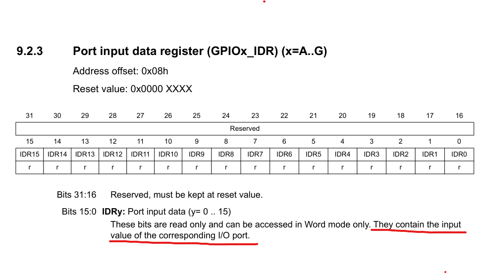

> **필요한 사전지식**
>
> 1. **GPIO Input mode**
> 2. **pull-up 저항**

# 회로도 참고


- 스위치 on/off에 따라 전류의 흐름 상태를 check하여 status를 반환하는 함수를 분석해보자

# HAL_GPIO_ReadPin

```c
GPIO_PinState HAL_GPIO_ReadPin(GPIO_TypeDef *GPIOx, uint16_t GPIO_Pin)
{
  GPIO_PinState bitstatus; // 0과 1 둘 중 하나의 값으로 초기화 될 예정

  /* Check the parameters */
  assert_param(IS_GPIO_PIN(GPIO_Pin));

  if ((GPIOx->IDR & GPIO_Pin) != (uint32_t)GPIO_PIN_RESET)
  {
    bitstatus = GPIO_PIN_SET;
  }
  else
  {
    bitstatus = GPIO_PIN_RESET;
  }
  return bitstatus;
}
```

### 예제 함수

- GPIOA 포트의 0번 핀의 상태값을 읽어들이는 함수

```c
HAL_GPIO_ReadPin(GPIO_SWITCH_GPIO_Port, GPIO_SWITCH_Pin)
// GPIO_SWITCH_GPIO_Port = GPIOA
// GPIO_SWITCH_Pin = GPIO_PIN_0
```

### 함수 return type

GPIOx의 y번재 pin을 읽어서 status값을 반환하는 함수

```c
typedef enum
{
  GPIO_PIN_RESET = 0u,
  GPIO_PIN_SET
} GPIO_PinState;
```

### 조건문 분석

```c
GPIO_PinState bitstatus;

  if ((GPIOA->IDR & GPIO_PIN_0) != (uint32_t) GPIO_PIN_RESET)
  {
    bitstatus = GPIO_PIN_SET;
  }
  else
  {
    bitstatus = GPIO_PIN_RESET;
  }
  return bitstatus;
```

#### 중요!!! **&(GPIOA->IDR)**: 0x40010808

- 스위치 on/off에 따라 값이 다르다.

##### 스위치 on

- **(\*0x40010808)**: 16자리의 랜덤 비트값이 할당된다. 하지만 **확실한건 bit 0의 자리의 값은 항상 0이다.**
- **따라서 `GPIOA->IDR & GPIO_PIN_0` 연산 결과는 0**

##### 스위치 off

- **(\*0x40010808)**: 16자리의 랜덤 비트값이 할당된다. 하지만 **확실한건 bit 0의 자리의 값은 항상 1이다.**
- **따라서 `GPIOA->IDR & GPIO_PIN_0` 연산 결과는 1**

#### **GPIO_PIN_0**: 1u // pin 0 selected

#### 분석 적용

```c
if ( (0 & 1) !=  (uint32_t) 0)
{
	bitstatus = 1;
	// GPIOA_IDR0 즉, 0번 핀 상태를 읽고 그 값이 0이 아니라면 GPIO_PIN_SET을 반환
}
else
{
	bitstatus = 0;
	// GPIOA_IDR0 즉, 0번 핀 상태를 읽고 그 값이 0이라면 GPIO_PIN_RESET을 반환
}
```

### 레퍼런스 참고 해석


