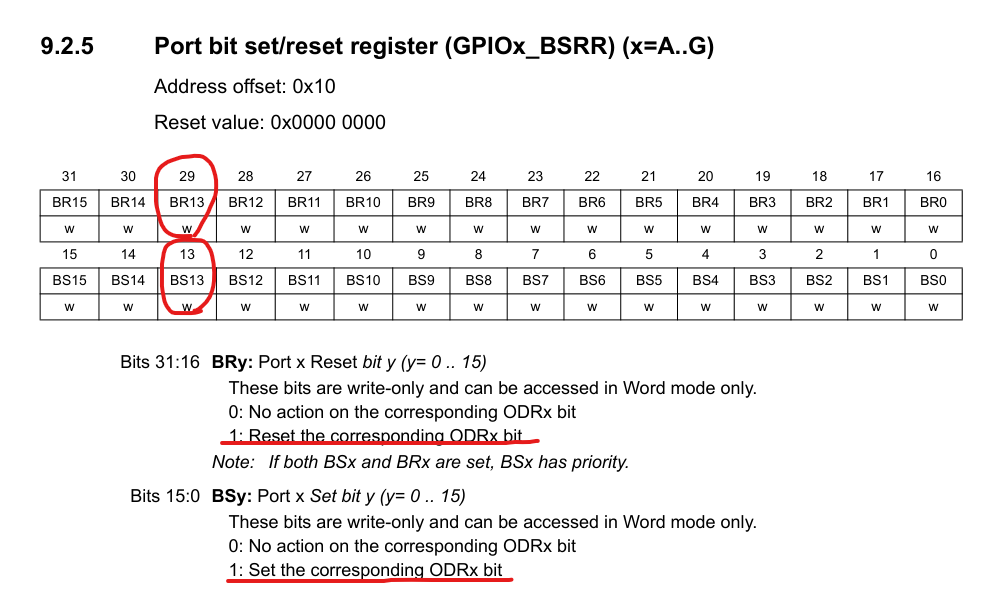

# HAL_GPIO_WritePin(GPIOx, GPIO_Pin, PinState);

## 예제

```c
HAL_GPIO_WritePin(GPIO_LED_GPIO_Port, GPIO_LED_Pin, GPIO_PIN_SET);
/*
* GPIO_LED_GPIO_Port: GPIOC
* GPIO_LED_Pin: GPIO_PIN_13
* GPIO_PIN_SET: 1 (High mode)
*/
```

## 함수 정의

```c
void HAL_GPIO_WritePin(GPIO_TypeDef *GPIOx, uint16_t GPIO_Pin, GPIO_PinState PinState)
{
  /* Check the parameters */
  assert_param(IS_GPIO_PIN(GPIO_Pin));
  assert_param(IS_GPIO_PIN_ACTION(PinState));

  if (PinState != GPIO_PIN_RESET)
  {
    GPIOx->BSRR = GPIO_Pin;
  }
  else
  {
    GPIOx->BSRR = (uint32_t)GPIO_Pin << 16u;
  }
}
```

### assert_param(expr)?

- function's parameters check

  - if expr is false, it calls assert_failed function

    - false를 반환한 소스파일 이름과 line number를 반환한다.

  - if expr is true, it calls **(void)0U... 즉, 아무것도 안한다.**

### 조건문 해석

#### 조건문

```c
if (1 != 0)
{
	GPIOC->BSRR = GPIO_PIN_13;
	// *(0x40011010) = 0x2000(8192, 10,0000,0000,0000)
	// 13번째 bit 1 setting
}
else
{
	GPIOC->BSRR = (uint32_t)GPIO_PIN_13 << 16u;
	// *(0x40011010) = 0x2000 << 16u;
	// 0x2000 << 16u; = 0x2000 0000
	// 29번째 bit 1 setting
}
```

### reference 참조



> **레퍼런스와 코드를 조합해서 참고하자면**
>
> - **BS13**: GPIOC 포트의 13번째 pin을 **Setting(활성화)한다.**
> - **BR13**: GPIOC 포트의 13번째 pin을 **Reset(비활성화)한다.**

#### 결론 GPIOC 포트의 13번째 pin on/off 기능을 코딩한것!
