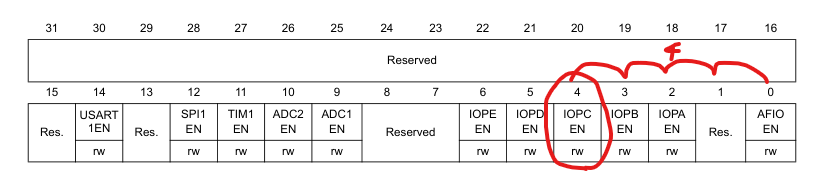
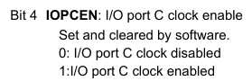

# Hal 드라이브 없이 GPIO 제어하기

## MX_GPIO_Init();

```c
static void MX_GPIO_Init(void)
{
  GPIO_InitTypeDef GPIO_InitStruct = {0};

  /* GPIO Ports Clock Enable */
  __HAL_RCC_GPIOC_CLK_ENABLE();
	__HAL_RCC_GPIOA_CLK_ENABLE();

  /*Configure GPIO pin Output Level */
  HAL_GPIO_WritePin(GPIO_LED_GPIO_Port, GPIO_LED_Pin, GPIO_PIN_SET);

  /*Configure GPIO*/
  GPIO_InitStruct.Pin = GPIO_LED_Pin; // GPIO_PIN_13
  GPIO_InitStruct.Mode = GPIO_MODE_OUTPUT_PP; // 0x00000001u Output Push Pull Mode
  GPIO_InitStruct.Pull = GPIO_PULLDOWN; // pull down 저항 모드
  GPIO_InitStruct.Speed = GPIO_SPEED_FREQ_HIGH; // 전환 스피드는 high
  HAL_GPIO_Init(GPIO_LED_GPIO_Port, &GPIO_InitStruct);

	/*Configure GPIO pin : GPIO_SWITCH_Pin */
  GPIO_InitStruct.Pin = GPIO_SWITCH_Pin;
  GPIO_InitStruct.Mode = GPIO_MODE_INPUT;
  GPIO_InitStruct.Pull = GPIO_PULLUP;
  HAL_GPIO_Init(GPIO_SWITCH_GPIO_Port, &GPIO_InitStruct);

/* USER CODE BEGIN MX_GPIO_Init_2 */
/* USER CODE END MX_GPIO_Init_2 */
}
```

### 코드 분석

#### 1. GPIO_InitTypeDef GPIO_InitStruct = {0};

- 현재 GPIO 옵션에 대한 초기설정은 아무것도 진행되지 않은 상태
- **사용자 정의 Type**

```c
typedef struct
{
  uint32_t Pin;       /*! GPIO Pin 번호 구성 */

  uint32_t Mode;      /*!< Output push pull 구성(전기 신호로 외부장치 조작 모드) */

  uint32_t Pull;      /*!< Output mode에서는 open drain Mode가 아닌이상 pull-up,
						pull-down 저항을 사용할 일은 없다. */

  uint32_t Speed;     /*!< High mode와 Low mode의 전환 속도*/
} GPIO_InitTypeDef;
```

#### 2. \_\_HAL_RCC_GPIOC_CLK_ENABLE();

- **clock 개념에 대한 이해가 필요하다.** [클럭 개념](../../컴퓨터%20구조/클럭.md)
- GPIOC Port에 대한 Clock 활성화 여부를 조작

```c
#define __HAL_RCC_GPIOC_CLK_ENABLE()   do { \
                                        __IO uint32_t tmpreg; \
                                        SET_BIT(RCC->APB2ENR, RCC_APB2ENR_IOPCEN);\
                                        /* Delay after an RCC peripheral clock enabling */\
                                        tmpreg = READ_BIT(RCC->APB2ENR, RCC_APB2ENR_IOPCEN);\
                                        UNUSED(tmpreg); \
                                      } while(0U)
```

- **결과적으로 사용하지 않는 코드**
  - 디버깅 에러메세지 호출시 동작하는 코드 `assert_param() 호출`

```c
__IO uint32_t tmpreg;
tmpreg = READ_BIT(RCC->APB2ENR, RCC_APB2ENR_IOPCEN);
UNUSED(tmpreg);
```

- **SET_BIT(RCC->APB2ENR, RCC_APB2ENR_IOPCEN); (이 코드만 이해하면 된다.)**

  **#define SET_BIT(REG, BIT) ((REG) |= (BIT))**

  - **REG**: **`RCC->APB2ENR`의 값 ==> 0x40021018**
  - **BIT**: **`RCC_APB2ENR_IOPCEN`의 값 ==> 1 << 4 (즉, 16**)

- **결론: \*(0x40021018) |= 1 << 4 == `0 |= 16` == `0b(0001,0000)`**

- **Reference 참조**
  
  
- 위 이미지에 따르면 위 코드는 Bit4(5번째 bit) IOPCEN bit를 조작하는 코드로서 `C port clock을 disable/enable`하는 코드이다.

  - **RCC**란?
    - "Reset and Clock Control"
    - **마이크로컨트롤러에서 시스템의 리셋 및 클럭 관리를 담당하는 모듈**
    - STM32 마이크로컨트롤러에서 RCC는 다양한 클럭 소스(HSE, HSI, LSE, LSI)를 선택하고 관리
    - 클럭을 다양한 시스템 및 주변 장치에 배분하는 기능을 수행

- `#define RCC                 (RCC_TypeDef *)RCC_BASE`
  ```c
  typedef struct
  {
  	// 시스템 리셋 및 클럭 관리를 위해 접근할 레지스터들
    __IO uint32_t CR;
    __IO uint32_t CFGR;
    __IO uint32_t CIR;
    __IO uint32_t APB2RSTR;
    __IO uint32_t APB1RSTR;
    __IO uint32_t AHBENR;
    __IO uint32_t APB2ENR; // 해당 레지스터를 조작하여 Port C의 clock을 enable
    __IO uint32_t APB1ENR;
    __IO uint32_t BDCR;
    __IO uint32_t CSR;
  } RCC_TypeDef;
  ```

#### 3. \_\_HAL_RCC_GPIOA_CLK_ENABLE();

```c
#define __HAL_RCC_GPIOA_CLK_ENABLE()   do { \
                                        SET_BIT(RCC->APB2ENR, RCC_APB2ENR_IOPAEN);
                                      } while(0U)
```

- **SET_BIT(RCC->APB2ENR, RCC_APB2ENR_IOPAEN);** 분석하기
  - \*(0x40021018) |= 1 << 2 와 같은 코드
  - 분석결과 GPIOA Prot Clock enable/disable을 결정하는 코드
