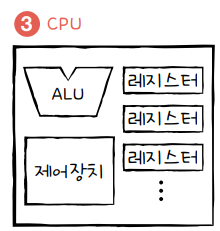

# CPU (Central Processing Unit)

- 메모리에 저장된 데이터를 읽고 해석 및 실행하는 장치
- `코어 수`, `클럭 속도` 및 `아키텍처`에 따라 성능이 결정됨
#### ALU: 연산
#### 제어장치: 제어 신호를 통해 컴퓨터 부품을 관리 및 control
#### 레지스터: 빠른 실행을 위한 cpu의 임시 저장장치

# MPU (Micro Processing Unit)
- **단일 칩**에서  **CPU 기능을 포함**하는 소형화된 형태
- **주로 임베디드 시스템에 사용되며, 특정 기능을 수행하도록 최적화된 연산 장치**
## 구성
### 아래와 같은 구성품들을 하나의 칩에 통합하여 사용
- CPU
- memory
- I/O interface 등

# MCU (Micro Controller Unit)
- 임베디드에서 특정 기능을 수행하기 위해서 설계된 소형화된 단일 칩(컴퓨팅 장치)
- **MPU + Peripehrals**
- `ADC`, `Serial 통신 Interface`, `타이머`, `카운터`, `I/O` prot 등 단일칩에 다양한 기능을 가진 소자들이 포함되어 있다.

### Arm사에서 core 관련 라이선스 제공
### stm사에서 Arm사에서 제공한 core에 GPIO, 타이머, Serial 통신 등 다양한 Peripheral 소자들을 추가하여 단일 칩으로 구성해 판매 