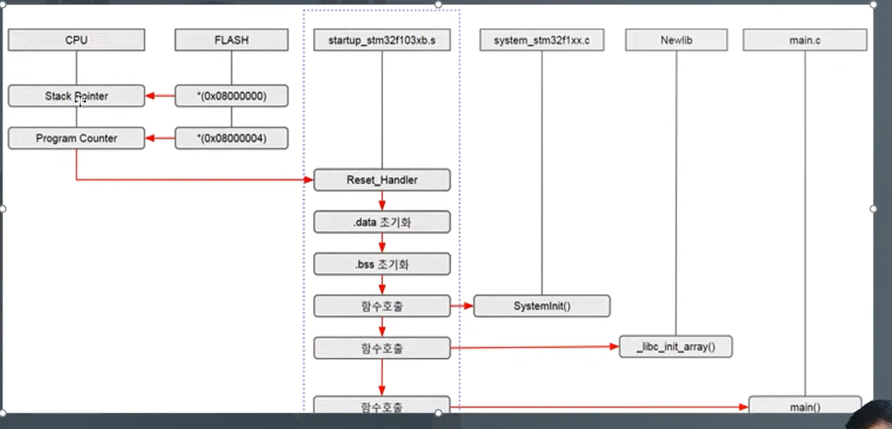

# GPIO 제어 과정
## 1. Power On
## 2. Startup Code

## 3. main()

// 그냥 읽으세요
### Hal_Init
- 주변 장치 리셋
- Flash Interface 초기화
- Systick 설정

### MX_GPIO_Init()
- __Hal_RCC_GPIOC_CLK_ENABLE();
// GPIOC 포트 클럭 활성화

### Hal_GPIO_Init()
- GPIO옵션 설정

# 24강을 보면서 전체적인 복습을 추천한다.