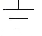
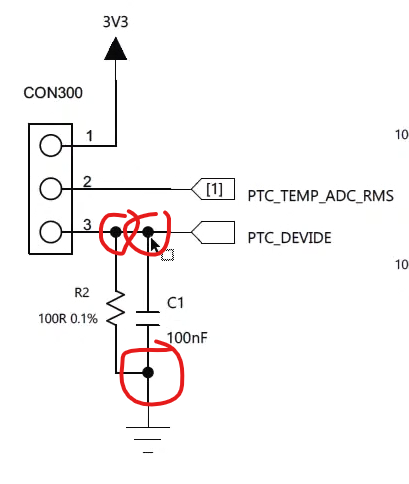
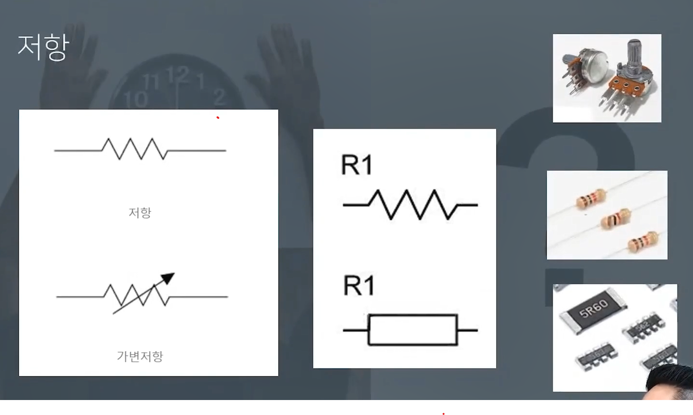
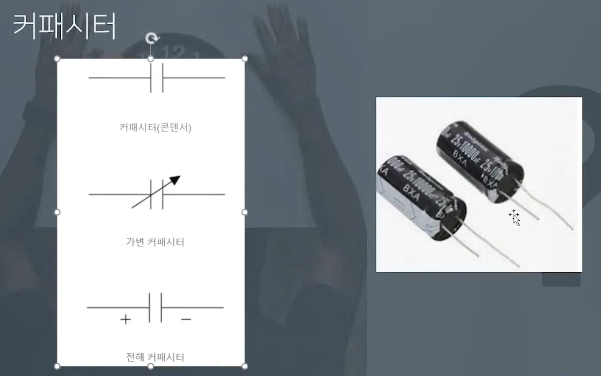
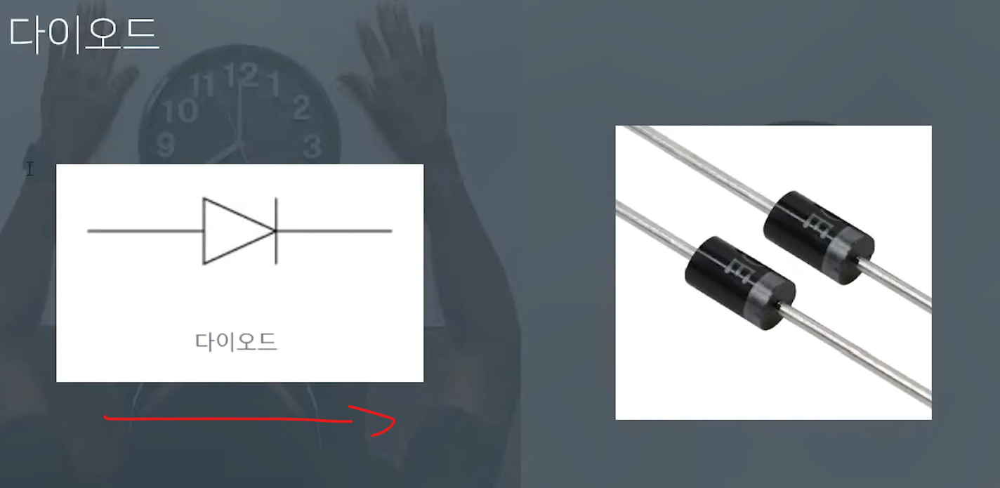
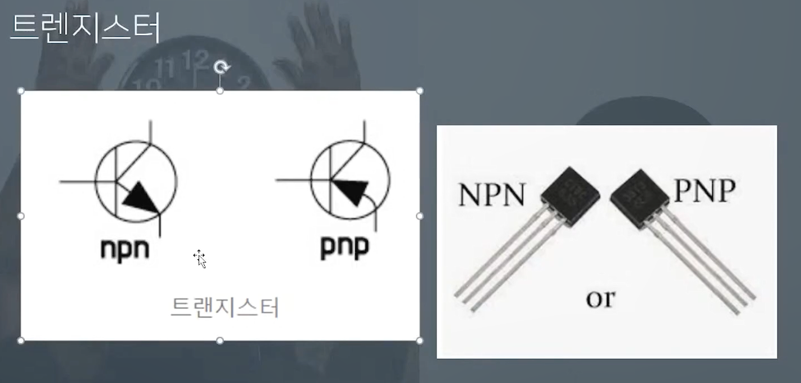

# 임베디드 sw 개발자는 회로도를 어느 정도 알아야할까?

1. 회로도를 보고 내가 제어할 부품이 무엇인지, 어떻게 제어해야 할지를 알면 된다.

2. 회로도 상의 부품을 실제 보드에서 찾을 수 있어야함

3. 어디가 전원이고 그라운드인지 찾을 수 있어야함

4. 하드웨어 디버깅시, 어디에 멀티미터기를 연결해야 할지, 오실로 스코프를 연결해야 될지 알아야함

- 어떤 값이 나와야 정상인지 알아야함
- 원인까지 알면 좋으나 문제가 있다 까지는 알아야한다.

# 회로도

- 약속된 기호로 그려진 전기 회로
- 실제 모양과 많이 다를 수 있음

## 회로도 기호

## 전원

## 그라운드

## 선이 연결됐다는 의미

- 교차하는 선에서 동그란 점은 연결됐다는 것을 의미

## 저항

- **기호[R]**
- **수치 값[k]**

### 주요 용도

- Pull-up 저항
- 전류 제어
- **디버깅시 측정 지점**

## 캐패시터

- 전하를 모으고 방출, **축전기**
- 안정적인 전기를 공급하는 역할

## 코일

- DC DC 컨버터 사용시 주로 쓰인다.
- **전류의 양을 항상 일정하게 한다.**

## 다이오드

- 신호가 역으로 흐르지 않게 한다.
- 다이오드는 두 단자로 구성되어 있다. (왼쪽기호부터 **에노드**, 오른쪽 기호는 **캐소드**)
- **다이오드에서 전류는 오직 에노드에서 캐소드 방향으로만 흐른다.**

## 트랜지스터

- **and 게이트**, **or 게이트** 생성
- **npn**, **pnp**

### 주요 용도

- **전기적 신호(GPIO)로 스위치 역할**
- 약한 신호를 강한 신호로 증폭

# 그 외

# 멀티미터기

## 전압을 측정하는 방법

- 그라운드에는 검은색 전원에는 빨간색을 대면 된다.
- **기준 전압치보다 높은 전압이 흐르면 당장 전원을 꺼야한다!**

# 중요한 것

1. 각각의 pin에 어느 선에 연결되어 있는가?
2. 데이터시트를 보고 코드를 어떻게 구현할 것인가?

## 원리는 모르지만 일단 우겨넣을 지식

- IOC모드에서 clock을 만드는 기능이 없는 pin이지만 clk을 만드는 기능이 필요한 pin의 경우는 GPIO Output으로 설정해야 한다.

  - High or Low 전기적 신호를 규칙적으로 내보내서 클럭을 sw적으로 만들어야한다.
  - PB15의 경우 해당

- 데이터시트를 보고 IOC모드에서 적절한 옵션을 설정해야한다.
  - FND_DIO는 Digital input output 을 뜻하는 것으로 데이터시트에 따르면 디지털 신호를 읽는 용도로 쓰이기 때문에 GPIO Input으로 설정해야한다.

## 숙제

1. 회로도를 보고 멀티미터기를 사용하여 각 pin당 연결된 저항에 쇼트테스트를 해보자
2. 오실로스코프로 GPIO LED control을 구현한 전기적 신호를 잡아서 관측해보자
