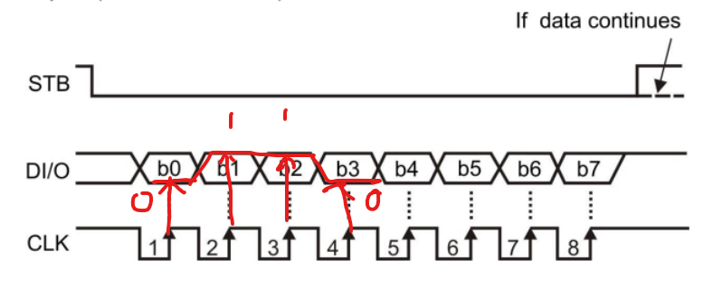

# 데이터 시트 보는 꼼수

## 1. 목적을 세우자

- 내가 해야하는 정확한 목표를 세우고, 그 목표에 맍는 지식만 습득하자
  - 개념과 필요한 API만 보자!

### 예시목표

- led display driver ic를 통해 7세그먼트 LED Displays를 제어해보자

## 2. 장치들의 개념을 이해하자

- 일단, 데이터 시트 없이 이게 뭐하는 장치인지 대충 파악해보고 상상해본다.
- Description을 읽어본다.

### 예시

- LED Displays, 7세그먼트

  - 구글링을 통해 뭐하는 장치인지 파악하자
  - 데이터시트를 읽어본다.

- LED display dirver ic 장치의 역할을 파악하자
  - 회로도를 본다.(회로도를 보고 어떻게 기능이 돌아가지는 상상한다.)
    
  - 데이터시트를 본다.
    (내가 생각한 기능이 맞는지 알 수 있을때까지 꼼꼼히 읽어본다.)

  - 하지만 위 예시의 경우 **백지식**을 먼저 공부하지 않으면 데이터 시트를 읽어도 뭐가 뭔지 이해할 수 없을것이다.
    - Uart
    - Rs232
    - Rs485
    - **SPI**
    - i2c
    - TCP,UDP
  - 위 예시의 경우에는 **SPI 통신 개념**을 모르면 데이터시트를 봐도 이해할 수 없다.
  - 따라서 데이터시트를 읽기전에 위 통신개념들은 필수로 익혀놔야한다.

### 빠져들어가면 안된다.

- 항상 목표에 맞게끔 가장 필요한 부분만 골라내서 데이터 시트나 구글링을 통해 기능을 완성해나가야 한다.

### 개념을 이해할 때

- 내가 깊게 알 필요가 있는 영역인가?
- 스킵해도 되는가?
- **하드웨어 영역인가?(나의 영역이 아니라면 알 필요가 없는 영역)**
- 소프트웨어 영역인가?

### 중요한거 2가지 개념만 알면된다.

#### 1. Serial Interface
#### 2. SPI 통신 개념
데이터를 통신하는 방법중 하나


- **STB**: 통신 시작과 끝을 알려준다.
- **DI\O**: 그림상으론 데이터를 8bit씩 보낸다.
  + CLK 상승 edge에 맞춰서 데이터를 규칙적으로 전송한다.
  + DI\O의 위치가 CLK의 상승 edge에서 위/아래에 위치하느냐에 따라 0과 1이 결정된다.
- **CLK**: 데이터를 인식하는 기준점, 규칙적인 전기 신호
  + 그림을 보면 default 값이 High인 상태를 알 수 있다.
  + 화살표를 보고 데이터를 인식하는 시점을 알 수 있다.(상승 edge)

#### 위 SPI통신은 GPIO Output(STB, CLK) 2개 Input(DI/O)통신 총 3개의 GPIO pin 설정을 통해 똑같이 구현할 수 있다.

#### SPI는 어떻게 데이터를 통신할지는 정의되어 있지만 어떤 데이터를 보낼지는 정의되어있지 않다.

### 어떤 데이터들을 보내야할까?
  - 어떤 방식으로 데이터를 보내는지는 데이터시트마다 전부 틀리다.
  + #### 어떻게 데이터가 구성된 매커니즘이고 로직으로 구성되어 sw 임베디드 개발자가 가장 집중적으로 봐야한다.
    * 1. 소스코드를 구해서 본다.
    * 2. 회로도를 보는 방법
    * 3. hw 담당자에게 물어본다. 
  - 그 의문은 데이터시트를 보면 해결된다.
  - Led_Display_Driver.PDF의 **Functional Description** (5P 참고)
  - **가장 좋은 점**: 샘플 소스를 구해서 일단 결과를 확인한다.

## 결론

### 1. 목적을 명확히하고 필요한 것만 찾아서 보는것이 가장 효율적이다.
- 빠져들어가서 무지성으로 순서대로 읽으면안된다.
- 데이터시트를 보면서 최소한으로 알아야할 필수 지식들이 있다.
```md
- Uart
- Rs232
- Rs485
- SPI
- i2c
- TCP,UDP
```
## 4. 데이터 시트만이 답은아니다.

1. 소스코드를 구해서 보는 방법
2. 회로도로 보는 방법
3. 하드웨어 담당자에게 물어보기
