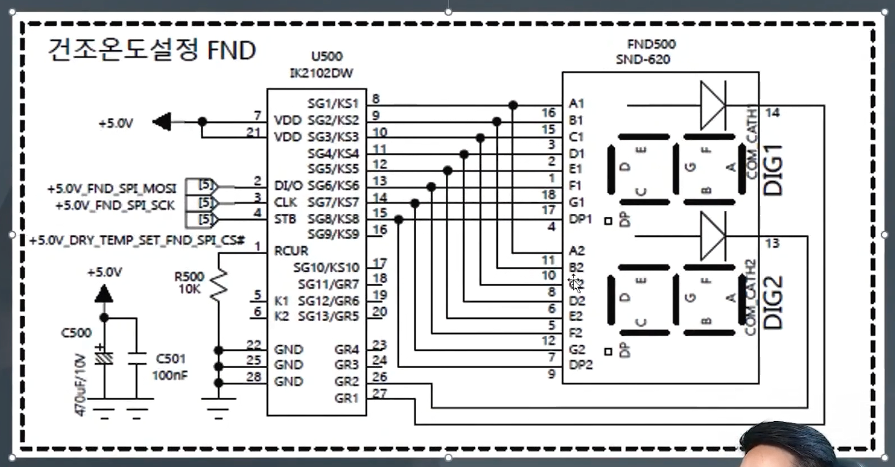

# 데이터 시트 보는 꼼수

## 1. 목적을 세우자

- 내가 해야하는 정확한 목표를 세우고, 그 목표에 맍는 지식만 습득하자
  - 개념과 필요한 API만 보자!

### 예시목표

- led display driver ic를 통해 7세그먼트 LED Displays를 제어해보자

## 2. 장치들의 개념을 이해하자

- 일단, 데이터 시트 없이 이게 뭐하는 장치인지 대충 파악해보고 상상해본다.
- Description을 읽어본다.

### 예시

- LED Displays, 7세그먼트

  - 구글링을 통해 뭐하는 장치인지 파악하자
  - 데이터시트를 읽어본다.

- LED display dirver ic 장치의 역할을 파악하자
  - 회로도를 본다.(회로도를 보고 어떻게 기능이 돌아가지는 상상한다.)
    
  - 데이터시트를 본다.
    (내가 생각한 기능이 맞는지 알 수 있을때까지 꼼꼼히 읽어본다.)
  - 하지만 위 예시의 경우 **백지식**을 먼저 공부하지 않으면 데이터 시트를 읽어도 뭐가 뭔지 이해할 수 없을것이다.
    - Uart
    - Rs232
    - Rs485
    - **SPI**
    - i2c
    - TCP,UDP
  - 위 예시의 경우에는 **SPI 통신 개념**을 모르면 데이터시트를 봐도 이해할 수 없다.

### 빠져들어가면 안된다.

- 항상 목표에 맞게끔 가장 필요한 부분만 골라내서 데이터 시트나 구글링을 통해 기능을 완성해나가야 한다.

### 개념을 이해할 때

- 내가 깊게 알 필요가 있는 영역인가?
- 스킵해도 되는가?
- **하드웨어 영역인가?(나의 영역이 아니라면 알 필요가 없는 영역)**
- 소프트웨어 영역인가?

## 3. 그림을 그려나가자

- 내 목적을 이루기 위해 그림을 하나씩 그려가고 모든 연결고리가 이어지도록 하자
- 이해되지 않는 연결고리가 있다면 그 부분을 연구하자

## 4. 데이터 시트만이 답은아니다.

1. 소스코드를 구해서 보는 방법
2. 회로도로 보는 방법
3. 하드웨어 담당자에게 물어보기
