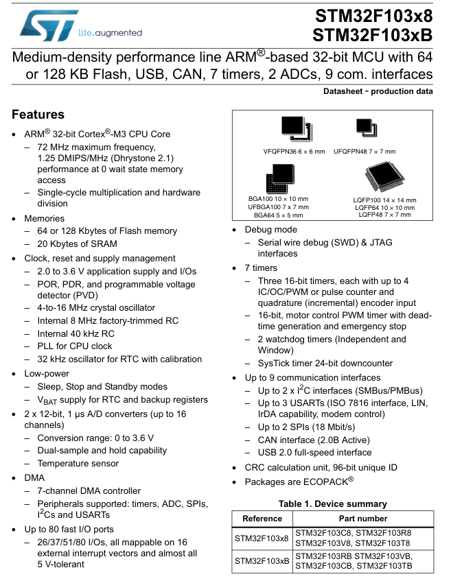

- **`Medium-density`**: **트린지스터가 얼마나 집약**되어있는가?
- `32-bit`: **메모리에서 레지스터로 데이터를 읽어올 때 한번에 처리되는 용량이 32bit**
  - **레지스터 용량이 32bit**
  - 메모리는 0부터 31번지까지 존재
  - 메모리 1번지에 해당하는 크기도 32bit
  - 메모리에서 레지스터로 읽어오는 선의 개수도 32개(0번지 ~ 31번지)
  - 32bit는 메모리 주소의 최댓값도 의미 2^32
- `64 or 128 KB Flash`: 이 제품에는 **Flash 용량**이 2종류(64KB, 128KB)인 제품이 있다.

  - **`FLASH`**
    - **RAM**보다는 느리지만 **HDD**보다 바른 비휘발성 메모리
    - **HDD**를 대체하거나 보완

- `USB, CAN`: 이 칩에서 지원하는 통신 인터페이스

- 7 timers: timer 7개 제공

- 2ADCs: analog digital converter 2개 제공

- `9 com. interfaces`: 9개의 communication이 가능한 인터페이스가 있다.

- `72 MHz maximum frequency`
  - Clock 단위, 1Hz 는 1초에 한 번 반복되는 주기적 이벤트(1초에 한번 진동)
  - 1kHz = 1000Hz
  - 1mHz = 1000kHz
  - 1GHz = 1000mHz

### 클럭(Hz) -> 명령어(MIPS) -> 특정행동(DMIPS)

- 클럭이 빠르면 cpu가 빠르다.

#### MIPS

- Million Instruction per second
- 초당 100만개의 명령어를 실행할 수 있는 능력

#### DMIPS

- Dhrystone 벤치마크 프로그램을 사용하여 측정한 MIPS 성능
- 컴파일러 및 시스템 성능을 평가하는 데 사용되는 프로그램
- `1.25 DMIPS/MHz`: CPU가 1MHz의 클럭 주파수에서 1.25 Dhrystone MIPS를 실행할 수 있다는 의미
  - **즉, CPU가 1MHz에서 초당 1.25백만개의 Dhrystone 명령어를 처리할 수 있다는 것**

### Single-cycle multiplication and hardware division

- **Single-cycle multiplication**
  - 한 사이클 내에 곱셈 연산을 완료하는 기능
  - 곱셈 연산이 매우 빠르게 수행됨을 보장 => 복잡한 계산을 빠르게 수행
- **hardware division**
  - 하드웨어적으로 나눗셈 연산을 수행하는 기능
  - 소프트웨어적으로 나눗셈을 구현하는 것보다 훨씬 빠르고 효율적으로 나눗셈을 처리

#### 정리: 효율적이고 빠른 연산 지원

### 전원 감시기(power supply supervisor)

마이크로컨트롤러의 전원 공급 상태를 모니터링하여 안정적인 동작을 보장하는 기능

#### POR - Power On Reset: Vpor 이상이면 리셋 해제(1.72V)

- **기능**: 전원이 처음 공급될 때, `MCU`를 리셋 상태로 유지하여 안정적인 전원이 공급되기 전까지 동작을 방지
- **동작 전압**: 전원 공급이 𝑉POR(1.72V) 이상이 되면 리셋이 해제

#### PDR - Power Down Reset: Vpdr 이하이면 리셋(1.68V)

- **기능**: 전원 공급 전압이 낮아질 때 `MCU`를 리셋하여 불안정한 동작을 방지
- **동작 전압**: 전원 공급 전압이 𝑉PDR(1.68V) 이하로 떨어지면 리셋이 활성화

#### BOR(Brownout Reset): threshold voltage 감시

- **기능**: 전원 공급 전압이 급격히 떨어질 때 이를 감지하고 리셋을 실행하여 데이터 손상 및 예기치 않은 동작을 방지
- **동작 방식**: 특정 임계 전압(threshold voltage)을 모니터링하여 전압이 임계치 이하로 떨어지면 리셋을 활성화

#### PVD(Programmable voltage detector)

- **기능**: 사용자가 설정한 임계 전압을 모니터링하고, 전압이 임계치에 도달하면 인터럽트를 발생시킵니다.
- **용도**: 전원 상태를 지속적으로 모니터링하고, 필요에 따라 경고 메시지 전송 또는 시스템 안전 상태로 전환 등의 작업을 수행합니다.

### Internal 8 MHz factory-trimmed RC Oscillator

- MCU에는 공장에서 미리 조정된 내부 8MHz RC 발진기가 포함되어 있음
- 초기 설정시 기본 시스템 클럭으로 사용
- **시스템 초기화**: **리셋** 또는 **전원 켜짐** 시 기본 클록 소스로 사용되어 시스템이 즉시 동작하는 클록 소스

### PLL (위상 동기 회로) for cpu clock

#### 역할: 입력받은 clock 주파수를 증폭시켜주는 역할

- 더 빠른 clock으로 만들어 cpu의 성능을 끌어올려주는 장치

### RTC

#### Real Time Clock

#### 시간을 측정하는 기준점

- RTC를 기준으로 특정 동작을 수행 할 수 있다.

### 초단위

- **ms(milli second) 1s = 1000ms**
- us(micro second) 1ms = 1000us
- ns(nano second) 1ns = 1000ns

### 2 x 12-bit, 1 µs A/D converters (up to 16–channels)

- 2개의 12비트 A/D 컨버터
- 최대 1us내에 변환 완료
- **up to 16-channels**: ADC 장치에 전압이 공급되는 채널이 16개 있다.
- **dual sample and hold capacity**: ADC 아날로그 신호를 디지털화 하기위해서는 입력되는 시간이 일정시간 보장되어야 한다. 따라서 캐패시터로 전류를 일정시간 안정적으로 공급하여 sample을 확보한다라는 의미일 것
  - 그리고 해당 샘플이 2개라는 의미

### DMA(Direct Memory Access)

- **7-channel DMA Controller**
- **Peripherals supported**: timers, ADC, SPIs, I2Cs and USARTs
- CPU의 개입 없이 `메모리`와 `주변 장치 간` 또는 메모리 간에 데이터를 직접 전송
- CPU의 부하를 줄이며, 시스템의 전반적인 성능을 향상

### Up to 80 fast I/O ports

- 최대 80개의 빠른 Input/Output GPIO ports
- 26/37/51/80 I/Os
- all mappable on 16 **external interrupt vectors** and almost all **5 V-tolerant**
  - **intterupt vectors**: 인터럽트가 발생했을 때 해당 인터럽트를 처리하기 위해 필요한 정보가 저장된 위치를 가리키는 포인터
  - **5 V-tolerant**: 해당 pin에 5V의 전입이 들어와도 다른 GPIO pin이나 디바이스의 다른 block에 문제가 발생하지 않음

### Debug mode

#### Serial Wire Debug(SWD)

- pin 설정이 단순하여 조작하기 쉽다.
- ST-link 도구를 사용하여 upload, download 및 디버깅을 할 수 있다.

#### JTAG interfaces

- pin 배열이 복잡하다.

### 7 timers

#### Three 16-bit timers, each with up to 4 IC/OC/PWM or pulse counter and quadrature (incremental) encoder input

- **Input Capture mode**: 외부 신호의 특정 이벤트(상승 에지, 하강 에지 등)를 캡처하여 타이머 카운터 값을 기록.
- **Output Campare mode**: 타이머 카운터가 사전 설정된 값에 도달하면 출력 핀의 상태를 변경(high, low, toggle)
- **PWM Output mode**: 필요한 만큼의 전압을 받기 위하여 기존 입력된 전압을 타이머를 기준으로 나눠서 입력해 받아들이는 총 전압의 양을 줄이는 방법
  - 16-bit, motor control PWM timer with dead-time generation and emergency stop

#### 그외 timer 모드

- **Counter mode**: 사용자가 설정한 카운터가 다 줄면 인터럽트가 발생
- **External Input counter mode**: 외부의 이벤트마다 인터럽트가 발생할 때마다 카운트 값이 증가
- **2 watchdog timers (Independent and Window)**
  - 사용자의 cpu가 정상적으로 작동하는지 검사
  - 주기적인 점검 중 시스템이 정상적으로 작동하지 않을 때 자동으로 리셋을 수행하여 시스템의 안정성을 보장.
  #### Independent WDT: 별도의 내부 저속 클럭으로 동작하며, 주기적으로 리셋되지 않으면 시스템을 리셋.
  #### Window WDT: 설정된 "윈도우" 내에서만 리셋할 수 있어, 너무 자주 또는 너무 늦게 리셋되는 것을 방지.
- **SysTick timer 24-bit downcounter**
  - 기준이 되는 timer로서 프로그래밍 중 시간을 활용할 때 사용

### CRC calculation unit

- 주로 데이터 전송 또는 저장의 무결성을 검증하기 위해 사용
- 노이즈나 다른 형태의 간섭으로 인한 데이터 오류를 감지할 수 있도록 설계
- OJ 강의 [모드버스 프로토콜](https://www.youtube.com/playlist?list=PLz--ENLG_8TPJsTDyihX9_fdpLPFdd1xl) 에서 CRC 강의 참고

