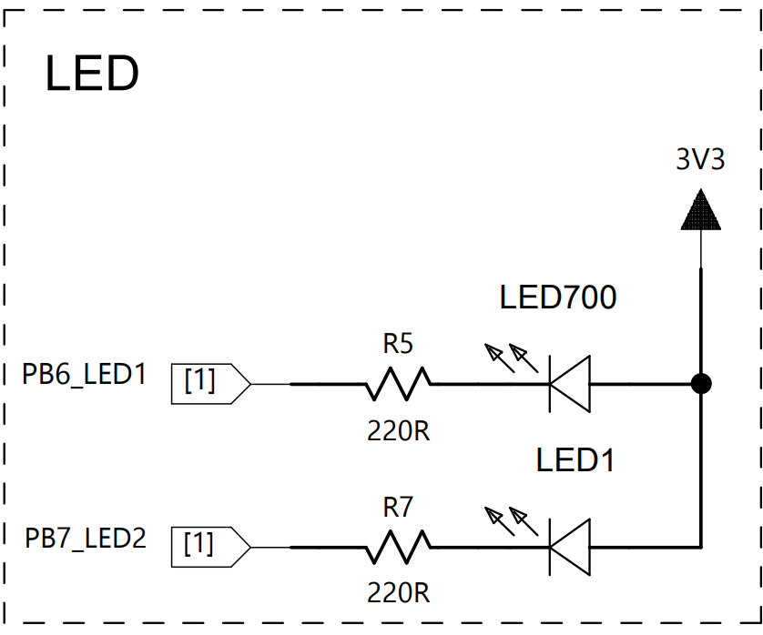

### 버튼을 눌러 PB0 상태값 변화 관찰하기

#### 스위치를 활용한 회로를 구성해보자


- 위 회로도를 바탕으로 빵판의 회로를 제작
- 회로구성후 코드 작성

#### IOC mode 옵션 설정

- pull-up 저항의 특성을 이해했음
- 코드를 작성한 후 스위치 on/off에 따라 PB0의 상태값을 관찰하자

```c
// 전역변수로 PB0 상태값 선언
int button_state = 0;
.
.
.

int main(void)
{
  ...
  button_state = HAL_GPIO_ReadPin(PB0_TEMP_SET_UP_GPIO_Port, PB0_TEMP_SET_UP_Pin);
  HAL_Delay(500);
  ...
}
```
- 디버깅하고 break point로 변수 button_state의 상태값을 관찰해보자
- GPIO input mode pull-up저항 이론에 맞는 state값을 관찰할 수 있다.

### 버튼을 눌러 LED on/off
- 기존 회로에서 다음 회로도 결합



### IOC모드 설정

- 코드 작성

```c
// 전역변수로 PB0 상태값 선언
int button_state = 0;
.
.
.

int main(void)
{
  ...
  button_state = HAL_GPIO_ReadPin(PB0_TEMP_SET_UP_GPIO_Port, PB0_TEMP_SET_UP_Pin);

	if (!button_state)
	{
	  HAL_GPIO_WritePin(PB6_LED1_GPIO_Port, PB6_LED1_Pin, 0);
	  HAL_GPIO_WritePin(PB7_LED2_GPIO_Port, PB7_LED2_Pin, 0);
	}

	else 
  {
	  HAL_GPIO_WritePin(PB6_LED1_GPIO_Port, PB6_LED1_Pin, 1);
	  HAL_GPIO_WritePin(PB7_LED2_GPIO_Port, PB7_LED2_Pin, 1);
	}
  ...
}
```

#### 숙제: 토글 스위치를 사용해서 LED를 control해보자