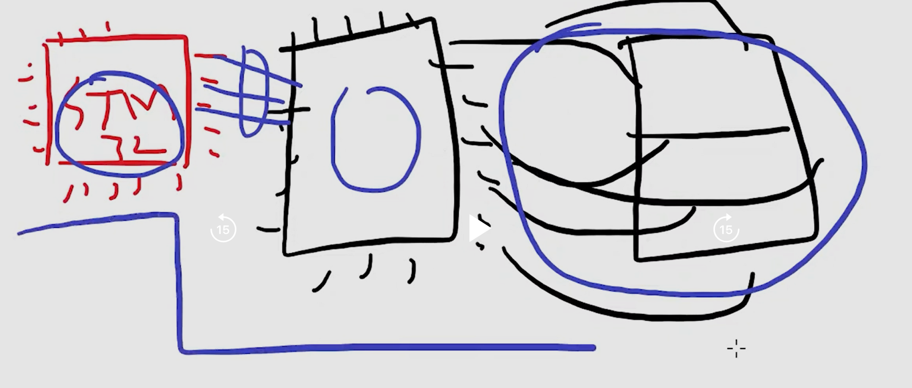

# 특정 제품을 카피하거나 분석할 때 실무

## 1. main chip의 이름을 확인한다.

`TM74HC595` + 7세그먼트 .... 로 구성된 모듈

## 2. 모듈 구성 파악

### example?

- stm칩과 fnd칩을 연결할 때 stm칩의 pin resource를 절약하기 위해서 중간에 LED chip을 둔다.
  
  - 8가닥이 필요한 fnd모듈을 LCD 드라이버를 통해 3가닥으로 제어

### 어떻게 파악하는가?

#### 1. main칩과 fnd모듈에 대한 데이터시트를 각각 구해서 분석한다. ==> 너무 오래걸리고 어렵다.

#### 2. 편법: 외부의 소스코드를 구해서 분석한뒤 다시 데이터시트를 역으로 분석하는 방법

- 정공법 보다 빠르게 분석이 가능

#### 3. 데이터 시트에 없는 회로 구성은 어떻게 찾는가?

- 쇼트 테스트로 찾는다.(노가다....)
- 남이 정리해 놓은 자료를 찾는다.(유튜브나 블로그)
- 샘플 코드를 구해서, 일단 동작시키고... 그 다음에 추리를 한다.
  - 코드를 찾는것도 능력이다. TM74HC595 sample code...

## 3. Sample 코드를 구했다면?

### 1. 데이터 시트의 모듈 구성도를 살펴보고 회로를 직접 구성한다.

- 소스코드를 보기전에 데이터시트의 모듈 그림을 본다.
- 모듈 그림데로 빵판과 칩 그리고 모듈을 연결한다.

### 2. 회로 구성 완료하고 코딩시작

- stm32IDE에서 IOC모드로 들어가 GPIO or CLK 설정을 한다.
- 현재 강의에서는 SCLK과 RCLK 그리고 DI/DO 모두 GPIO Output 옵션으로 구성하여 진행하자
- 옵션 설정 후 sample코드를 IDE에 적용하기
- sample 코드 분석해서 내것으로 만들기 ==> 분석해서 내것으로 만들면 추후 프로젝트 진행시 유리하다.

### 주변 장치 폴더의 FND 폴더에서 소스코드와 데이터시트를 참고

아래 블로그 참고
https://blog.naver.com/boilmint7/221442725896
