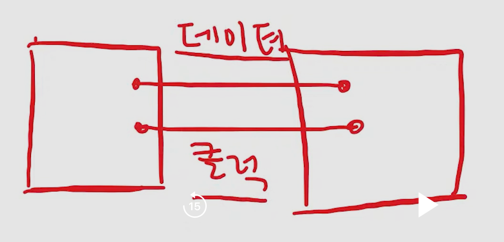
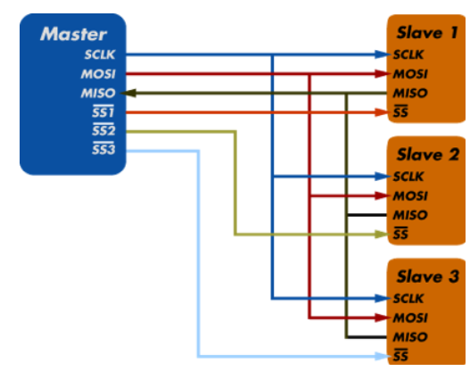
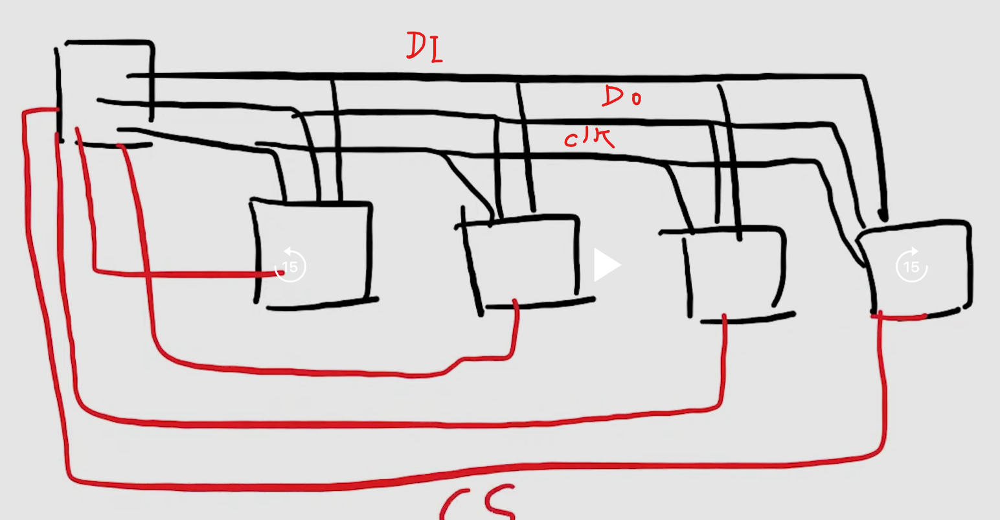

# SPI (Serial Peripheral Interface)

- 근거리에서 많이 사용
- 2개의 부품 사이에서 데이터를 주고받는 통신 방법
  - 2개의 전압 차이를 이용

## SPI 통신 측정 기준

### 1. TimeBase

- 신호를 측정하는 기준 통신 시간
- EX bps 9600) 1초를 9600의 1로 나눔

## 2. CLOCK

- CLICK 주파수의 주기를 기준으로 신호를 측정

## 반이중 방식

- **SPI 통신선이 2개일 경우**
  - CLK선 1개 DI/DO선 1개
- 두 부품 사이에서 동시에 신호를 보내면 신호 간섭이 일어나기 때문에 문제가 발생한다. 따라서 두 부품이 신호를 송수신하는 규칙(순서)를 정해야한다.

## 전이중 방식

- **SPI 통신선이 3개일 경우**
- CLK, DI, DO(3가닥)
- 두 부품 사이에 Data Input/output 선 2개를 두어 신호의 간섭을 방지
- SPI통신은 전이중 방식이 기본이다.

### 한번에 전이중 반이중 방식도 가능하다.

## 1대 다중 방식

### 문제점과 해결법 1. 누가 신호를 보냈는지 알 수 없다.

- Master와 Slave 관계를 정의하여 신호를 보내는 주체(Master)를 설정한다.
- Slave는 신호를 송신하는 권한이 없고 무조건 신호를 수신하고 응답하는 권한밖에 없다.
- 기본적으로 SPI 1대 다중 통신에 있어서 Master는 1개로 고정된다.

### 문제점과 해결법 2. Master가 누구에게 신호를 보내는가?

- CS(Chpi Select)선 사용
- 보통 GPIO옵션으로 사용하는데 평상시에는 High 상태로 있다가 Master가 보내는 chip에 한하여 Low 상태로 낮춰준다.
  - 이 방식은 Master가 한번만 신호를 보내도 여러 Slave 소자들이 동시에 수신이 가능하다.

### 따라서 SPI 통신에서는 기본적으로 선이 4가닥이다.(CLK, DI, DO, CS)

#### 참고로 I2C는 DI/O. CLK 선 2가닥만 사용하는데도 1대 다중 통신이 가능하다. 그 이유는 CS선을 사용하는 대신 Software적으로 다중통신이 가능하게 설계했기 때문이다.

- 주소 체계 사용
