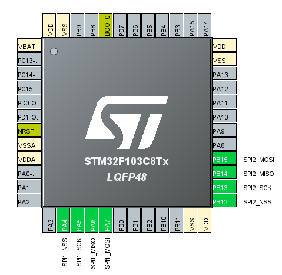
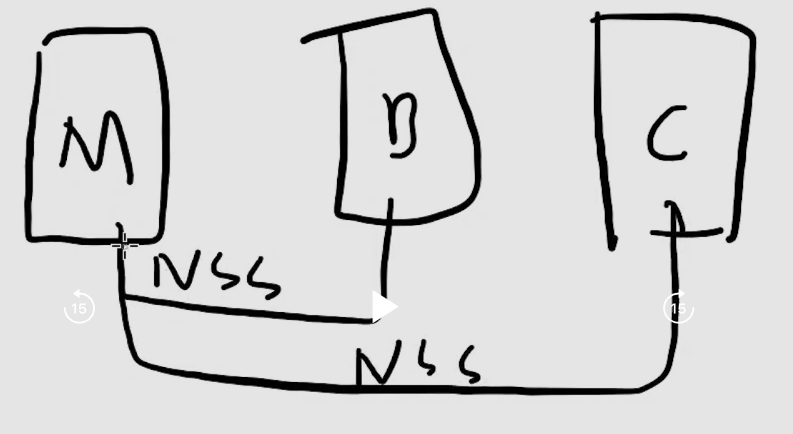
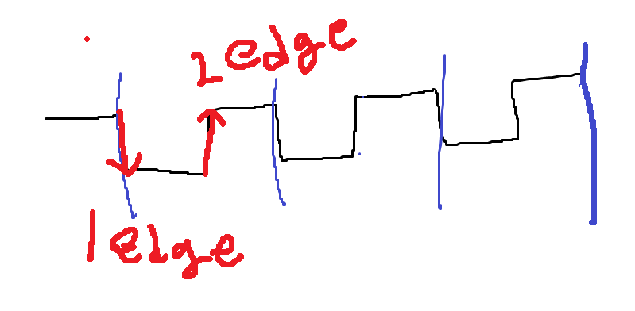
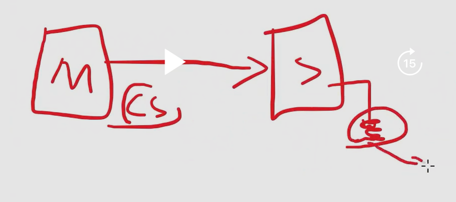
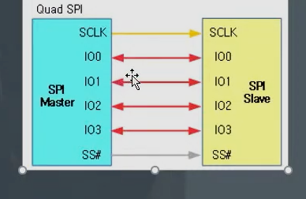

# STM32F103C8Tx 칩에서 지원하는 SPI 통신 알아보기

- 기본적으로 이 칩은 SPI를 2개 지원한다.

## 용어 파악하기

### MISO

- **Master Input Slave Output**

### MOSI

- **Master Output Slave Input**
- Mater가 신호를 보내는 전용선

## Mode

### Full-Duplex: 전이중 (CLK, DI, DO)

### Half-Duplex: 반이중 (CLK, DI/DO)

### Receive only: 수신 전용 (CLK, DI)

### Transmit only: 송신 전용 (CLK, DO)

## Hardware NSS Signal

- CS를 어떻게 컨트롤할것인가?
- Hardware적으로 하면 데이터를 보낼 때 CS 자동으로 LOW 상태가 된다.
- 단 NSS선 한개를 2개의 SLAVE로 연결하면 **Chip Select**의 역할을 수행할 수 없다.
  
- **즉, Hardware적으로 CS선을 사용하는 건 선 한개당 Master와 Slave 관계가 1:1이라는 것이다!**

  ### Software Type: GPIO를 사용

  ### Hardware Type: hw CS선 사용

## Parameter Settings

### Frame Format : Motorola(SPI 통신을 최초로 설계한 회사)

### 데이터시트를 보고 Data Size를 선택할 수 있다.

### First Bit

- MSB: first bit부터 시작
- LSB: Last bit부터 시작

### Clock Parameters

#### Prescaler: 클럭 속도를 일정 비율로 나눠줌

#### Baud Rate: 클럭 속도

#### Clock Polarity(CPOL)

- 극성
- CLK이 default로 Low 상태인가 High 상태인가?

#### Clock Phase: 어느 시점에 데이터를 측정하는지에 대한 설정

### Master에 연결된 Slave가 하나밖에 없는 경우

- 위 그림처럼 회로를 구성하여 CS선을 아예 LOW로 만들어 버린다.

### Quad SPI

- Data Input/ Data Output으로 4가닥 사용
