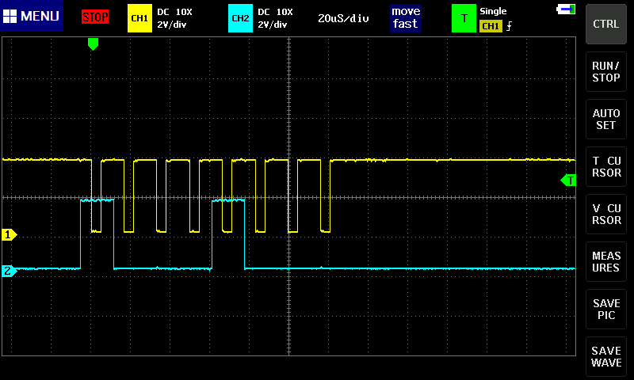
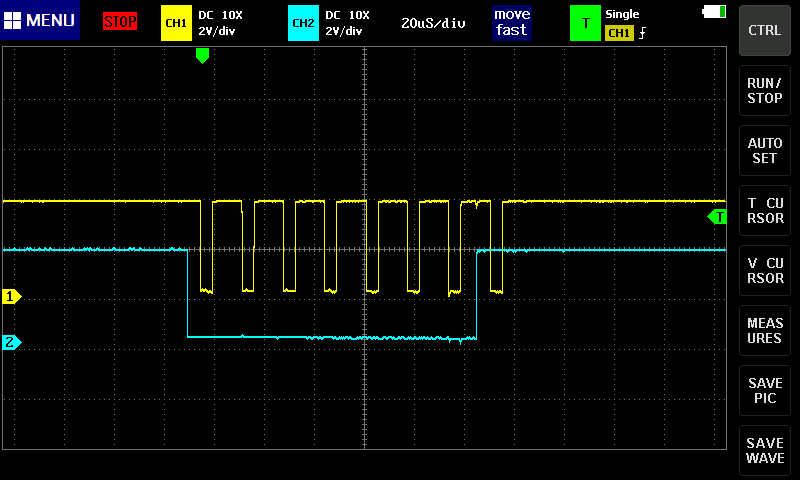
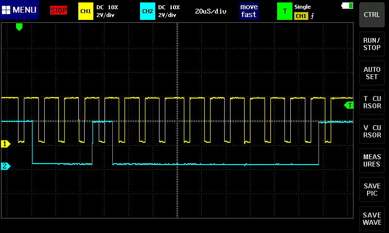
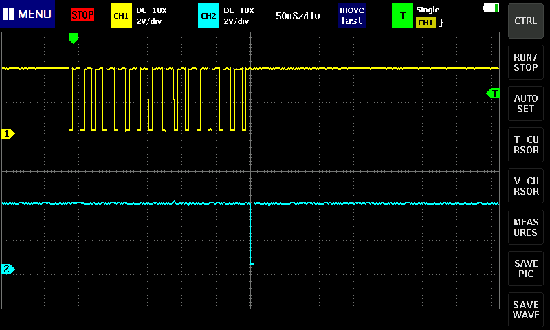
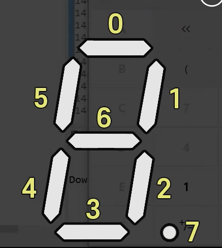
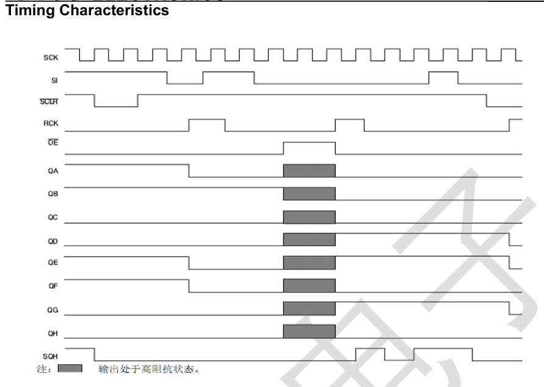
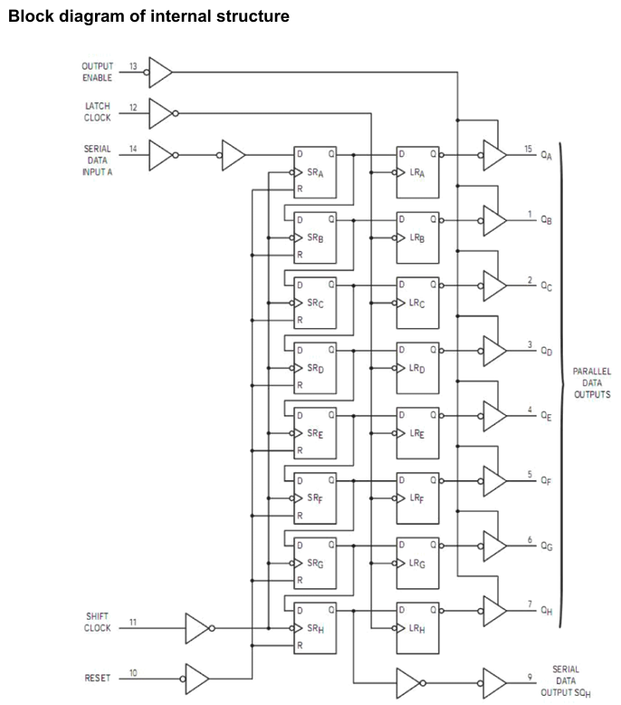

# FND 소스 분석하기

## send(uint_8 x) 함수 분석하기

```c
void send(uint8_t X)
{
  for (int i = 8; i >= 1; i--)
  {
    if (X & 0x80)
    {
      HAL_GPIO_WritePin(FND_DIO_GPIO_Port, GPIO_PIN_14, HIGH);
    }
    else
    {
    	HAL_GPIO_WritePin(FND_DIO_GPIO_Port, GPIO_PIN_14, LOW);
    }
    X <<= 1;
    HAL_GPIO_WritePin(FND_SCLK_GPIO_Port, FND_SCLK_Pin, LOW);
    HAL_GPIO_WritePin(FND_SCLK_GPIO_Port, FND_SCLK_Pin, HIGH);
  }
}
```

### example: send(0x88);

- **X & 0x80**는 `X & 1000 0000`와 같은 상태
- if X가 0x88 이면 `1000 1000`이고 둘을 & 연산하면 DIO 전기신호의 0번째 비트와 5번째 비트가 HIGH가 된다.
- 0x88신호는 A를 나타낸다.

  

## send_port(uint_8 x, uint_8 port) 함수 분석

```c
void send_port(uint8_t X, uint8_t port)
{
  send(X);
  send(port);
  HAL_GPIO_WritePin(FND_RCLK_GPIO_Port, FND_RCLK_Pin, LOW);
  HAL_GPIO_WritePin(FND_RCLK_GPIO_Port, FND_RCLK_Pin, HIGH);
}
```

### send(x)함수는 위 이미지와 같다.

### send(port) 함수

- send(0b0001); 에서
  
- 1번째 LED 숫자칸 on

### 위 두 함수를 같이 표현하면



### 마지막 RCLK 표현

```c
	HAL_GPIO_WritePin(FND_RCLK_GPIO_Port, FND_RCLK_Pin, LOW);
  HAL_GPIO_WritePin(FND_RCLK_GPIO_Port, FND_RCLK_Pin, HIGH);
```



- RCLK은 제일 마지막에 한번 tik이 있다.
- RCLK에 대해 찾아보니 아래와 같다고 한다.

```
RCK은 Shift Register TM74HC595의 핀 중 하나로, Latch Clock 입력 핀입니다. 이 핀의 주요 역할은 시프트 레지스터의 데이터를 래치(latch)하여 출력 레지스터에 저장하는 것입니다. 구체적으로, RCK 핀에 상승 에지가 입력되면, 시프트 레지스터에 저장된 데이터가 출력 레지스터에 저장됩니다. 이 과정은 입력 데이터가 지속적으로 변경될 때마다 안정적인 출력을 보장하기 위해 사용
```

### port LED 키는법

#### 0b0001: 첫 번째 LED

#### 0b0010: 두 번째 LED

#### 0b0100: 세 번째 LED

#### 0b1000: 네 번째 LED

## LED 메커니즘

```c
	send_port(0b11111110 ,0b0001);
	HAL_Delay(500);
	send_port(0b11111101 ,0b0001);
	HAL_Delay(500);
	send_port(0b11111011 ,0b0001);
	HAL_Delay(500);
	send_port(0b11110111 ,0b0001);
	HAL_Delay(500);
	send_port(0b11101111 ,0b0001);
	HAL_Delay(500);
	send_port(0b11011111 ,0b0001);
	HAL_Delay(500);
	send_port(0b10111111 ,0b0001);
	HAL_Delay(500);
	send_port(0b01111111 ,0b0001);
	HAL_Delay(500);
```

- 8bit 중 0bit인 부분이 켜지는 시스템
  

### 아래 데이터시트를 참고하여 위 코드를 만들었다는 강사님




#### 어케하누....

## LED의 소수점을 표현하는 코드

```c
void digit_temper(int n, int replay)
{
  int n1, n2, n3, n4;
  n1 = (int) (n % 10);
  n2 = (int) (n % 100) / 10;
  n3 = (int) (n % 1000) / 100;
  n4 = (int) (n % 10000) / 1000;

 for(int i = 0; i<=replay; i++){
 	 send_port(_LED_0F[n1], 0b0001);
   send_port(_LED_0F[n2] & 0x7F, 0b0010);
   if(n>99)send_port(_LED_0F[n3], 0b0100);
   if(n>999)send_port(_LED_0F[n4], 0b1000);
 }
}
```

- 온도계를 사용하기 위한 LED 소수점 표현
- hint: 7F
