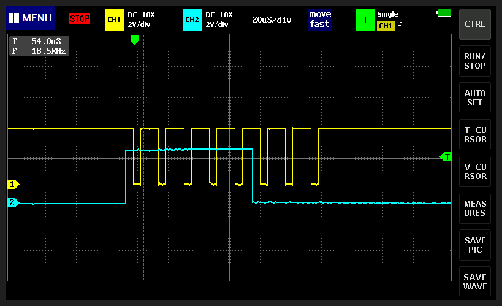
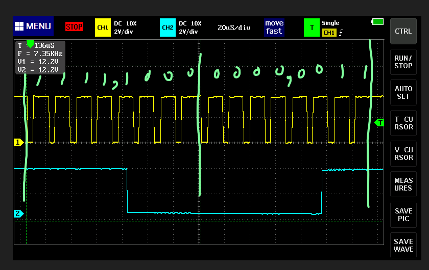
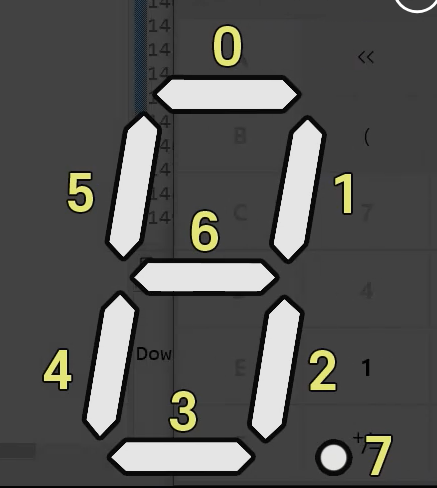

# FND 소스 분석하기

## send(uint_8 x) 함수 분석하기

```c
void send(uint8_t X)
{
  for (int i = 8; i >= 1; i--)
  {
    if (X & 0x80),
    {
      HAL_GPIO_WritePin(FND_DIO_GPIO_Port, GPIO_PIN_14, HIGH);
    }
    else
    { 
    	HAL_GPIO_WritePin(FND_DIO_GPIO_Port, GPIO_PIN_14, LOW);
    }
    X <<= 1;
    HAL_GPIO_WritePin(FND_SCLK_GPIO_Port, FND_SCLK_Pin, LOW);
    HAL_GPIO_WritePin(FND_SCLK_GPIO_Port, FND_SCLK_Pin, HIGH);
  }
}
```

### send(0xF8) 함수를 통해서 데이터를 보내고 파형 확인하기
- `_LED_0F[7] = 0xF8; //7`
- `0xF8` = `1111,1000`
```c
send(0xF8);
HAL_Delay(1000);
```
- Just Data Transmit code
- 오실로스코프로 찍어보기


## send_port(uint_8 x, uint_8 port)를 통해 LED 제어

- 함수 정의
```c
void send_port(uint8_t X, uint8_t port)
{
  send(X);
  send(port);
  HAL_GPIO_WritePin(FND_RCLK_GPIO_Port, FND_RCLK_Pin, LOW);
  HAL_GPIO_WritePin(FND_RCLK_GPIO_Port, FND_RCLK_Pin, HIGH);
}
```
- LED `  77` 제어 코드
```c
  send(0xF8);
  send(0b0011);
  HAL_GPIO_WritePin(FND_RCLK_GPIO_Port, FND_RCLK_Pin, LOW);
  HAL_GPIO_WritePin(FND_RCLK_GPIO_Port, FND_RCLK_Pin, HIGH);
  HAL_Delay(1000);
```
- 오실로 스코프로 확인

- 숫자 7을 3,4번째 자리에 LED로 표시
- RCLK 한주기에 일어나는 일

### LED 제어 메커니즘

#### 0b0001: 첫 번째 LED

#### 0b0010: 두 번째 LED

#### 0b0100: 세 번째 LED

#### 0b1000: 네 번째 LED
#### 참고 코드
```c
send_port(0b11111110, 0b0001);
HAL_Delay(1000);
send_port(0b11111101, 0b0001);
HAL_Delay(1000);
send_port(0b11111011, 0b0001);
HAL_Delay(1000);
send_port(0b11110111, 0b0001);
HAL_Delay(1000);
send_port(0b11101111, 0b0001);
HAL_Delay(1000);
send_port(0b11011111, 0b0001);
HAL_Delay(1000);
send_port(0b10111111, 0b0001);
HAL_Delay(1000);
send_port(0b01111111, 0b0001);
HAL_Delay(1000);
```
- 8bit 중 0bit인 부분이 켜지는 시스템



### 아래 데이터시트를 참고하여 위 코드를 만들었다는 강사님


#### 어케하누....

## LED의 소수점을 표현하는 코드
```c
// main.c
for(int i = 0; i<=9999; i++)
{
	digit4_temper(i, 50); 
}
```

```c
// fnd_controller.c
void digit_temper(int n, int replay)
{
  int n1, n2, n3, n4;
  n1 = (int) (n % 10);
  n2 = (int) (n % 100) / 10;
  n3 = (int) (n % 1000) / 100;
  n4 = (int) (n % 10000) / 1000;

 for(int i = 0; i<=replay; i++)
 {
   send_port(_LED_0F[n1], 0b0001);
   send_port(_LED_0F[n2] & 0x7F, 0b0010);
   if(n>99)send_port(_LED_0F[n3], 0b0100);
   if(n>999)send_port(_LED_0F[n4], 0b1000);
 }
}
```
```c
// fnd_controller.h에 아래코드 추가
void digit_temper(int n, int replay);
```

- 온도계를 사용하기 위한 LED 소수점 표현
- 복습때마다 분석 ㄱㄱ  