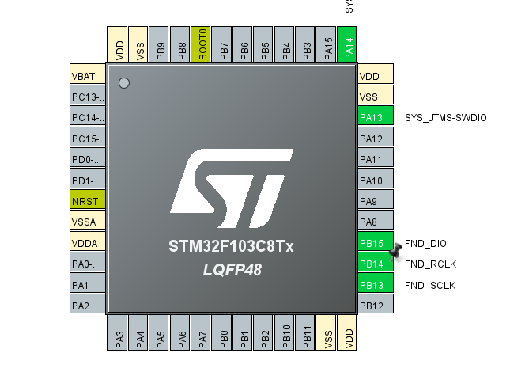
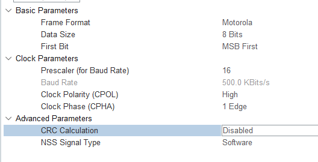

# STM32에서 제공하는 SPI기능

이전 강의에서는 GPIO로 SPI 기능을 구현했었다...
지금부터 GPIO옵션을 SPI로 변경하자

## 프로젝트를 복사한다.

## IOC모드에서 그림과 같이 옵션을 변경한다.



### 그림과 같이 parameters setting에 옵션 설정



## 수정 코딩

### fnd_controller.c (.h도 수정 필요)

```c
static SPI_HandleTypeDef * mhspi;

void init_fnd(SPI_HandleTypeDef * hspi)
{
	mhspi = hspi;
  _LED_0F[0] = 0xC0; //0
  _LED_0F[1] = 0xF9; //1
  _LED_0F[2] = 0xA4; //2
  _LED_0F[3] = 0xB0; //3
  _LED_0F[4] = 0x99; //4
  _LED_0F[5] = 0x92; //5
  _LED_0F[6] = 0x82; //6
  _LED_0F[7] = 0xF8; //7
  _LED_0F[8] = 0x80; //8
  _LED_0F[9] = 0x90; //9
  _LED_0F[10] = 0x88; //A
  _LED_0F[11] = 0x83; //b
  _LED_0F[12] = 0xC6; //C
  _LED_0F[13] = 0xA1; //d
  _LED_0F[14] = 0x86; //E
  _LED_0F[15] = 0x8E; //F
  _LED_0F[16] = 0xC2; //G
  _LED_0F[17] = 0x89; //H
  _LED_0F[18] = 0xF9; //I
  _LED_0F[19] = 0xF1; //J
  _LED_0F[20] = 0xC3; //L
  _LED_0F[21] = 0xA9; //n
  _LED_0F[22] = 0xC0; //O
  _LED_0F[23] = 0x8C; //P
  _LED_0F[24] = 0x98; //q
  _LED_0F[25] = 0x92; //S
  _LED_0F[26] = 0xC1; //U
  _LED_0F[27] = 0x91; //Y
  _LED_0F[28] = 0xFE; //hight
}
```

```c
void send(uint8_t X)
{
    HAL_SPI_Transmit(mhspi, &X, 1, 100);
}
```

### main.c

- spi handler 변수를 포인로 가져온다.
- while문에서 기능 구현

### 문제점

- CPHA에서 강사님과 달리 2edge에서 동작하는 이유 알아내기
