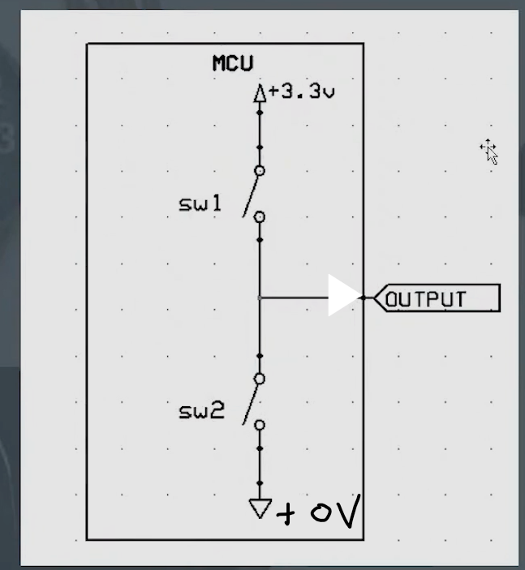

## 전압의 차
- 접지는 항상 0V는 아니다.
	- 전원 출력이 5V이고 접지 전압이 0V이면 전압은 5V이다.
	- 전원 출력이 8V이고 접지 전압이 3V이면 전압은 5V이다.

## GND
- 회로에서 공통 기준 전위를 나타내며, 모든 전압 측정의 **기준점**으로 사용
- 일반적으로 `0V`를 가짐
- 회로의 모든 전류가 돌아가는 끝점

## 그라운드와 접지의 차이

### 접지(earth)
- 땅에 도체선을 감아 박아 **0V 절댓값**을 갖게한다.
- 부하된 전원은 접지가 연결되어 있으면 땅으로 흐른다.
- 접지가 연결되어 있지 않으면 부하된 전기에 접촉했을 때 감전된다.

### 그라운드 (GND)
- **회로 기판내에 0V 기준점을 말한다.**
- 기준점이 반드시 0V가 아닐 수 있다.
	+ 예를 들어 5V의 전압을 사용하는 회로도가 있더라도 출력 전원이 7V이고 기준점이 2V인 상태도 있을 수 있다는 것

### 정리
- 직류에서 +극과 -극을 바꿔서 연결하면 고장난다.
- 교류에서는 반대로 연결해도 알아서 맞춰 돌아간다. (**ADC**)

## 쇼트
- 건전지를 도체선을 +극 -극 direct로 연결하면 일어나는 현상
- 몇 초만에 말도안되게 뜨거워진다.
- 엄청난 열로 전선이 탄다.
- 부품이 못버티고 타버린다.

### 발생시키는 방법
- 물에 접촉
- 겨울에 털옷 입고 맨손으로 보드 만지기
- 도체 물체위에 보드 올려놓기
	+ 가위나 칼 따위를 PCB기판에 올려놓는 행위....

### 피복이 벗겨진후 다른 물체가 닿으면 저항이 강해진다...