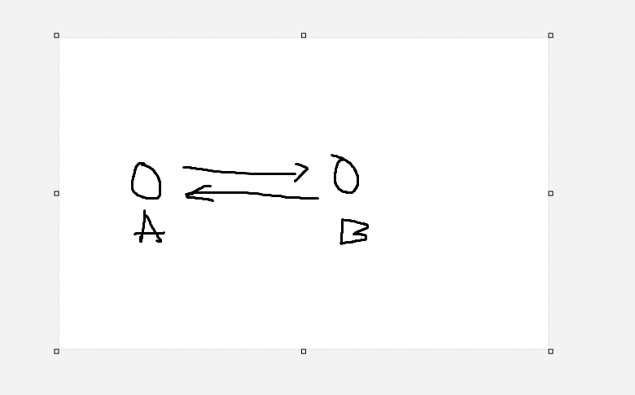
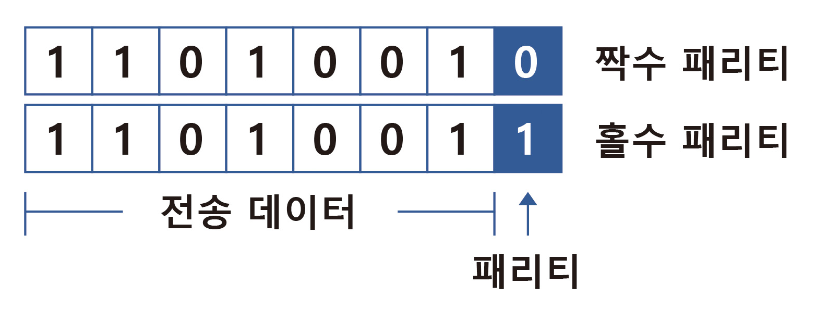
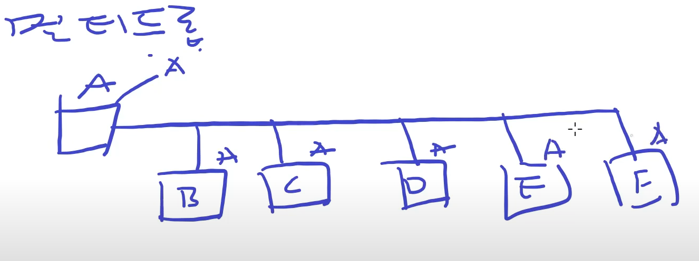

# 모드 버스 프로토콜

- RS232(꾸짐)
  - 1:1 통신
  - 외부의 영향을 많이 받는다.
- RS422(아주 좋다)
  - 전이중 방식
  - 전선 4가닥 필요(현장에서 많이 안쓰는 이유)
- **RS485(좋다, 가장 많이 쓴다.)**, TCP에 내장됨
- 유선이면 통신선 개수에따라 또는 무선이면 주파수 영역에 따라 통신 방법이 달라진다.
- 전압 크기 그리고 High, Low 상태의 규칙을 약속으로 정해서 통신 프로토콜을 정한다.

## Serial 통신

### 데이터 전송 방식

- 데이터를 1비트씩 순차적으로 전송
- 송신 장치와 수신 장치 사이에 최소한의 선(일반적으로 2~3개 핀: TX, RX, RND)으로 통신

### 장점

- 적은 선의 개수를 사용하여 간단하고 장거리 통신에 적합
- 따라서 비용이 적게들고 하드웨어 통신도 복잡하지 않다.

### 단점

- 속도제한: 같은 조건에서 병렬 통신보다 느림(한 번에 1비트씩 전송)
- 대역폭 필요: 전송 속도가 높아지면 높은 대역폭이 필요하다.

#### UART, SPI, I2C, USB등이 대표적인 Serial 통신

#### 정리

- serail 통신은 한번에 1비트를 전송
- ex 9600bps ==> 초당 9600bit 전송

### Serial 통선 설정

- 대부분 1bit씩 8bit단위로 전송한다.
- **Parity Bit(에러 검출)**
  - 외부 전파 요인에 의해 전송과정에서 1이 0 or 0이 1로 변경되면 Parity Bit 연산을 통해 옳바른 값을 예측할 수 있다.
- **정지비트**
  - 8bit 데이터 전송후 그 뒤로 오는 정지비트 개수를 설정하는것
  - 1개 or 2개의 bit를 사용하는데 대부분 1개의 bit를 사용한다.

#### BPS

- bit per second
- 통신 속도
- 115200 bit/s ==> 1초를 115,200개로 나눠서 시간간격을 설정해 데이터를 전송한다.
  
- A와 B의 BPS가 일치하지 않으면 데이터의 옳바른 통신이 불가능하다.

#### Parity Bit(N. E. O)

- 컴퓨터는 정해진 프로그램에 따라 움직이는데 이 과정에서 오류가 생기면 다양한 문제가 나타날 수 있다.
- 프로그램을 작성할 때는 반드시 오류 검출 과정을 거치게 된다.
- 정보 전달 과정에서 오류가 생겼는 지 검사하기 위해 추가하는 비트를 말한다.
- **N (None)**: 패리티 비트를 사용하지 않음을 의미
- **E (Even parity)**: 짝수 패리티를 의미 즉, 전송된 데이터의 1의 개수를 짝수로 만들기 위해 패리티 비트를 설정
- **O (Odd parity)**: 홀수 패리티를 의미 즉, 전송된 데이터의 1의 개수를 홀수로 만들기 위해 패리티 비트를 설정
- **한계**
  - 오류 발생 여부만 확인가능하고 수정은 불가능
  - 2개 이상의 비트 오류가 발생하면 효과 없음
- [패리티 비트](https://velog.io/@octo__/%ED%8C%A8%EB%A6%AC%ED%8B%B0-%EB%B9%84%ED%8A%B8-Parity-Bit)

## 병렬 통신(Parallel)

### 데이터 전송 방식

- 데이터를 여러 비트를 동시에 전송

  - **따라서 각 비트마다 독립된 데이터 라인이 필요**
  - ex) **8bit를 동시에 전송하려면 8개의 데이터 라인 필요**

### 장점

- **빠른 전송 속도**: 여러 bit 전송라인을 사용하므로 직렬 통신보다 빠르다.
- **고속 데이터 처리**: CPU내부나 메모리와 같은 짧은 거리 통신에서 유리

### 단점(복잡한 연결)

- HW적으로 복잡하고 데이터 라인 증가로 케이블 비용이 높아짐
- **긴 거리 통신 어려움**

#### 컴퓨터 내부 데이터 버스, 프린터 포트 등

### serial과 parallel비교

- 현재는 Serial통신이 더 널리 사용됨
- 긴 거리에서의 신뢰성 이슈와 연결의 복잡도 때문
- Serial 통신이 간단하고 효율적이면 장거리 통신에 적합

## RS485

- Serial 통신중 하나
  - 한번에 1bit씩 보낸다.
- 통신 선: 2개 or 4개 둘다 가능하다.(2가닥을 가장 많이 사용한다.)
- RS485 통신을 기반으로 모드버스 프로토콜이 만들어졌다.(추정)
- 멀티드롭이 가능

### 멀티드롭

- a가 데이터를 전송하면 b,c,d,e,f 모두 데이터를 수신한다.
- 문제점: 원하는 상대뿐 아나라 다른 상대들도 데이터를 수신한다.
  - 따라서 전송 대상을 명시적으로 지칭해야한다.
  - 그러면 다른 상대들은 데이터를 수신하지만 전송 대상자가 아니므로 해당 데이터를 무시한다.
  - 수신자가 응답할 때도 마찬가지로 명시적으로 원전송자를 지칭하고 데이터를 전송한다.
    - 똑같이 원송신자를 제외한 다른 상대들은 데이터를 무시한다.

## 이더넷

- 통신선 8가닥 씀
