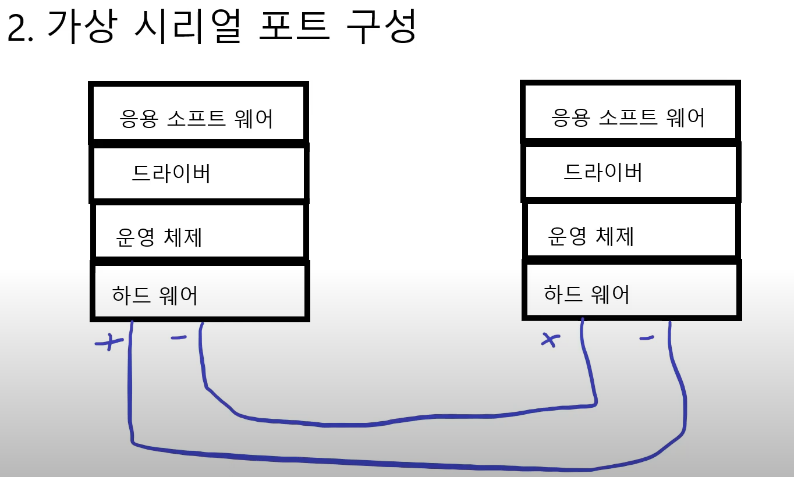

# 모드버스 프로토콜

## Master와 Slave가 존재하는 이유
- RS485통신은 대부분 Master와 Slave가 존재
- 이는 멀티드롭과 관련이있다.(a가 데이터를 전송하면 b,c,d,e,f들 모두가 수신한다.)
- 이처럼 여러 노드가 동시에 전기신호를 보내면 서로 전기적 간섭이 일어나 데이터 송수신이 원활하지않다.
  + **즉, 여러 노드들이 동시에 데이터를 송신하면 안된다!**
- 이 때 등장한게 Master-Slave 통신
  + Master: 발언권이 있는 노드(시작 노드)
    * 여러 노드들이 동시에 데이터 송/수신을 원천적으로 차단
  + Slave: Master에 대한 응답만 가능한 노드(응답 노드)

## 가상 Serial Port 구성

- 양쪽 하드웨어가 다른 제품이여도 같은 RS485 프로토콜을 사용한다면 자유롭게 통신이 가능하다.

```c
// A노드
dev/tty01
fd = open("dev/tty01", "w");

9600
8
1
N

Write(fd, "abc");

// B노드
dev/tty02
fd = open("dev/tty02", "r");
// 원활한 통신을위해 옵션을 동일하게 설정
9600
8
1
N

char buff[256];
Read(fd, buff);

printf("%s\n", buff); // abc
```
- 위 코드와 같이 a, b노드 둘다 서로 다른종류의 하드웨어라도 RS485의 통신규칙을 지킨다면 서로 원활하게 통신이 가능하다.
- 4부 강의를 보고 시리얼 통신 프로그램 만들기

## 실제 패킷을 주고받는 코드 작성

## 모드버스 프로토콜 검증 프로그램을 통한 테스트