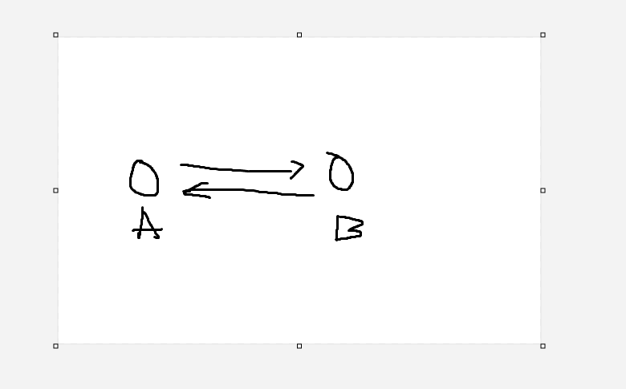
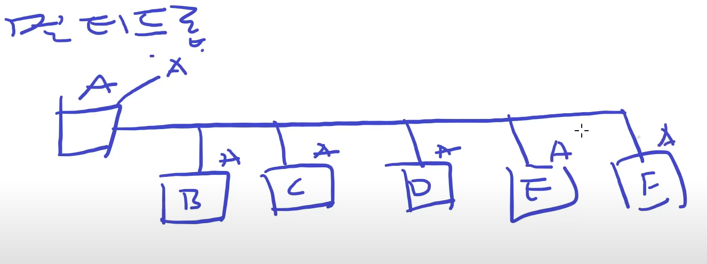

# 모드 버스 프로토콜
- RS232(꾸짐)
  + 1:1 통신
  + 외부의 영향을 많이 받는다.
- RS422(아주 좋다)
  + 전이중 방식
  + 전선 4가닥 필요(현장에서 많이 안쓰는 이유)
- **RS485(좋다, 가장 많이 쓴다.)**, TCP에 내장됨
- 유선이면 통신선 개수에따라 또는 무선이면 주파수 영역에 따라 통신 방법이 달라진다.
- 전압 크기 그리고 High, Low 상태의 규칙을 약속으로 정해서 통신 프로토콜을 정한다.

## Serial 통신
- 데이터를 송수신하는 과정에서 각 비트를 단위시간당 하나씩 전송
```md
0, 1, 0, 1, 1, 0, 0, 0
```
### Serial 통신에 따라오는 설정들
- bps
  + 대부분 9600 bit/s를 쓴다. 느리면 안좋고 너무 빨라도 에러가 많이생긴다.
- 대부분 한번에 8bit씩 전송한다.
- Parity Bit(에러 검출)
  + 외부 전파 요인에 의해 전송과정에서 1이 0 or 0이 1로 변경되면 Parity Bit 연산을 통해 옳바른 값을 예측할 수 있다. 
- 정지비트
  + 8bit 데이터 전송후 그 뒤로 오는 정지비트 개수를 설정하는것
  + 1개 or 2개의 bit를 사용하는데 대부분 1개의 bit를 사용한다.

#### BPS
- bit per second 
- 통신 속도
- 115200 bit/s ==> 1초를 115,200개로 나눠서 시간간격을 설정해 데이터를 전송한다.

- A와 B의 BPS가 일치하지 않으면 데이터의 옳바른 통신이 불가능하다.

#### Parity Bit(N. E. O)

- 컴퓨터는 정해진 프로그램에 따라 움직이는데 이 과정에서 오류가 생기면 다양한 문제가 나타날 수 있다.
- 프로그램을 작성할 때는 반드시 오류 검출 과정을 거치게 된다. 
-  정보 전달 과정에서 오류가 생겼는 지 검사하기 위해 추가하는 비트를 말한다.
- **N (None)**: 패리티 비트를 사용하지 않음을 의미
- **E (Even parity)**: 짝수 패리티를 의미 즉, 전송된 데이터의 1의 개수를 짝수로 만들기 위해 패리티 비트를 설정
- **O (Odd parity)**: 홀수 패리티를 의미 즉, 전송된 데이터의 1의 개수를 홀수로 만들기 위해 패리티 비트를 설정
- **한계**
  +  오류 발생 여부만 확인가능하고 수정은 불가능
  +  2개 이상의 비트 오류가 발생하면 효과 없음
- [패리티 비트](https://velog.io/@octo__/%ED%8C%A8%EB%A6%AC%ED%8B%B0-%EB%B9%84%ED%8A%B8-Parity-Bit)

### 병렬 통신
- 한번에 여러 bit씩 전송한다.
```md
0, 1
0, 1
1, 0
0, 0
```
  + 한번에 4bit씩 전송

## RS485
- Serial 통신중 하나
  + 한번에 1bit씩 보낸다.
- 통신 선: 2개 or 4개 둘다 가능하다.(2가닥을 가장 많이 사용한다.)
- RS485 통신을 기반으로 모드버스 프로토콜이 만들어졌다.(추정)
- 멀티드롭이 가능

### 멀티드롭

- a가 데이터를 전송하면 b,c,d,e,f 모두 데이터를 수신한다.
- 문제점: 원하는 상대뿐 아나라 다른 상대들도 데이터를 수신한다.
  + 따라서 전송 대상을 명시적으로 지칭해야한다.
  + 그러면 다른 상대들은 데이터를 수신하지만 전송 대상자가 아니므로 해당 데이터를 무시한다.
  + 수신자가 응답할 때도 마찬가지로 명시적으로 원전송자를 지칭하고 데이터를 전송한다.
    + 똑같이 원송신자를 제외한 다른 상대들은 데이터를 무시한다.

## 이더넷
- 통신선 8가닥 씀