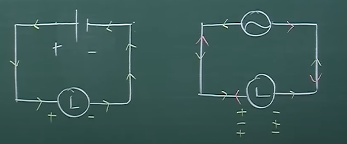

## 전력 (electric Power)
- 단위는 W(와트)를 사용
### W = A x V

## 전류 (A-암페어)
- 회로내의 전자 흐름
- 전기를 사용하는 장치들을 단방향(직류) 전류를 사용한다.

## 전압 (V-볼트)
- 전하량 차이에 따라 발생하는 압력
- 수압과 비슷
- **전압은 높은 전하량 point에서 낮은 전하량 point로 이동하는 성질이 있음(매우 중요!)**
	+ 전압을 가해서 전기 회로의 전자를 움직이게 한다.

## 저항 (Ω -옴)
- 전류의 흐름을 방해하는 전기적 소자

## 직류와 교류

(왼쪽부터 직류와 교류 회로 기호)

### 직류(DC)
- Direct Current
- 단 방향으로 흐르는 전류

### 교류(AC)
- Alternative Current
- 양 방향 교대로 흐르는 전류