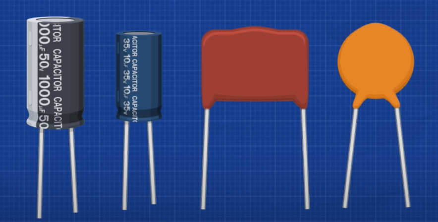
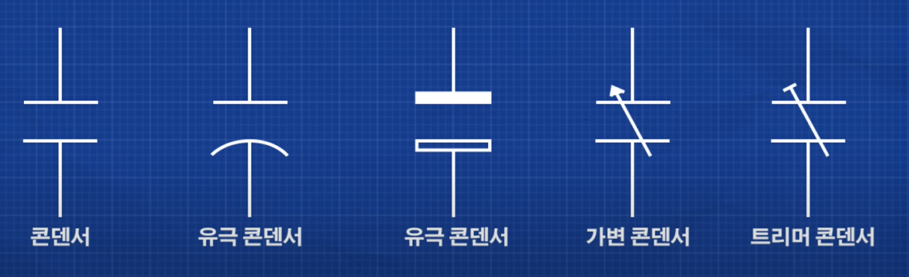
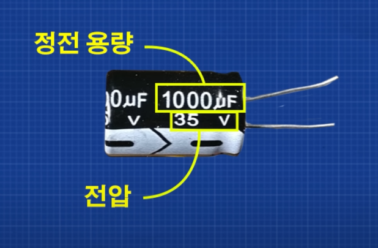
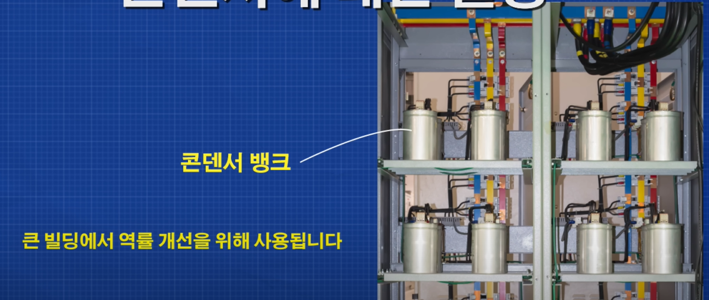

> 참고 자료
> - [콘덴서에 대한 설명 - 공학적 사고 방식](https://www.youtube.com/watch?v=oD4R0dG6qoQ&list=PLEjL9JHUhQj6IBnmiDEuaynDlSVPc5PvA)

#### 용어
> 

# 콘덴서(캐패시터)란?
- 전하를 저장하는 소자
- 많은 전기를 저장할 수 없지만 빠르게 전기를 충전할 수 있다.

# 콘덴서는 어떻게 작동할까?
- 콘덴서는 물 저장 탱크와 같은 역할을 한다.
- 전기 공급 중단을 하더라도 충전된 전기로인해 전기 공급 중단을 원만하게 할 수 있다.
	+ **ex)** 잠깐동안 스위치가 꺼져도 `콘덴서(물탱크)`에서 일정 시간동안은 전기가 계속 공급되기 때문에 전구는 (일정시간 동안)계속 켜져있을 수 있다.

# 콘덴서 찾는 방법
## 실제 모습

## 회로판

## 구성

- 정전 용량: 콘덴서가 전하를 충전할 수 있는 용량
	+ 패럿[F] 단위로 측정
	+ 회로판은 보통 마이크로 패럿[uF]단위를 사용
	+ 1[F] = 1000[mF]
	+ 1[mF] = 1000[uF]
	+ 1[uF] = 1000[nF]
- 전압: 그림에 나오는 전압값은 콘덴서가 최대로 다룰 수 있는 값
	+ ### 콘덴서에 나오는 전압을 초과하면 콘덴서는 폭발한다.(주의!)

# 콘덴서를 사용하는 이유
## 대형 건물에서

- 역률 개선이란?: [역률 개선](https://www.youtube.com/watch?v=qzLG_SAHsZM)
	+ 간단히 말해서 역률은 위상차이다!
	+ 전력P = V * I인데 역률 즉, 위상차가 낮을수록 전력이 강하다는 성질이 있다.
	+ **즉 역률 개선이란 위상차를 줄여 전력을 강화하는 것**

	+ 사전 지식[임피던스(Impedance)](https://www.youtube.com/watch?v=agdC54hlrno&t=28s)
		+ 요약: 직류 회로에서 V/I를 저항이라고 하고 **교류 회로에서 V/I를 z(임피던스)**라고 한다. `즉, 직류 회로에서의 저항을 교류 회로에서는 임피던스 라고 부르는 것!`
		+ 임피던스는 저항, 캐패시터, 인덕터(코일)로 이루어져 있다.
	+ 사전 지식 리액턴스(위 영상에 포함됨)
		+ 요약: 인피던스를 **백터도로 표현할 때 허수 축을 리액턴스라고 한다!**(실수 축은 저항이라고 부른다.)
		+ 캐패시터와 인덕터에 의한 성분들은 전기 에너지를 축적하기 때문에 **리액턴스(x)** 성분에 해당된다.
		+ **임피던스 = 리액턴스(리액턴스 성분(캐패시터 및 인덕터)) + 저항(실수 축 저항 성분)**

# 콘덴서 주의 사항
- 콘덴서는 전원과 연결이 끊어져도 전력을 저장하는 특성 때문에 오랫동안 고전압을 갖고 있으므로 다룰 때 주의해야 한다.
- 다루기 전에 [mv]단위로 전압을 낮춰야 한다.(쇼크를 경험할 수 있다.)